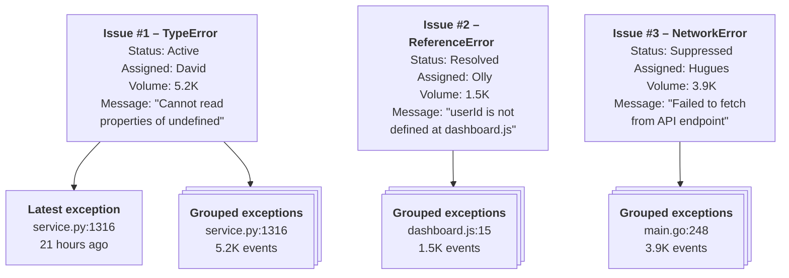
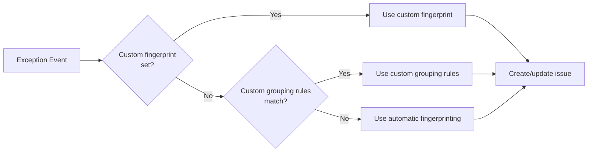

As fullstack developer expert, you have to ask to user request, there is documentation : 

# Capture exceptions for error tracking

import Tab from "components/Tab"

You can track and monitor errors and exceptions in your code by capturing [exception events](/docs/error-tracking/issues-and-exceptions). This can be done automatically when exceptions are thrown in your code, or manually by calling the exception capture method.

## Capturing exceptions

Exceptions are a special type of [event](/docs/data/events) in PostHog. Similar to any other event, they can be captured, customized, filtered, and used in insights for analysis.

To help group exceptions into issues and help you debug them, PostHog automatically captures the following properties:

| Name                     | Key    | Example value                                                                                                                                              |
| ------------------------ | ------ | ---------------------------------------------------------------------------------------------------------------------------------------------------------- |
| `$exception_list`        | List   | A list of exceptions that occurred. In languages that support chained exceptions, the list will contain multiple items. Contains the following properties: |
| └─ `type`                | String | The type of exception that occurred                                                                                                                        |
| └─ `value`               | String | The message of the exception that occurred                                                                                                                 |
| └─ `stacktrace`          | Object | Contains a list of stack frames that occurred                                                                                                              |
| └─ `mechanism`           | Object | If the stacktrace is handled and if it's synthetic                                                                                                         |
| `$exception_fingerprint` | String | A fingerprint of the exception                                                                                                                             |
| `$exception_level`       | String | The level of the severity of the error                                                                                                                     |

Like normal events, it's important to [identify the user](/docs/product-analytics/identify) when capturing exceptions.

import { CalloutBox } from 'components/Docs/CalloutBox'

<CalloutBox icon="IconInfo" title="Source maps" type="fyi">

If you serve minified or compiled code, PostHog needs source maps to display the correct stack traces. [Configure source maps](/docs/error-tracking/upload-source-maps) to get the most out of your exception events.

</CalloutBox>

### Automatic exception capture

If you followed one of our guides to [set up error tracking](/docs/error-tracking/installation) and you [enabled exception auto capture](https://app.posthog.com/error_tracking/configuration), you'll have automatic exception capture enabled.

```js
posthog.init("<ph_project_api_key>", {
  api_host: "<ph_api_client_host>",
  defaults: "<ph_posthog_js_defaults>",
  capture_exceptions: {
    capture_unhandled_errors: true, // default
    capture_unhandled_rejections: true, // default
    capture_console_errors: false, // default
  },
});
```

### Manual exception capture

You can also manually call the exception capture method.

<MultiLanguage>

```javascript file=Web
posthog.captureException(error, {
  custom_property: "custom_value",
  custom_list: ["custom_value_1", "custom_value_2"],
});
```

```javascript file=Node.js
posthog.captureException(e, "user_distinct_id", {
  custom_property: "custom_value",
  custom_list: ["custom_value_1", "custom_value_2"],
});
```

```python
additional_properties = {
    "custom_property": "custom_value",
    "custom_list": ["custom_value_1", "custom_value_2"],
}

posthog.capture_exception(
    e,
    distinct_id="user_distinct_id",
    properties=additional_properties
)
```

</MultiLanguage>

## Customizing exception capture

Like all data, the better **quality** of your exception events, the more **context** you'll have for debugging and analysis. Customizing exception capture helps you do this.

Customizing exception capture lets you override exception properties to influence how they're grouped into issues.

Equally important, you can customize properties on the exceptions to help you configure rules for [automatic issue assignment](/docs/error-tracking/assigning-issues#automatic-issue-assignment), [alerts](/docs/error-tracking/alerts), [issue grouping](/docs/error-tracking/grouping-issues). They can also be used in analysis in [insights](/docs/product-analytics/insights), [dashboards](/docs/product-analytics/dashboards), and [data warehouse queries](/docs/product-analytics/data-warehouse).

### Customizing exception properties

#### During manual capture

When capturing exceptions manually, passing properties to the capture exception method adds them to the event just like any other PostHog event.

You can also override the [fingerprint](/docs/error-tracking/fingerprints) to [group](/docs/error-tracking/issues-and-exceptions#how-are-issues-grouped) exceptions together at capture time.

Here are some examples of how to override exception properties:

<MultiLanguage>

```javascript file=Web
try {
  // ...
} catch (error) {
  posthog.captureException(error, {
    custom_property: "custom_value",
    // You can also *optionally* override generated properties like fingerprint
    $exception_fingerprint: "CustomExceptionGroup",
  });
}
```

```javascript file=Node.js
try {
  // ...
} catch (error) {
  posthog.captureException(error, "user_123", {
    custom_property: "custom_value",
    // You can also *optionally* override generated properties like fingerprint
    $exception_fingerprint: "CustomExceptionGroup",
  });
}
```

```python
import posthog

posthog.api_key = '<ph_project_api_key>'
posthog.host = '<ph_client_api_host>'

# With context
with posthog.new_context():
    posthog.identify_context(distinct_id="user_123")

    # When using context, you define properties with tags
    posthog.tag("custom_property", "custom_value")

    # You can also *optionally* override generated properties like fingerprint
    posthog.tag("$exception_fingerprint", ["custom_fingerprint"])

    posthog.capture_exception(Exception("Test custom exception"))

# Or without context
posthog.capture_exception(
    Exception("Test custom exception without context"),
    distinct_id="user_123",
    properties={
        "$exception_type": "Custom exception without context",
        "$exception_fingerprint": ["custom_fingerprint without context"],
        "custom_property": "custom_value",
    },
)
```

</MultiLanguage>

#### During automatic capture

When automatic exception capture is enabled, you can still override the default properties and add custom properties to the exception event.

You can also override the [fingerprint](/docs/error-tracking/fingerprints) to [group](/docs/error-tracking/issues-and-exceptions#how-are-issues-grouped) exceptions together at capture time.

The process is slightly different depending on the SDK you're using.

<Tab.Group tabs={['Web and Node.js', 'Python']}>
<Tab.List>
<Tab>Web and Node.js</Tab>
<Tab>Python</Tab>
</Tab.List>
<Tab.Panels>
<Tab.Panel>

In [JavaScript Web](/docs/libraries/js) and [Node.js](/docs/libraries/node) SDKs, you can override the default properties by passing a `before_send` callback. This callback is called before any exception is captured.

```javascript
posthog.init("<ph_project_api_key>", {
  api_host: "<ph_client_api_host>",
  defaults: "<ph_posthog_js_defaults>",
  before_send: (event) => {
    if (event && event.event === "$exception") {
      const exceptionList = event.properties?.["$exception_list"] || [];
      const exception = exceptionList.length > 0 ? exceptionList[0] : null;

      if (exception) {
        event.properties["custom_property"] = "custom_value";
        // You can also *optionally* override generated properties like fingerprint
        event.properties["$exception_fingerprint"] = "MyCustomGroup";
        // ... and any other properties you want to override
      }
    }
    return event;
  },
});
```

</Tab.Panel>
<Tab.Panel>

In Python, you can override the default properties through the use of [contexts](/docs/libraries/python#contexts) and tags.

```python
import posthog

posthog.api_key = '<ph_project_api_key>'
posthog.host = '<ph_client_api_host>'

# With context
with posthog.new_context():
    posthog.identify_context(distinct_id="<user_distinct_id>")
    posthog.set_context_session(session_id="<session_id>")

    posthog.tag("custom_property", "custom_value")
    # You can also *optionally* override generated properties like fingerprint
    posthog.tag("$exception_fingerprint", ["custom_fingerprint"])

    # When this exception is automatically captured, it will be tagged with the custom properties
    raise Exception("Test custom exception")
```

</Tab.Panel>
</Tab.Panels>
</Tab.Group>

### Capturing properties for custom issue grouping rules

Other than grouping with [custom fingerprints](#customizing-exception-properties), you can also set custom properties on the exception to help you group exceptions together using [issue grouping rules](/docs/error-tracking/grouping-issues).

For example:

- Setting fields like `db_transaction` to group exceptions together for a specific database transactions.
- Setting `feature_name`, `service_name`, or `service_version` to group exceptions together for a specific features and services.
- Setting `intent` to group exceptions due to common interactions like accessing storage or network.

It's important to think about your grouping rules when you configure exception capture. You cannot group exceptions together if you don't set some common properties between them.

Note that grouping issues means that all exceptions will be grouped together under a **single issue**. You **cannot** group exceptions into multiple issues, but you can still [filter on custom properties](/docs/error-tracking/monitoring#finding-specific-issues) across multiple issues without grouping them.

## Suppressing exceptions

We recommend that you suppress exceptions on the client side for performance and cost reasons.

You can use the [`before_send`](/docs/libraries/js/features#amending-or-sampling-events) callback in the [web](/docs/libraries/js) and [Node.js](/docs/libraries/node) SDKs to exclude any exception events you do not wish to capture. Do this by providing a `before_send` function when initializing PostHog and have it return a falsey value for any events you want to drop.

```js
posthog.init("<ph_project_api_key>", {
  before_send: (event) => {
    if (event.event === "$exception") {
      const exceptionList = event.properties["$exception_list"] || [];
      const exception = exceptionList.length > 0 ? exceptionList[0] : null;

      if (exception && exception["$exception_type"] === "UnwantedError") {
        return false;
      }
    }
    return event;
  },
});
```

You can also suppress exceptions in PostHog, these rules will be applied client-side.

Autocaptured exceptions can be ignored client-side by [configuring suppression rules](https://app.posthog.com/error_tracking/configuration?tab=error-tracking-exception-autocapture#selectedSetting=error-tracking-exception-autocapture) in PostHog settings. You can only filter based on the exception type and message attributes because the stack of an exception may still be minified client-side.

<ProductScreenshot
    imageLight="https://res.cloudinary.com/dmukukwp6/image/upload/suppression_rule_light_8db44eb6b1.png"
    imageDark="https://res.cloudinary.com/dmukukwp6/image/upload/suppression_rule_dark_5972d57398.png"
    alt="Issue suppression rules"
    classes="rounded"
/>

## Burst protection

The JavaScript web SDK uses burst protection to limit the number of autocaptured exceptions that can be captured in a period. This prevents an excessive amount of exceptions being captured from any one client, typically because they're being thrown in an infinite loop.

By default, we capture 10 exceptions (bucket size) of the same type within a 10 second period before the rate limiter kicks in, after which, we capture 1 exception (refill rate) every 10 seconds.

Often not needed, but you can change the bucket size and refill rate as part of your configuration:

```js
import posthog from 'posthog-js'

posthog.init('<ph_project_api_key>', {
    api_host: '<ph_client_api_host>',
    error_tracking: {
        __exceptionRateLimiterRefillRate: 1
        __exceptionRateLimiterBucketSize: 10
    }
})
```

# Grouping exceptions into issues

import { CalloutBox } from 'components/Docs/CalloutBox'

Issues are created by grouping together similar exception events. When **no custom grouping behavior is configured**, exceptions are grouped together automatically based on their [fingerprint](/docs/error-tracking/fingerprints).

> We're working on improving our grouping algorithm. If you spot two issues that you think should have been one, or one issue that you think should have been split into two, please [let us know in-app](https://app.posthog.com#panel=support%3Afeedback%3Aerror_tracking%3Alow%3Atrue).

PostHog's default grouping logic may not work for every use case, making custom grouping a useful option. For example, you may want to group exceptions into issues by:

- Business logic, like all errors that occur at checkout
- Specific service, like all error messages containing `postgres`
- Specific feature, like all error messages containing `feature_flag_variant_a`

## Custom issue grouping

PostHog attempts to group similar exceptions into issues automatically. If you want more control over issue grouping, you can use custom grouping rules during ingestion or define a client-side fingerprint.

### Option 1: Custom grouping rule

You can group exceptions as a single issue based on their properties using custom grouping rules. As with [auto assignment rules](/docs/error-tracking/assigning-issues#automatic-issue-assignment), you have access to properties of the unminified stack trace because the rules run during ingestion.

<ProductScreenshot
  imageLight="https://res.cloudinary.com/dmukukwp6/image/upload/custom_grouping_light_f3e99a56b5.png"
  imageDark="https://res.cloudinary.com/dmukukwp6/image/upload/custom_grouping_dark_927e7c5774.png"
  alt="Error tracking custom issue grouping"
  classes="rounded"
/>

To create a **custom grouping rule** in the [error tracking settings](https://app.posthog.com/error_tracking/configuration?tab=error-tracking-custom-grouping#selectedSetting=error-tracking-custom-grouping):

1. Click the **Add rule** button to create a new grouping rule.
2. Select **Any** to match any of the criteria, or **All** to match all of the criteria.
3. Click the **+ Add filter** button to add a new filter. These filters can be configured to match any [event property](/docs/data/events) in PostHog.
4. Click **Save** to create the rule.

Here are some common exception event properties you can filter on:

| Property              | Event property       | Description                                           |
| --------------------- | -------------------- | ----------------------------------------------------- |
| Exception type        | `$exception_types`   | The type of exception that occurred.                  |
| Exception message     | `$exception_values`  | The message detected on the error.                    |
| Exception source      | `$exception_sources` | The source file(s) where the exception occurred.      |
| Exception level       | `$exception_level`   | The level of the severity of the error.               |
| Exception was handled | `$exception_handled` | Whether the exception was handled by the application. |

You can also set custom properties on the error tracking event to filter on. You can find more about custom properties on exception capture in the [capture guide](/docs/error-tracking/capture).

Grouping rules are evaluated in the order they are configured and can be reordered. The first rule that matches will be used to group exceptions into an issue. This means you should configure the most specific rules first, and then the more general rules. If you configure a catch-all rule first, it will always match and block other rules from being evaluated.

### Option 2: Client-side fingerprint

Every captured exception is assigned a [fingerprint](/docs/error-tracking/fingerprints) by PostHog during ingestion, which is used for grouping. You can override this by setting the `$exception_fingerprint` property when capturing exceptions.

```js
posthog.captureException(error, { $exception_fingerprint: "MyCustomGroup" });
```

If the exception is autocaptured, you need to modify the properties before the event is sent. The PostHog config offers a [`before_send`](/docs/libraries/js/features#amending-or-sampling-events) hook that fires for each event which you can use to alter event and add the property:

```javascript
posthog.init("<ph_project_api_key>", {
  before_send: (event) => {
    if (event.event === "$exception") {
      const exceptionList = event.properties["$exception_list"] || [];
      const exception = exceptionList.length > 0 ? exceptionList[0] : null;

      if (exception && exception["$exception_type"] == "SyntaxError") {
        event.properties["$exception_fingerprint"] = "MyCustomGroup";
      }
    }
    return event;
  },
});
```

## Issue grouping best practices

Exceptions can only be grouped under a single issue. Every issue is meant to represent a single problem that can be fixed by a single change. You should only group issues when the default grouping algorithm is creating a lot of noise.

Some examples of this could be:

- A common issue like `ClickHouseTimeout` that occurs in many different places, but are mistakenly labeled as different issues.
- A specific error message that shouldn't account for any differences in stack traces, such as "Failed to send billing status to SQS for customer".

You should avoid using grouping to address problems that can be otherwise solved by [auto assignment rules](/docs/error-tracking/assigning-issues#automatic-issue-assignment) or filtering by [custom properties](/docs/error-tracking/capture#customizing-exception-properties). When you over-group issues, they lack specificity and become meaningless.

## How PostHog prioritizes issue grouping logic

PostHog prioritizes issue grouping logic in the following order:

1. Client-side defined custom fingerprint using `$exception_fingerprint`
2. Match custom grouping rules defined in PostHog
3. If no user defined logic, fall back to grouping as issues based on automatic fingerprinting

Read more about how PostHog prioritizes grouping logic in the [issues and exceptions guide](/docs/error-tracking/issues-and-exceptions#how-exceptions-are-grouped-into-issues).

## Merging separate issues

You can merge issues representing the same problem from the issue list by:

1. Selecting the primary issue others should be merged into
2. Selecting the issue(s) to merge into the primary issue
3. Clicking the **Merge** button

After merging, all events and aggregated counts from the merged issues are added to the primary issue. The merged issues are then deleted (but the underlying events are not).

<ProductScreenshot
  imageLight="https://res.cloudinary.com/dmukukwp6/image/upload/merge_light_0489da02c6.png"
  imageDark="https://res.cloudinary.com/dmukukwp6/image/upload/merge_dark_aab4bfcc93.png"
  alt="Error tracking issue merging"
  classes="rounded"
/>

# Issues and exceptions

This page introduces the concept of issues and exceptions, how they fit into the error tracking workflow, and how you can work with them.

## What is an exception?

Errors are initially captured as individual `$exception` events. Like other [events](/docs/data/events) in PostHog, they contain properties that you can use to filter and group them. You can also use them to create insights, filter recordings, trigger surveys, and more.

<ProductScreenshot
    imageLight="https://res.cloudinary.com/dmukukwp6/image/upload/exception_activity_light_3fbe98b154.png"
    imageDark="https://res.cloudinary.com/dmukukwp6/image/upload/exception_activity_dark_57bf2554e0.png"
    alt="Exception events"
    classes="rounded"
/>

<Caption>View recent exception events in the <strong>Activity</strong> tab</Caption>

You can expect the following properties to be present in the exception events (in addition to the [standard event properties](/docs/data/events#default-properties)):

| Name                     | Key    | Example value                                                                                                                                              |
| ------------------------ | ------ | ---------------------------------------------------------------------------------------------------------------------------------------------------------- |
| `$exception_list`        | List   | A list of exceptions that occurred. In languages that support chained exceptions, the list will contain multiple items. Contains the following properties: |
| └─ `type`                | String | The type of exception that occurred                                                                                                                        |
| └─ `value`               | String | The message of the exception that occurred                                                                                                                 |
| └─ `stacktrace`          | Object | Contains a list of stack frames that occurred                                                                                                              |
| └─ `mechanism`           | Object | If the stacktrace is handled and if it's synthetic                                                                                                         |
| `$exception_fingerprint` | String | A fingerprint of the exception                                                                                                                             |
| `$exception_level`       | String | The level of the severity of the error                                                                                                                     |

These captured properties are used to build a [fingerprint](/docs/error-tracking/fingerprints) of the exception, which is used to group similar exceptions into issues.

## What is an issue?

Issues are groups of similar `$exception` events that share common event information, such as the exception type, message, and stack trace. They're the primary way you interact with captured exceptions in error tracking.

<ProductScreenshot
    imageLight="https://res.cloudinary.com/dmukukwp6/image/upload/issues_list_light_0d64676348.png"
    imageDark="https://res.cloudinary.com/dmukukwp6/image/upload/issues_list_dark_b24ad6301b.png"
    alt="Issues list view"
    classes="rounded"
/>

<Caption>The error tracking dashboard displays a list of issues</Caption>

<ProductScreenshot
    imageLight="https://res.cloudinary.com/dmukukwp6/image/upload/issue_light_f17781d806.png"
    imageDark="https://res.cloudinary.com/dmukukwp6/image/upload/issue_dark_5e825b1fe6.png"
    alt="Issue view"
    classes="rounded"
/>

<Caption>Opening an issue shows detailed information about its exceptions</Caption>

When working in the context of error tracking, PostHog [groups similar exception events](/docs/error-tracking/grouping-issues) into issues to help you triage them and take action. You can do the following with issues:

- [Mark the issue as active, suppressed, or resolved](/docs/error-tracking/managing-issues#resolving-and-suppressing-issues)
- [Assign the issue to a team member or role](/docs/error-tracking/assigning-issues)
- [Connect the issue to an external tracking system like GitHub issues or Linear](/docs/error-tracking/external-tracking)
- [View session replays to help root cause the issue](/docs/error-tracking/monitoring#viewing-session-replays)

## How exceptions are grouped into issues

PostHog attempts to group similar exceptions into an issue automatically by their exception type, exception message, and [stack traces](/docs/error-tracking/stack-traces). The quality of automatic grouping can vary depending on the data available.



You can customize issue grouping logic by using [custom grouping rules](/docs/error-tracking/grouping-issues#option-1-custom-grouping-rule), [merging issues](/docs/error-tracking/grouping-issues), or labeling exceptions with a [custom fingerprint](/docs/error-tracking/grouping-issues#option-2-client-side-fingerprint).

When multiple issue grouping methods apply, PostHog applies them in the following order:



1. Client-side defined [custom fingerprint](/docs/error-tracking/capture#customizing-exception-capture) using `$exception_fingerprint`
2. Match [custom grouping rules](/docs/error-tracking/grouping-issues#option-2-custom-grouping-rule) defined in PostHog
3. If no user defined logic, fall back to [automatic fingerprinting](/docs/error-tracking/fingerprints)

> We're working on improving our grouping algorithm. If you spot two issues that you think should have been one, or one issue that you think should have been split into two, please [let us know in-app](https://app.posthog.com#panel=support%3Afeedback%3Aerror_tracking%3Alow%3Atrue).

# Stack traces

import Tab from "components/Tab"

Error tracking enables you to view the stack trace and code context associated with an exception. This can help understand, identify and resolve the root cause of an issue.

Stack traces are available for all languages and can be found in the details page of an issue.

<ProductScreenshot
    imageLight="https://res.cloudinary.com/dmukukwp6/image/upload/Screenshot_2025_01_30_at_09_48_09_63dd3c5241.png"
    imageDark="https://res.cloudinary.com/dmukukwp6/image/upload/Screenshot_2025_01_30_at_09_48_39_1030eea240.png"
    alt="Stack traces example"
    classes="rounded"
/>

## Resolving stack traces

If you use a compiled language or server minified bundles, you'll need to [upload source maps](/docs/error-tracking/upload-source-maps) to get stack traces. Compiled or minified code obfuscates the original source code, so PostHog uses the source map to resolve the stack trace to the original source code.

For languages like Python, the stack trace and code context can be gathered by the PostHog client and requires no additional processing.

### Uploading source maps

If your source maps are not publicly hosted, you will need to upload them during your build process to see unminified code in your stack traces. You can either use the `@posthog/nextjs-config` package or the `posthog-cli` to handle this process. Select your platform to view instructions.

import UploadSourceMapPlatforms from './upload-source-maps/\_snippets/upload-source-map-platforms.tsx'

<UploadSourceMapPlatforms />

## Troubleshooting symbol sets

Compiled or minified languages requires additional information to perform a process called symbolification to produce the same stack trace and code context output shown above. The additional information is known as a symbol set.

The `source` of a frame in the exception stack trace should point to the minified code of your application which should contain the `sourceMappingUrl` parameter denoting the location of the source map. These files must either be publicly accessible for PostHog to fetch or uploaded manually to symbolify the stack trace.

You can see the symbol sets fetched by PostHog and the associated frames within the [error tracking settings](https://app.posthog.com/settings/project-error-tracking#error-tracking-symbol-sets). Any missing symbol sets will also be present along with the failure reason. From here, you can also manually upload missing symbol sets or replace existing ones.

<ProductScreenshot
    imageLight="https://res.cloudinary.com/dmukukwp6/image/upload/Screenshot_2025_01_29_at_21_24_09_7b244773eb.png"
    imageDark="https://res.cloudinary.com/dmukukwp6/image/upload/Screenshot_2025_01_29_at_21_24_27_d8ab1b154b.png"
    alt="Symbol set examples"
    classes="rounded"
/>

We strongly recommend you follow the [upload source maps](/docs/error-tracking/upload-source-maps) guide to ensure your stack traces are uploaded automatically in CI instead of manually debugging the process. If you're still having issues, [let us know in-app](https://us.posthog.com/project/2#panel=support%3Afeedback%3Aerror_tracking%3A%3Afalse).
