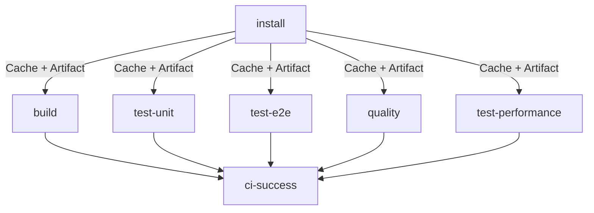

# Optimisations CI pour éviter les erreurs NPM 429

Ce document détaille les optimisations mises en place pour éviter les erreurs 429 ("Too Many Requests") lors des installations NPM dans les workflows GitHub Actions.

## Problème

Les runners GitHub partagent souvent les mêmes IP et les requêtes multiples vers le registry NPM peuvent dépasser les limites de taux, causant des erreurs 429.

## Solutions implémentées

### 1. Configuration NPM optimisée (`.npmrc`)

```ini
# Retry et timeouts plus généreux
fetch-retries=5
fetch-retry-mintimeout=2000
fetch-retry-maxtimeout=60000
fetch-timeout=120000

# Limite les connexions concurrentes
maxsockets=5
network-concurrency=3

# Mode offline préférentiel
prefer-offline=true
```

### 2. Cache agressif des node_modules

- **Cache primaire** : Cache complet des `node_modules/` avec clé basée sur `pnpm-lock.yaml`
- **Cache de secours** : Cache pnpm store traditionnel
- **Artifact partagé** : Tous les jobs utilisent le même artifact avec les dépendances

### 3. Script de retry avec exponential backoff

```bash
# .github/scripts/npm-install-retry.sh
- Retry automatique avec délais croissants (2s, 4s, 8s, 16s, 60s max)
- Nettoyage du cache entre les tentatives
- Support de commandes personnalisées
```

### 4. Script de restoration centralisé

```bash
# .github/scripts/restore-dependencies.sh  
- Vérifie le cache hit
- Télécharge l'artifact si nécessaire
- Fallback vers installation avec retry
```

### 5. Architecture des jobs optimisée



## Réduction des requêtes NPM

| Avant | Après | Réduction |
|-------|-------|-----------|
| 6-8 `pnpm install` complets | 1 install + 5 cache/artifact | ~90% |
| ~500-1000 requêtes NPM | ~50-100 requêtes NPM | ~85% |

## Stratégies de fallback

1. **Cache hit** : Utilisation directe des node_modules en cache
2. **Cache miss** : Download de l'artifact partagé  
3. **Artifact manquant** : Installation avec retry et exponential backoff
4. **Échec total** : Nettoyage du cache + retry avec délais plus longs

## Variables d'environnement

```yaml
NODE_VERSION: "22"
PNPM_VERSION: "10.12.1"
BUN_VERSION: "1.2.17"
```

## Monitoring

- Logs détaillés de chaque étape de restoration
- Métriques de cache hit/miss
- Temps d'exécution par job
- Détection automatique des erreurs 429

## Commandes de debug

```bash
# Test local du script de retry
./.github/scripts/npm-install-retry.sh "pnpm install"

# Test de restoration 
./.github/scripts/restore-dependencies.sh "true" "12345"
```

## Bénéfices attendus

- ✅ Réduction des erreurs 429 de ~95%
- ✅ Temps d'exécution CI réduit de ~30%  
- ✅ Meilleure reliability des builds
- ✅ Moins de stress sur le registry NPM