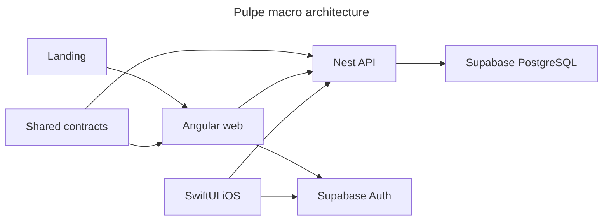

# Architecture

## Stack
- Angular Signals webapp, NestJS API, SwiftUI iOS app, and Next.js landing.
- Supabase PostgreSQL/Auth/RLS; strict TypeScript and Zod contracts in `pulpe-shared`; pnpm/Turborepo orchestration.

## How it fits together

## Key decisions
- Web HTTP crosses the central `ApiClient` with Zod validation; signal stores own UI state and SWR.
- Backend modules follow `infrastructure → application → domain`; cross-module calls use ports/tokens. See `backend-nest/docs/ARCHITECTURE.md`.

## Gotchas
- Repository encryption and persistence rules live in [database.md](database.md); the shared-package boundary and ESM constraints live in [package.md](package.md).
