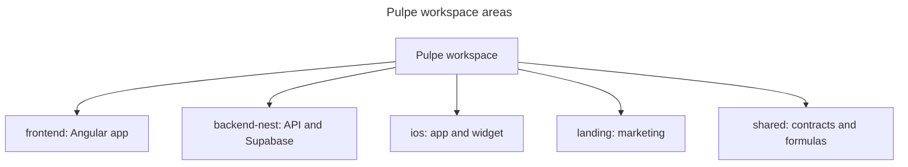

# Codebase Map

## Areas
- `frontend/` renders the authenticated web product; `backend-nest/` owns HTTP, domain use cases, persistence, migrations, and generated DB types.
- `ios/` ships the SwiftUI app/widget; `landing/` is acquisition; `shared/` owns cross-web/API schemas, types, constants, and pure formulas.

## Entry points
- `frontend/projects/webapp/src/main.ts`, `backend-nest/src/main.ts`, `ios/Pulpe/App/PulpeApp.swift`, `landing/app/page.tsx`, `shared/index.ts`.

## Packages
- pnpm workspaces: `pulpe-frontend`, `backend-nest`, `pulpe-landing`, `pulpe-shared`. iOS is outside pnpm.
