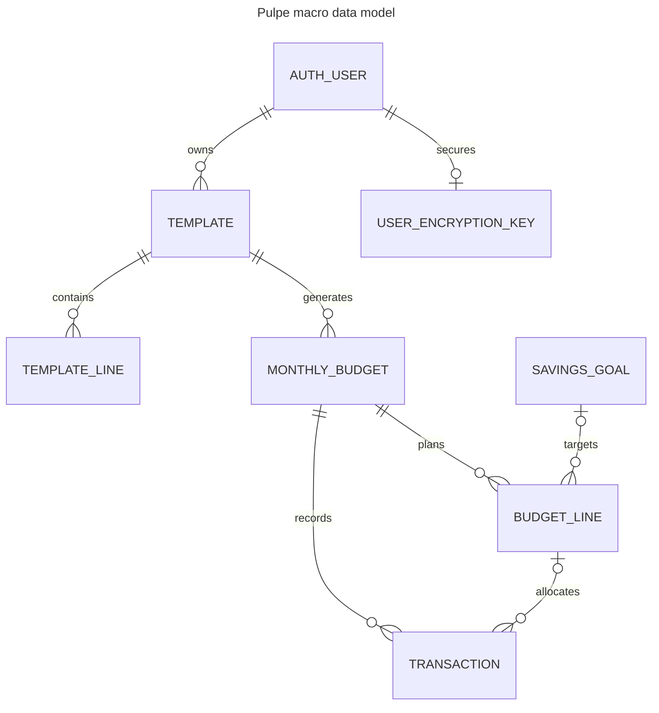

# Database

## Setup
- Supabase PostgreSQL with typed `supabase-js` repositories and no ORM. Current contract: `backend-nest/src/types/database.types.ts`; migrations: `backend-nest/supabase/migrations/`.

## Main entities

## Conventions
- RLS enforces ownership; multi-row invariants use PostgreSQL RPCs. After schema changes run `bun run generate-types:local` in `backend-nest/`.
- Financial amounts are AES-256-GCM ciphertext in `text`; repositories must cross `ENCRYPTION_PORT`. See `docs/ENCRYPTION.md`.
