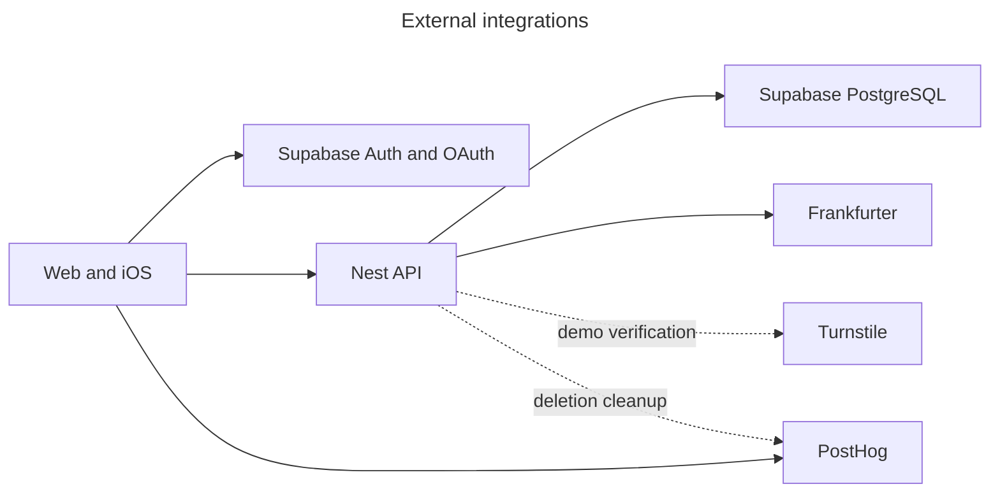

# Integration

## External services
- Supabase provides Auth, PostgreSQL/RLS, and RPCs; Frankfurter provides cached CHF/EUR rates with stale fallback.
- Turnstile protects demo creation; PostHog handles analytics/error tracking and optional account-deletion cleanup.
- Identity providers are detailed in [auth.md](auth.md); clients reach them through Supabase, not the Nest backend.

