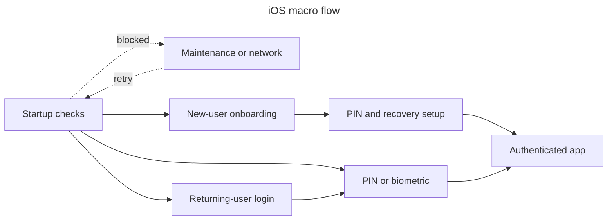

# Mobile

## Platform

- Native iPhone SwiftUI app with strict concurrency; XcodeGen `ios/project.yml` is the project-settings source. Includes a WidgetKit extension and Local/Preview/Prod schemes.
- Android app built with Expo/React Native, Expo Router, TanStack Query and Zustand. It imports TypeScript contracts and calculators from `pulpe-shared`.

## Navigation

- Android follows the same session → vault → authenticated-app gates through Expo Router route groups.

## Native access

- Face ID/Touch ID, Keychain, Sign in with Apple/Google callback, deep links, BackgroundTasks, WidgetKit, and App Group storage. No camera/location/push permission exists.
- Android uses SecureStore, biometric unlock, App Links/deep links and notifications; sensitive data backup is disabled.

## State and storage

- Observable stores with API authority; session/encryption secrets use Keychain/memory. Bounded drafts/preferences use UserDefaults; widget snapshots use App Group UserDefaults.
- Android keeps server state in TanStack Query, app state in Zustand, and the active client key in memory with an optional authenticated SecureStore slot.

## Build and release

- Generate with XcodeGen, build/test through Xcode/GitHub Actions, and export for App Store Connect; no OTA path exists.
- Android uses EAS Build/Workflows, preview APKs and Maestro smoke flows; Expo Updates provides the OTA path within the configured runtime version.
