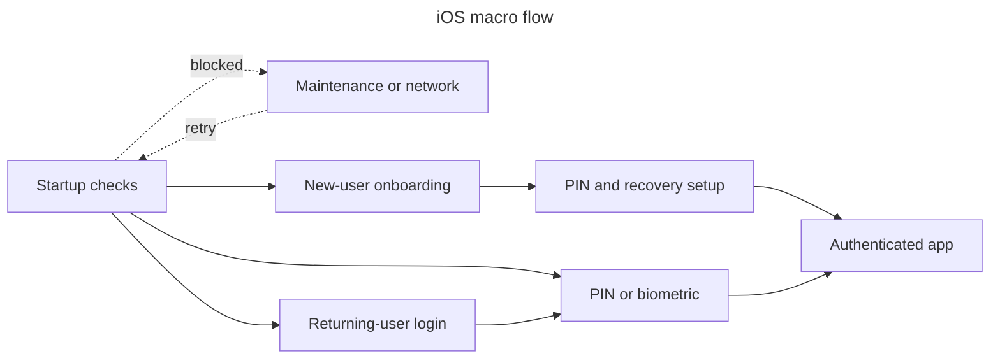

# Mobile

## Platform

- Native iPhone SwiftUI app with strict concurrency; XcodeGen `ios/project.yml` is the project-settings source. Includes a WidgetKit extension and Local/Preview/Prod schemes.

## Navigation

## Native access

- Face ID/Touch ID, Keychain, Sign in with Apple/Google callback, deep links, BackgroundTasks, WidgetKit, and App Group storage. No camera/location/push permission exists.

## UI controls

- Every 1-of-N selector goes through `SegmentedPicker`, a thin wrapper over the native `Picker(.segmented)` — chosen over a hand-built capsule control after an on-device comparison (PR #603) for cross-release stability. `UISegmentedControl` constraints to respect: labels must be plain Text/Image (composed views explode into extra segments), and the selected label's color cannot be styled per instance from SwiftUI (`foregroundStyle` is ignored; only the global UIKit appearance proxy exists) — per-context accent ink is a deliberate concession. A non-nil title must be resolved with `AppLocale.string(...)` before it reaches the wrapper because its `String` title does not localize against Pulpe's explicit app locale.

## State and storage

- Observable stores with API authority; session/encryption secrets use Keychain/memory. Bounded drafts/preferences use UserDefaults; widget snapshots use App Group UserDefaults.

## Build and release

- Generate with XcodeGen, build/test through Xcode/GitHub Actions, and export for App Store Connect; no OTA path exists.
