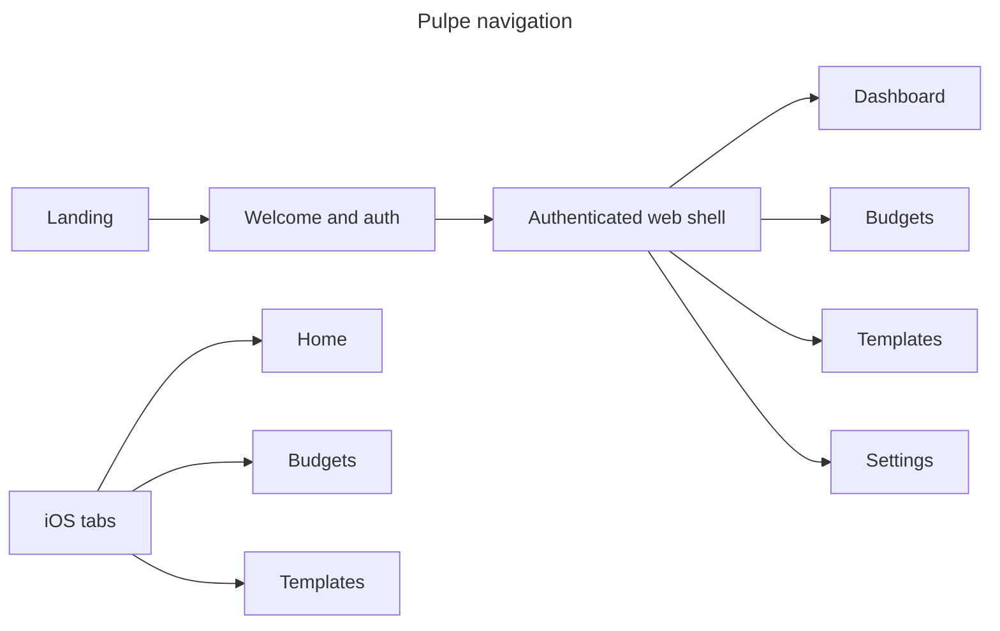

# Navigation

## Routing
- Angular Router uses lazy public/auth and guarded main shells; maintenance, auth, encryption, and budget guards gate access.
- Landing uses Next App Router; iOS uses a three-tab root plus typed stack destinations. Startup lifecycle lives in [mobile.md](mobile.md).

## Structure

