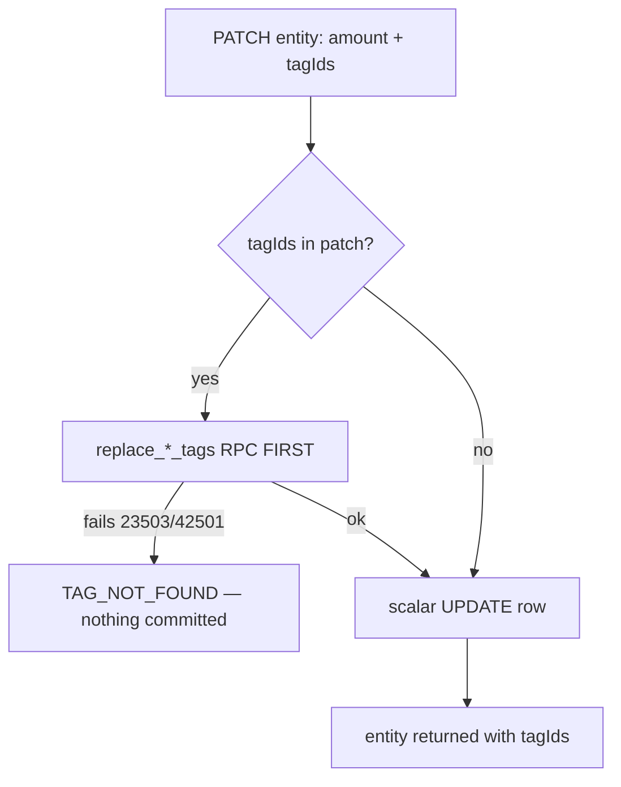

# Instruction: Single-entity tag atomicity (findings #1, #3, #11)

## Architecture projection

> Tree of the final files. ✅ create · ✏️ modify · ❌ delete

```txt
backend-nest/src/modules/
├── budget-line/
│   ├── budget-line.module.ts                                        ✏️ createInfoLoggerProvider(SupabaseBudgetLineRepository.name)
│   └── infrastructure/persistence/
│       ├── supabase-budget-line.repository.ts                       ✏️ #1 reorder update(); #11 check compensating delete error
│       └── supabase-budget-line.repository.spec.ts                  ✏️ repro tests (ordering, cleanup-failure warn)
├── transaction/
│   ├── transaction.module.ts                                        ✏️ createInfoLoggerProvider(SupabaseTransactionRepository.name)
│   └── infrastructure/persistence/
│       ├── supabase-transaction.repository.ts                       ✏️ #1 reorder update(); #11 check compensating delete error
│       └── supabase-transaction.repository.spec.ts                  ✏️ repro tests
└── budget-template/
    ├── budget-template.module.ts                                    ✏️ createInfoLoggerProvider(SupabaseBudgetTemplateRepository.name)
    └── infrastructure/persistence/
        ├── supabase-budget-template.repository.ts                   ✏️ #1 reorder updateLine(); #3 insertLine compensation
        └── supabase-budget-template.repository.spec.ts              ✏️ repro tests
```

## User Journey



## Tasks to do

### `1)` Repro tests first (bug-reporting rule)

> Each bug gets a failing test before its fix.

1. budget-line `update()`: mock tag RPC failure → assert the scalar `.update()` was never called (call-order assertion on the mock client).
2. Same test shape for transaction `update()` and template `updateLine()`.
3. template `insertLine()`: mock `replace_template_line_tags` failure → assert compensating `delete().eq('id', …)` was issued and the tag error rethrown.
4. budget-line + transaction `insert()`: mock tag failure AND compensating delete failure → assert `logger.warn` called with the cleanup error, original tag error still rethrown.

### `2)` Reorder update paths tags-first (#1)

> A tag failure must abort before any scalar write lands.

1. In each of the 3 repositories, move the `replaceTagLinks`/`replaceTemplateLineTags` call BEFORE the scalar `.update()` when the patch carries `tagIds`.
2. Verify a tags-only patch on budget-line/transaction: if `toUpdateRow` can produce an empty row, mirror the template repo's skip-update-and-select branch.
3. Accepted tradeoff: updating a just-deleted entity with non-empty tagIds now surfaces `TAG_NOT_FOUND` (junction FK fires first) instead of `*_NOT_FOUND` — adjust any existing test asserting the old precedence.

### `3)` insertLine compensation (#3)

> A template line without its requested tags must not survive.

1. Wrap the `replaceTemplateLineTags` call in `insertLine()` with the same try/catch + `delete().eq('id', data.id)` + rethrow used by `transaction.insert()` (lines 229-238).

### `4)` Check compensating-delete errors (#11)

> A failed cleanup is logged, never silently discarded.

1. Inject `InfoLogger` into the 3 repositories (precedent: `supabase-account-deletion.repository.ts`, `supabase-user.repository.ts`); add matching `createInfoLoggerProvider` entries in each module.
2. At every compensating delete (budget-line `insert`, transaction `insert`, template `insertLine` from task 3): capture `{ error }`, on failure `logger.warn({ operation, entityId, err }, …)` — warn only, the original tag error is still what's rethrown (log-or-throw rule: warn is the non-blocking exception).

## Test acceptance criteria

| Task | Acceptance criteria |
| ---- | ------------------- |
| 1    | Each new test fails against the current code and passes after its fix. |
| 2    | A tag-replace failure during an update leaves the scalar columns untouched in all 3 repositories. |
| 3    | A tag-replace failure during `insertLine` leaves no `template_line` row behind; the client receives the tag error. |
| 4    | When the compensating delete itself fails, a structured warn is emitted with the cleanup error and the original tag error still reaches the client. |
