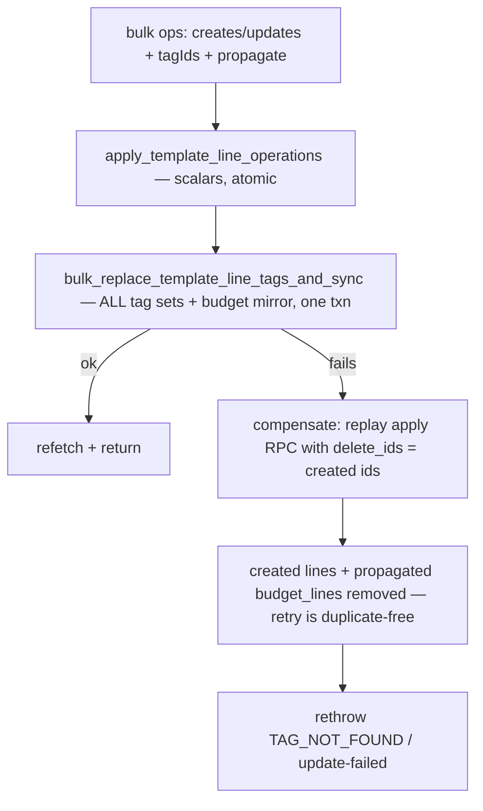

# Instruction: Bulk tag propagation atomicity (findings #2, #6)

## Architecture projection

> Tree of the final files. ✅ create · ✏️ modify · ❌ delete

```txt
backend-nest/
├── supabase/migrations/
│   └── 20260707120000_template_line_tags.sql                        ✏️ UNCOMMITTED — replace sync_template_line_tags_to_budgets
│                                                                       with bulk_replace_template_line_tags_and_sync (single txn)
├── src/modules/budget-template/
│   ├── infrastructure/persistence/
│   │   ├── supabase-budget-template.repository.ts                   ✏️ 1 RPC call instead of Promise.all + sync; compensation for creates
│   │   ├── supabase-budget-template.repository.spec.ts              ✏️ repro tests
│   │   └── schemas/rpc-payload.schemas.ts                           ✏️ strict Zod for p_line_tag_pairs jsonb
│   └── application/bulk-template-line-operations.use-case.spec.ts   ✏️ adjust mocks to new RPC surface
└── src/types/database.types.ts                                      ✏️ regenerated (generate-types:local + bun run format)
```

## User Journey



## Tasks to do

### `1)` Repro tests first

> Duplicate-create and partial-tag scenarios captured before the fix.

1. Bulk create with tags, tag RPC fails → assert compensation replay of `apply_template_line_operations` with `delete_ids` = the generated created ids, then error rethrown (#2).
2. Bulk update of N lines with tags → assert exactly ONE tag RPC round-trip carrying all pairs, not N calls (#6).
3. Compensation replay itself fails → `logger.warn` with cleanup error, original error rethrown (extends phase-1 #11 pattern).

### `2)` Migration: one atomic tag+sync RPC (#6)

> N+2 round-trips become 2; tag replacement and budget mirroring share one transaction.

1. Edit the uncommitted `20260707120000_template_line_tags.sql`: drop `sync_template_line_tags_to_budgets`, add `bulk_replace_template_line_tags_and_sync(p_line_tag_pairs jsonb, p_budget_ids uuid[]) RETURNS void`, `SECURITY INVOKER`, `SET search_path TO 'public'`.
2. Body: loop `jsonb_to_recordset(p_line_tag_pairs) AS x(template_line_id uuid, tag_ids uuid[])` doing delete+insert per line, then the former sync body filtered on those line ids and `p_budget_ids` (skip when empty). Same REVOKE/GRANT block as the siblings.
3. Local apply needs `supabase db reset --local` via the `supabase:reset` script (migration already applied locally) — ask the user before resetting; run Supabase from the main repo, not this worktree.
4. `cd backend-nest && bun run generate-types:local && bun run format` (types file loses semicolons otherwise).

### `3)` Repository: single call + compensation (#2, #6)

> A failed tag step can no longer strand freshly created lines.

1. Add strict Zod schema for the pairs payload in `schemas/rpc-payload.schemas.ts` (uuid checks, `.strict()` — `jsonb_to_recordset` silently nulls unknown keys).
2. In `bulkApplyTemplateLineOperations`, replace the `Promise.all(replaceTemplateLineTags…)` + conditional sync RPC with one `bulk_replace_template_line_tags_and_sync` call.
3. On its failure with `input.createdLines.length > 0`: replay `apply_template_line_operations` with `delete_ids` = created ids, same `budget_ids`, empty updates/creates (removes propagated `budget_line`s too — FK is `ON DELETE SET NULL`, a raw delete would orphan them); warn if the replay fails; rethrow mapped 23503/42501 → `TAG_NOT_FOUND`, else `TEMPLATE_UPDATE_FAILED`.
4. Accepted residual (per finding #6): update-ops' scalar changes stay committed when the tag step fails — user-recoverable by re-editing.

## Test acceptance criteria

| Task | Acceptance criteria |
| ---- | ------------------- |
| 1    | New tests fail on current code, pass after the fix. |
| 2    | `supabase db reset --local` applies cleanly; regenerated types expose the new RPC and no longer expose `sync_template_line_tags_to_budgets`. |
| 3    | A failed bulk tag step leaves no created `template_line` or propagated `budget_line` behind; a user retry produces exactly one line. Tag sets and budget mirroring commit together or not at all. |
