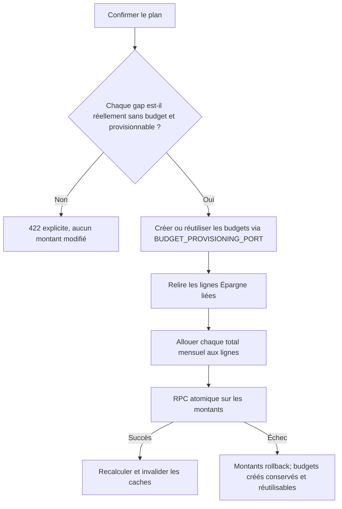

# Instruction: Provisionner et appliquer le plan sans perdre d'intégrité

## Architecture projection

> Tree of the final files. ✅ create · ✏️ modify · ❌ delete

```txt
backend-nest/
├── src/
│   ├── common/constants/error-definitions.ts                         ✏️ erreurs de provisioning explicites
│   ├── modules/
│   │   ├── budget-line/
│   │   │   ├── application/
│   │   │   │   ├── create-budget-line-spread.use-case.ts            ✏️ conserver savingsGoalId
│   │   │   │   ├── spread-budget-line-from-line.use-case.ts         ✏️ transmettre le lien source
│   │   │   │   └── spread-budget-line-from-line.use-case.spec.ts    ✏️ repro ligne Épargne liée
│   │   │   ├── domain/
│   │   │   │   ├── budget-line.entity.ts                            ✏️ lien dans SpreadSourceLine
│   │   │   │   └── ports/budget-line-spread.port.ts                 ✏️ lien optionnel du fan-out
│   │   │   └── infrastructure/persistence/
│   │   │       └── supabase-budget-line.repository.ts               ✏️ lire le lien de la source
│   │   └── savings-goal/
│   │       ├── application/
│   │       │   ├── apply-savings-goal-plan.use-case.ts              ✏️ prévalider, provisionner, allouer, appliquer
│   │       │   ├── get-savings-goal-progress.use-case.ts            ✏️ contexte des gaps
│   │       │   └── get-savings-goal-progress.use-case.spec.ts       ✏️ disponibilité des périodes
│   │       ├── domain/
│   │       │   ├── savings-goal.entity.ts                           ✏️ résultats de provisioning
│   │       │   └── ports/savings-goal-repository.port.ts            ✏️ périodes matérialisées
│   │       ├── infrastructure/persistence/
│   │       │   ├── schemas/rpc-payload.schemas.ts                   ✏️ RPC sans jambe template
│   │       │   ├── schemas/rpc-payload.schemas.spec.ts              ✏️ payload chiffré strict
│   │       │   ├── supabase-savings-goal.repository.ts              ✏️ lecture périodes et apply FX-safe
│   │       │   └── supabase-savings-goal.repository.spec.ts         ✏️ mapping et erreurs
│   │       ├── savings-goal-plan.integration.spec.ts                ✏️ provisioning, retry et rollback des montants
│   │       └── savings-goal.module.ts                               ✏️ ports budget et Mois Type
│   └── types/database.types.ts                                      ✏️ types régénérés
└── supabase/
    ├── migrations/
    │   └── 20260713120000_harden_savings_goal_plan_apply.sql        ✅ RPC sans template, nettoyage FX
    └── tests/apply_savings_goal_plan_guards.sql                     ✏️ guards, FX et signature
shared/src/error-codes.ts                                            ✏️ codes publics de provisioning
```

## User Journey



## Tasks to do

### `1)` Écrire les tests de provisioning avant le correctif

> Prouver le chemin nominal et la frontière d'atomicité.

1. Reproduire un objectif de 24 mois avec deux budgets existants et un Mois Type lié.
2. Vérifier la création des 22 budgets, la propagation du lien, l'allocation et le recalcul unique de chaque budget touché.
3. Vérifier le retry après échec de la RPC : aucun budget dupliqué, montants finaux identiques.
4. Vérifier les refus avant écriture de montants : aucun Mois Type par défaut, ligne du Mois Type non liée, budget existant sans ligne liée, période hors horizon.

### `2)` Alimenter la disponibilité de la timeline

> Construire `isProvisionable` depuis l'état réel du compte.

1. Lire les périodes de `monthly_budget` dans le repository savings-goal.
2. Réutiliser `BUDGET_TEMPLATE_REPOSITORY` pour trouver le Mois Type par défaut et ses lignes liées, sans nouveau service parallèle.
3. Passer ces données au calcul partagé dans `GetSavingsGoalProgressUseCase`.
4. Ne jamais qualifier de provisionnable une période passée ou un budget déjà matérialisé.

### `3)` Provisionner les ajustements manquants

> Convertir les intentions par période en updates de lignes existantes.

1. Injecter `BUDGET_PROVISIONING_PORT` et `BUDGET_TEMPLATE_REPOSITORY` via leurs modules exporteurs.
2. Prévalider le Mois Type lié, les périodes, l'horizon et l'absence de doublon avec les ajustements existants.
3. Appeler `ensureBudgetsForPeriods`, traiter `skippedMonths` comme une erreur métier et invalider le cache même après une mutation partielle.
4. Relire les contributions liées, appliquer `allocateMonthAmountToLines`, fusionner avec les lignes matérialisées et appeler la RPC une fois.
5. Recalculer chaque budget touché une fois, y compris ceux provisionnés.

### `4)` Retirer la jambe template du writer et corriger le FX

> Garder un seul mécanisme d'horizon : des budgets réels.

1. Créer une nouvelle migration; ne pas modifier la migration historique.
2. Remplacer la signature SQL par la jambe `p_line_updates` seule et supprimer le code template du repository.
3. Lors d'un changement de `amount`, conserver `target_currency` et remettre `original_amount`, `original_currency`, `exchange_rate` à `NULL`.
4. Continuer d'accepter uniquement `templateAdjustments: []` à la frontière HTTP pendant la migration des clients.
5. Régénérer les types Supabase locaux.

### `5)` Préserver le rattachement pendant un lissage

> Une Prévision Épargne lissée doit rester contributrice du même objectif.

1. Faire remonter `savingsGoalId` depuis `findSpreadSource` jusqu'au fan-out.
2. Propager le lien sur chaque tranche; garder `null` pour une source non liée et le create additif.
3. Laisser le trigger existant valider `kind=saving` et l'appartenance au même utilisateur.

## Test acceptance criteria

| Task | Acceptance criteria |
| ---- | ------------------- |
| 1 | Le scénario 2/24 crée 22 budgets une seule fois; un retry ne duplique rien. |
| 2 | `/progress` distingue un budget absent provisionnable d'un budget existant non lié. |
| 3 | Une confirmation applique les 24 parts; un échec final garde seulement les budgets provisionnés, jamais des montants partiels. |
| 4 | Toute ligne ajustée perd ses métadonnées FX source, conserve sa devise cible et respecte `fx_metadata_coherent`. |
| 5 | Lisser une Prévision Épargne liée conserve le même `savingsGoalId` sur toutes les tranches. |
