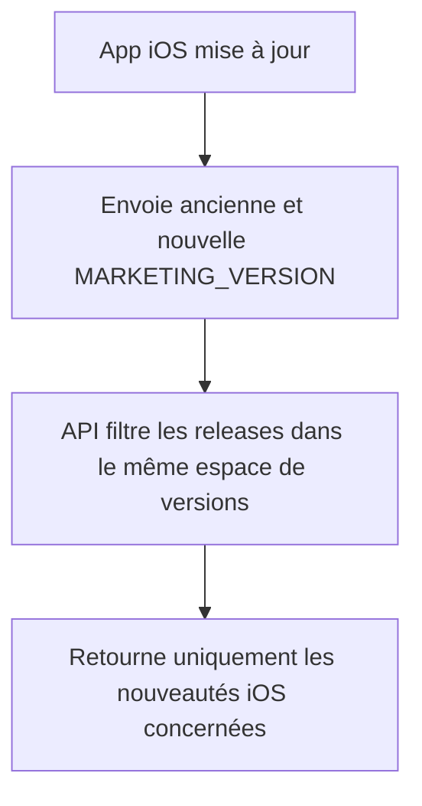

# Instruction: Aligner le contrat et les données sur les versions iOS

## Architecture projection

> Tree of the final files. ✅ create · ✏️ modify · ❌ delete

```txt
.
├── .claude/skills/update-changelog/
│   ├── ✏️ SKILL.md
│   └── references/
│       └── ✏️ ios-release.md
├── backend-nest/src/modules/whats-new/
│   ├── ✏️ releases-data.ts
│   ├── ✏️ whats-new-payload.ts
│   ├── ✏️ whats-new-payload.spec.ts
│   └── ✏️ whats-new.controller.spec.ts
├── landing/data/
│   └── ✏️ releases.json
└── shared/
    └── ✏️ schemas.ts
```

## User Journey



## Tasks to do

### `1)` Rendre la version iOS explicite dans le changelog canonique

> Éliminer toute comparaison entre la version produit et la version du bundle iOS.

1. Ajouter une métadonnée optionnelle de version marketing iOS aux releases qui ciblent iOS.
2. Renseigner les correspondances historiques utiles à partir des tags et de `ios/project.yml`, sans inventer de version lorsque plusieurs releases produit appartiennent au même binaire.
3. Conserver `landing/data/releases.json` comme point d'authoring et ignorer cette métadonnée dans le rendu landing.

### `2)` Filtrer et répondre dans l'espace de versions iOS

> Faire du contrat backend une projection des versions réellement envoyées par l'app.

1. Étendre le type interne des releases avec la version marketing iOS.
2. Filtrer les bornes `lastSeenVersion` et `currentVersion` sur cette valeur.
3. Grouper les éléments qui partagent la même version iOS afin de produire un identifiant/version unique et un ordre chronologique stable.
4. Valider le dataset complet dans les tests, notamment versions, dates et releases iOS sans correspondance exploitable.
5. Adapter le test du contrôleur à une plage réelle `1.x`.

### `3)` Rendre la synchronisation de release impossible à oublier

> Préserver la cohérence lors des futures releases.

1. Faire déterminer et confirmer la future `MARKETING_VERSION` avant l'écriture des notes iOS.
2. Écrire la même métadonnée iOS dans le changelog canonique et son miroir backend.
3. Conserver le comportement `--skip-whats-new` et l'exclusion des releases sans changement visible.
4. Documenter le contrôle de cohérence entre version iOS publiée, données de nouveautés et variable Railway existante.

## Test acceptance criteria

| Task | Acceptance criteria |
| --- | --- |
| 1 | Une release iOS distingue explicitement sa version produit de sa version marketing iOS, sans changer le rendu du changelog public. |
| 2 | Une requête `1.0.4 → 1.1.0` renvoie les notes affectées à `1.1.0`; une plage identique, inversée ou sans nouveauté renvoie une liste vide; tout le dataset est validé par le schéma. |
| 2 | Deux releases produit rattachées au même binaire iOS ne créent ni identifiants SwiftUI dupliqués ni sections de version contradictoires. |
| 3 | La procédure de release ne peut pas publier une entrée iOS sans connaître sa `MARKETING_VERSION`, et les deux copies portent la même valeur. |
