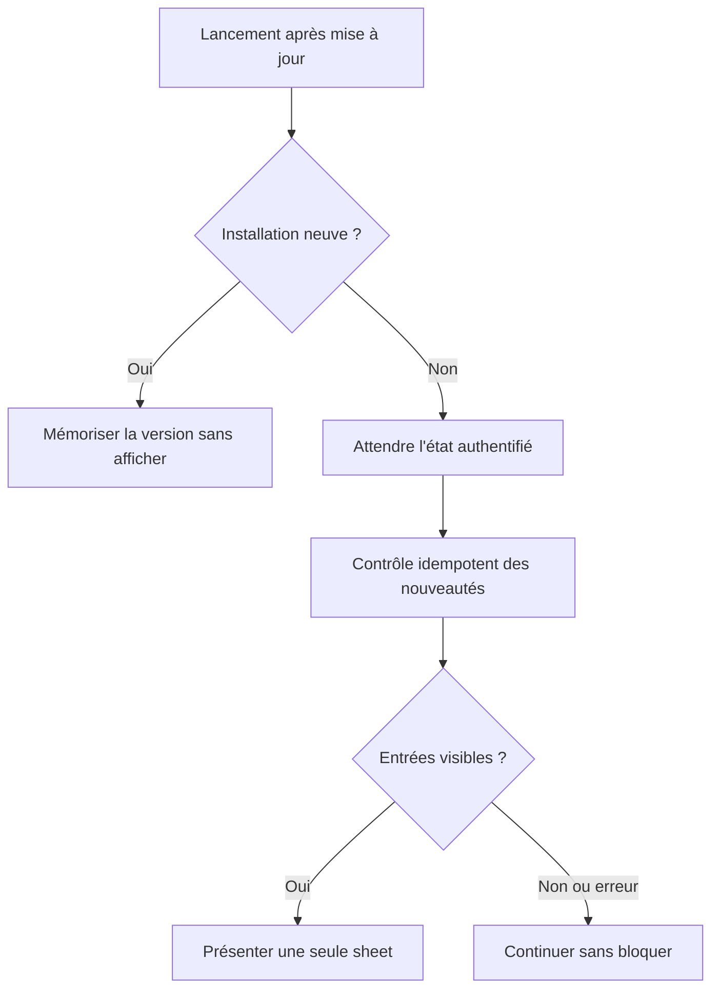

# Instruction: Fiabiliser migration, authentification et idempotence

## Architecture projection

> Tree of the final files. ✅ create · ✏️ modify · ❌ delete

```txt
.
└── ios/
    ├── Pulpe/App/
    │   ├── ✏️ PulpeApp.swift
    │   ├── ✏️ RootViewModifiers.swift
    │   └── ✏️ WhatsNewFlagsStore.swift
    ├── Pulpe/Domain/Store/
    │   └── ✏️ WhatsNewStore.swift
    └── PulpeTests/
        ├── App/
        │   └── ✅ WhatsNewLifecycleTests.swift
        └── Domain/Store/
            └── ✏️ WhatsNewStoreTests.swift
```

## User Journey



## Tasks to do

### `1)` Migrer correctement les installations préexistantes

> Ne plus confondre une mise à jour depuis une version antérieure à PUL-186 avec une installation neuve.

1. Capturer avant le bootstrap si le marqueur `pulpe-has-launched-before` existait déjà.
2. Pour une installation neuve, mémoriser la version courante sans requête ni sheet.
3. Pour une installation préexistante sans clé PUL-186, initialiser une seule fois la baseline de la dernière version iOS publiée avant la feature, puis exécuter le contrôle normal.
4. Préserver le comportement de réinstallation déjà défini par `AppState`.

### `2)` Déclencher après toute authentification réussie

> Couvrir démarrage direct, saisie PIN, biométrie, récupération et connexion après lancement.

1. Sortir le contrôle du seul chemin de fin de `handleAppStart()`.
2. Le déclencher sur la transition vers `.authenticated`, après que le client authentifié est utilisable.
3. Conserver le chargement initial existant sans dupliquer ses responsabilités.
4. Ajouter une preuve d'intégration du callback pour un démarrage verrouillé puis déverrouillé et pour une connexion depuis l'écran login.

### `3)` Garantir une seule requête et un seul événement par présentation

> Fermer le risque de réentrance soulevé dans la PR.

1. Refuser un nouveau contrôle pendant une requête ou lorsqu'une sheet est déjà présentée.
2. Rendre le garde réentrant robuste aux transitions d'authentification rapprochées.
3. N'émettre `ios_whats_new_shown` qu'au passage effectif de caché à présenté.
4. Après dismissal, persister la version affichée et nettoyer les entrées en mémoire.
5. Sur erreur réseau, rester fail-open et permettre une tentative à un prochain déclenchement valide.

## Test acceptance criteria

| Task | Acceptance criteria |
| --- | --- |
| 1 | Une installation neuve reste silencieuse; une installation pré-PUL-186 récupère les notes de la première mise à jour; une réinstallation suit la sémantique first-install existante. |
| 2 | Les parcours démarrage déjà authentifié, PIN, biométrie/récupération et login après lancement atteignent tous exactement le même contrôle post-authentification. |
| 3 | Deux déclenchements concurrents ou un reverrouillage pendant la sheet ne produisent qu'une requête, une présentation et un événement analytique. |
| 3 | Une réponse vide avance le marqueur silencieusement; une erreur ne l'avance pas; un dismissal par bouton ou geste l'avance une seule fois. |
