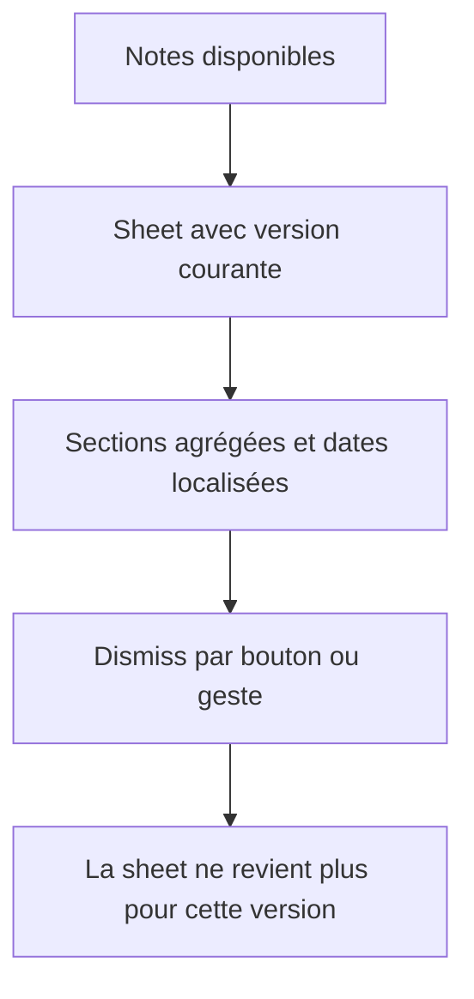

# Instruction: Finaliser la présentation et prouver le parcours complet

## Architecture projection

> Tree of the final files. ✅ create · ✏️ modify · ❌ delete

```txt
.
└── ios/Pulpe/Shared/Components/
    └── ✏️ WhatsNewSheet.swift
```

## User Journey



## Wireframe

```txt
┌─────────────────────────────────────┐
│ (1) Titre de la version courante    │
├─────────────────────────────────────┤
│ (2) Zone défilante                  │
│  Version · date localisée           │
│  • élément de nouveauté             │
│  • élément de correction            │
│                                     │
│  Version · date localisée           │
│  • élément de nouveauté             │
├─────────────────────────────────────┤
│ (3) Action principale de fermeture  │
└─────────────────────────────────────┘
```

1. En-tête: identifie le binaire iOS actuellement installé.
2. Contenu: sépare les versions agrégées et présente leurs dates selon la locale système.
3. Pied: action unique qui termine la lecture.

## Tasks to do

### `1)` Localiser les métadonnées visibles

> Retirer la date ISO brute signalée dans la PR.

1. Parser la date ISO avec les API Foundation existantes.
2. L'afficher avec une `FormatStyle` respectant la locale système.
3. Conserver la chaîne brute comme fallback si le backend renvoie malgré tout une valeur illisible.
4. Préserver Dynamic Type, le scroll, les tokens et `.standardSheetPresentation()`.

### `2)` Vérifier le parcours réel de bout en bout

> Prouver la feature au-delà des tests unitaires isolés.

1. Exécuter build shared, tests backend ciblés, quality backend et quality monorepo.
2. Régénérer le projet iOS si requis, puis exécuter SwiftLint, build iOS et les tests du store/lifecycle concernés.
3. Tester manuellement une mise à jour réelle avec versions marketing cohérentes, d'abord après PIN puis après login.
4. Vérifier single-entry, agrégation de versions sautées, date localisée, erreur réseau, bouton et swipe-to-dismiss.
5. Rejouer la review code/fonctionnelle/pertinence et confirmer que chaque thread PR est corrigé ou explicitement écarté avec preuve.

## Test acceptance criteria

| Task | Acceptance criteria |
| --- | --- |
| 1 | Une agrégation affiche une date naturelle dans la locale système et ne montre l'ISO brut qu'en fallback d'une donnée invalide. |
| 1 | La sheet reste lisible avec Dynamic Type, scrollable, et son bouton conserve une cible tactile conforme. |
| 2 | Les commandes de build, quality et tests ciblés passent, avec leurs résultats consignés dans la review finale. |
| 2 | Sur une mise à jour iOS réelle, la sheet apparaît une fois après authentification, agrège uniquement les notes attendues, puis ne revient plus après dismissal. |
| 2 | La review finale ne contient aucun finding critique ou warning et les quatre threads GitHub disposent d'une conclusion justifiée. |
