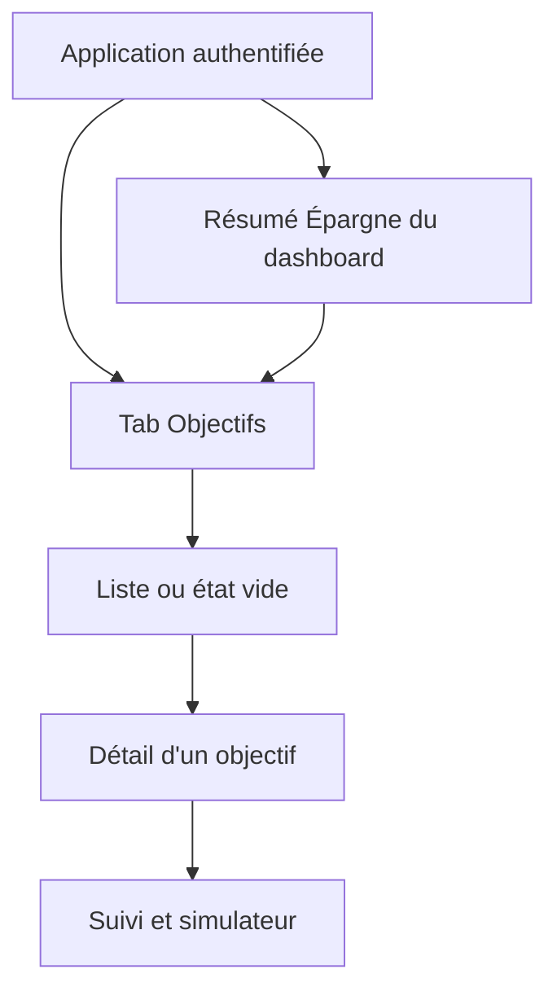

# Instruction: Promouvoir les objectifs dans la navigation principale

## Architecture projection

> Tree of the final files. ✅ create · ✏️ modify · ❌ delete

```txt
.
├── docs/
│   └── SAVINGS.md                                      ✏️ nouvelle décision d'entrée produit
└── ios/
    ├── Pulpe/
    │   ├── App/
    │   │   ├── AppState.swift                          ✏️ tab et chemin Objectifs
    │   │   ├── AppState+SessionReset.swift             ✏️ reset du chemin Objectifs
    │   │   └── MainTabView.swift                       ✏️ quatrième tab et pile dédiée
    │   └── Features/
    │       ├── CurrentMonth/CurrentMonthView.swift     ✏️ raccourci vers le tab
    │       └── SavingsGoals/SavingsGoalsListView.swift ✏️ contrat de navigation racine
    └── PulpeTests/App/
        ├── MainTabViewLayoutTests.swift                ✏️ visibilité et géométrie à quatre tabs
        ├── AppStateLogoutTests.swift                   ✏️ reset de la nouvelle pile
        └── AppStateResetMatrixTests.swift              ✏️ matrice reset/préservation
```

## User Journey



## Wireframe

```txt
┌─────────────────────────────────────┐
│ (1) En-tête de navigation · action  │
├─────────────────────────────────────┤
│ (2) Liste principale ou état vide   │
│  ┌───────────────────────────────┐  │
│  │ (3) Élément d'objectif        │  │
│  └───────────────────────────────┘  │
│                                     │
├─────────────────────────────────────┤
│ (4) Tab A · Tab B · Cible · Tab D   │
└─────────────────────────────────────┘
```

1. En-tête: identité de l'écran et unique action de création.
2. Contenu: racine stable du pilier, quel que soit l'état des données.
3. Élément: résumé scannable ouvrant le détail existant.
4. Navigation: quatre destinations principales avec la cible sélectionnée.

## Tasks to do

### `1)` Étendre l'état de navigation

> Donner au pilier Objectifs une identité et une pile indépendantes.

1. Ajouter le cas Objectifs au modèle `Tab`, avec titre et SF Symbol existants.
2. Ajouter `savingsGoalsPath` à `AppState`.
3. Réinitialiser ce chemin lors des resets qui effacent la navigation.
4. Étendre la règle pure de visibilité de la barre avec la profondeur Objectifs.

### `2)` Installer la racine du tab

> Réutiliser les écrans existants sans dupliquer la feature.

1. Ajouter le quatrième `Tab` dans `MainTabView`.
2. Créer `SavingsGoalsTab` dans le même fichier, avec `NavigationStack(path:)`.
3. Utiliser `SavingsGoalsListView` comme racine et `SavingsGoalDestination.detail` comme push.
4. Masquer la barre flottante sur le détail, tout en conservant son dégagement à la racine.
5. Garder le FAB d'ajout de transaction exclusivement sur Accueil.

### `3)` Unifier les deux points d'entrée

> Faire du dashboard un raccourci vers la même racine.

1. Remplacer le push dashboard par une sélection du tab Objectifs.
2. Vider le chemin Objectifs avant ce changement de tab pour garantir l'arrivée sur la liste.
3. Retirer la destination Objectifs devenue inutile de la pile Accueil.
4. Conserver la destination détail depuis une prévision du tab Budgets.

### `4)` Aligner le contrat et ses tests

> Formaliser le changement de décision produit et protéger les resets.

1. Mettre à jour `docs/SAVINGS.md`: tab principal et raccourci dashboard secondaire.
2. Étendre les scénarios de layout aux quatre tabs et au drill-down Objectifs.
3. Vérifier que logout et resets destructifs vident `savingsGoalsPath`.
4. Vérifier que les expirations prévues pour préserver la navigation la conservent.

## Test acceptance criteria

| Task | Acceptance criteria |
| ---- | ------------------- |
| 1 | `Tab.allCases` expose quatre destinations et chaque reset de navigation traite explicitement le chemin Objectifs. |
| 2 | Un tap sur Objectifs affiche directement la liste; ouvrir un objectif pousse son détail et masque correctement la barre flottante. |
| 3 | « Voir mes objectifs » depuis le dashboard sélectionne le tab Objectifs à sa racine, sans seconde instance de liste dans Accueil. |
| 4 | Les tests de layout, logout et matrice de reset passent avec le nouveau tab et la documentation ne décrit plus une entrée uniquement contextuelle. |
