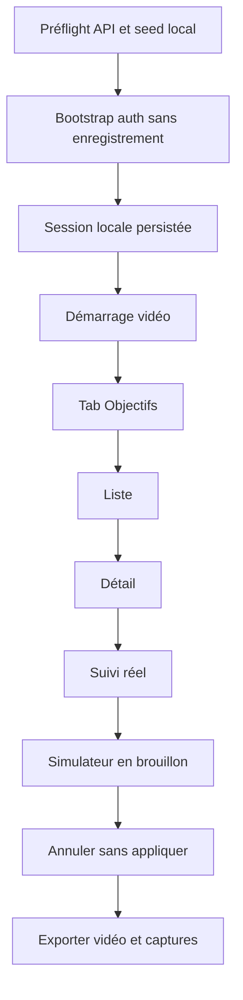

# Instruction: Automatiser une capture réelle et sûre du compte seed

## Architecture projection

> Tree of the final files. ✅ create · ✏️ modify · ❌ delete

```txt
.
├── ios/
│   ├── Pulpe/Features/SavingsGoals/
│   │   ├── SavingsGoalsListView.swift                  ✏️ identifiants d'accessibilité stables
│   │   └── SavingsGoalDetailView.swift                 ✏️ repères détail, suivi et simulateur
│   ├── PulpeUITests/
│   │   ├── SavingsGoalsSeedWorkflowTests.swift         ✅ bootstrap et parcours de capture
│   │   ├── BudgetLineLongPressTests.swift              ✏️ isolation MainActor Swift 6
│   │   ├── LoginFlowTests.swift                        ✏️ isolation MainActor Swift 6
│   │   └── PulpeUITests.swift                          ✏️ isolation MainActor Swift 6
│   └── scripts/
│       └── capture-savings-goals-workflow.sh           ✅ orchestration locale sécurisée
└── artifacts/
    ├── ios-savings-workflow/                           ❌ captures synthétiques devenues ambiguës
    └── ios-savings-workflow-real/
        ├── 01-objectifs-liste.png                      ✅ sortie locale non versionnée
        ├── 02-objectif-detail.png                      ✅ sortie locale non versionnée
        ├── 03-objectif-suivi.png                       ✅ sortie locale non versionnée
        ├── 04-objectif-simulateur.png                  ✅ sortie locale non versionnée
        └── workflow-compte-seed.mp4                    ✅ sortie locale non versionnée
```

## User Journey



## Tasks to do

### `1)` Stabiliser l'automatisation UI

> Cibler la structure, jamais le texte ou des coordonnées fragiles.

1. Ajouter des identifiants d'accessibilité aux racines liste, détail, suivi et simulateur.
2. Ajouter un identifiant déterministe à chaque ligne d'objectif.
3. Isoler les classes XCTest UI sur `MainActor` pour Swift 6.
4. Ajouter un test de bootstrap qui lit uniquement `PULPE_CAPTURE_EMAIL`, `PULPE_CAPTURE_PASSWORD` et `PULPE_CAPTURE_PIN` depuis l'environnement du runner.
5. Ajouter un test distinct, sans secret, qui parcourt et capture les écrans de la feature.

### `2)` Orchestrer le compte seed sans fuite

> Authentifier avant l'enregistrement et nettoyer toute donnée transitoire.

1. Faire échouer le script si une variable requise, Supabase local ou l'API Nest manque.
2. Injecter temporairement les variables dans l'environnement du simulateur sans `set -x`.
3. Exécuter uniquement le test de bootstrap, sans vidéo, et confirmer l'arrivée dans l'app authentifiée.
4. Retirer immédiatement les variables du simulateur avec un `trap`, succès ou échec.
5. Ne jamais écrire les valeurs dans un fichier, une pièce jointe XCTest ou une commande journalisée.

### `3)` Capturer le parcours fonctionnel réel

> Produire des preuves revues sur les données du seed, sans mutation métier.

1. Démarrer `simctl recordVideo` après le bootstrap authentifié.
2. Ouvrir le tab Objectifs, une ligne existante, le suivi et le simulateur.
3. Démontrer la redistribution uniquement dans l'état brouillon.
4. Annuler le simulateur sans appeler l'action d'application.
5. Conserver quatre screenshots XCTest et exporter la vidéo autonome dans le dossier réel.

### `4)` Nettoyer et contrôler les médias

> Ne laisser qu'un jeu de preuves non ambigu et partageable.

1. Vérifier visuellement chaque image et la vidéo.
2. Confirmer l'absence des écrans login/PIN, de l'e-mail et de toute valeur secrète.
3. Supprimer les captures synthétiques et les enregistrements réels incomplets.
4. Garder les médias hors du commit; fournir leurs chemins absolus dans le compte rendu.

## Test acceptance criteria

| Task | Acceptance criteria |
| ---- | ------------------- |
| 1 | Le target `PulpeUITests` compile sous Swift 6 et le parcours utilise des identifiants d'accessibilité stables. |
| 2 | Des variables absentes provoquent un arrêt explicite; après chaque exécution, aucune variable de capture ne subsiste dans le simulateur. |
| 3 | La vidéo commence sur l'app authentifiée, couvre tab → liste → détail → suivi → simulateur et ne modifie aucune donnée persistée. |
| 4 | Les cinq médias réels sont lisibles, ne révèlent aucun identifiant, et aucun média synthétique ou incomplet ne reste à côté. |
