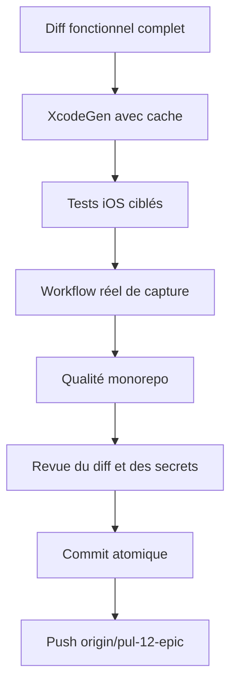

# Instruction: Qualifier, versionner et pousser le périmètre iOS

## Architecture projection

> Tree of the final files. ✅ create · ✏️ modify · ❌ delete

```txt
.
├── ios/Pulpe/Core/Network/Endpoints.swift                         ✏️ diff local des contributions à publier
├── ios/Pulpe/Domain/Models/SavingsGoalProgress.swift              ✏️ modèle de suivi à publier
├── ios/Pulpe/Domain/Services/SavingsGoalService.swift             ✏️ service de suivi à publier
├── ios/Pulpe/Features/SavingsGoals/SavingsGoalDetailView.swift    ✏️ suivi et correction écran blanc à publier
├── ios/PulpeTests/Domain/Models/SavingsGoalProgressCodableTests.swift ✏️ tests de décodage à publier
├── ios/PulpeTests/Features/SavingsGoals/SavingsGoalDetailViewModelTests.swift ✏️ tests de chargement à publier
└── ios/PulpeTests/Helpers/MockSavingsGoalService.swift            ✏️ double de service à publier
```

## User Journey



## Tasks to do

### `1)` Régénérer et tester iOS

> Prouver ensemble le suivi existant et la nouvelle navigation.

1. Exécuter `xcodegen generate --use-cache` depuis `ios`.
2. Relancer les suites progression, simulateur, navigation, logout et reset.
3. Exécuter le workflow UI réel de la phase 2 sur le simulateur local.
4. Exécuter SwiftLint strict sur tous les fichiers iOS touchés.

### `2)` Passer la barrière qualité du dépôt

> Satisfaire les règles obligatoires avant commit.

1. Exécuter `pnpm quality` depuis la racine.
2. Exécuter les tests complémentaires signalés par la qualité ou le diff.
3. Corriger seulement les échecs causés par ce périmètre.
4. Vérifier `git diff --check` et l'absence de secrets dans le diff.

### `3)` Revoir et isoler le contenu publié

> Préserver les changements utilisateur et exclure les médias locaux.

1. Comparer le diff final à `origin/preview` et au plan approuvé.
2. Confirmer que chaque fichier versionné appartient aux objectifs iOS.
3. Exclure `artifacts/` et toute donnée locale de l'index Git.
4. Conserver intacts les changements non liés s'il en apparaît.

### `4)` Commit et push atomiques

> Publier la totalité du gap iOS validé sur la branche demandée.

1. Créer un commit conventionnel unique pour la finalisation iOS des objectifs.
2. Pousser `pul-12-epic` vers `origin` sans force.
3. Vérifier que le SHA distant correspond au commit local.
4. Rapporter le SHA, les commandes de validation et les chemins des médias réels.

## Test acceptance criteria

| Task | Acceptance criteria |
| ---- | ------------------- |
| 1 | XcodeGen est à jour; les suites iOS ciblées, SwiftLint et le workflow réel réussissent. |
| 2 | `pnpm quality` réussit et le diff ne contient ni erreur d'espace ni secret. |
| 3 | L'index Git contient uniquement le code, les tests, le script et la documentation pertinents; `artifacts/` reste local. |
| 4 | `origin/pul-12-epic` pointe sur le commit validé et le compte rendu fournit des preuves reproductibles. |
