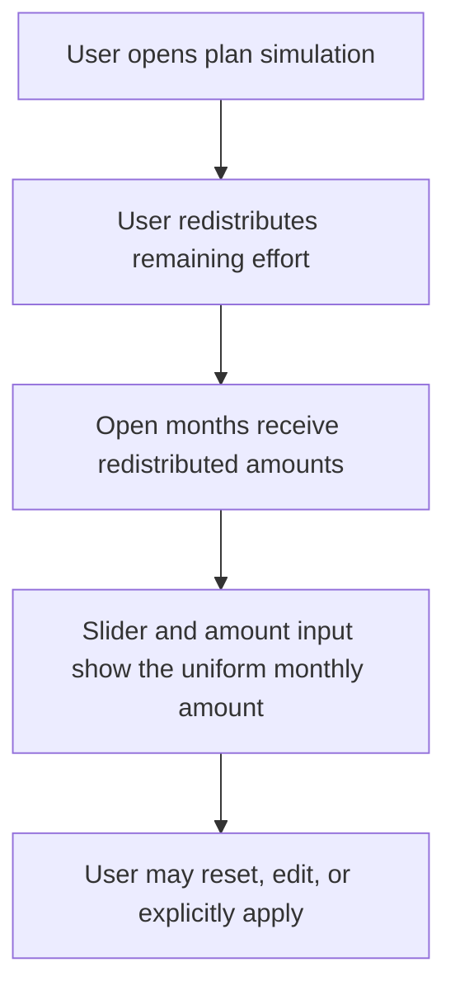

# Instruction: Regress and synchronize redistribution controls

## Architecture projection

> Tree of the final files. ✅ create · ✏️ modify · ❌ delete

```txt
frontend/projects/webapp/src/app/feature/savings-goals/detail/
├── components/
│   └── goal-plan-simulator-toolbar.spec.ts  ✅ observable control regression
└── services/
    ├── goal-plan-simulator-store.ts         ✏️ expose redistributed uniform amount to controls
    └── goal-plan-simulator-store.spec.ts    ✏️ preserve store state and reset semantics
```

## User Journey



## Wireframe

```txt
┌──────────────────────────────────────────────────────────┐
│ (1) Monthly contribution                                 │
│     [──────────────●────────────]  [ (2) Amount input ]  │
│     (3) Projection verdict                               │
│     [ (4) Redistribute ]  [ (5) Reset ]                 │
├──────────────────────────────────────────────────────────┤
│ (6) Month-by-month plan                                  │
│     Month A                                  amount      │
│     Month B                                  amount      │
└──────────────────────────────────────────────────────────┘
```

1. Monthly contribution: existing simulator control group.
2. Amount input: precise numeric representation paired with the slider.
3. Projection verdict: existing feedback for the current simulation.
4. Redistribute: existing action that balances remaining effort.
5. Reset: existing action that restores the baseline simulation.
6. Month-by-month plan: existing detailed representation of simulated amounts.

## Tasks to do

### `1)` Reproduce the stale control state

> Protect the user-observable interaction before changing production behavior.

1. Add a focused toolbar regression that enters simulation with a known required amount.
2. Trigger redistribution and assert the month rows, slider value, and numeric input agree on the redistributed amount.
3. Cover reset and a subsequent direct control edit so existing synchronization remains protected.

### `2)` Keep the control amount in simulator state

> Make successful redistribution publish its uniform per-month amount through the state already consumed by both controls.

1. Retain the redistribution adjustments as the authoritative month-by-month result.
2. Update the control-facing amount only when redistribution succeeds.
3. Preserve non-distributable, reset, direct slider/input, non-uniform, and persistence behavior.

### `3)` Verify the focused behavior

> Prove the regression and surrounding simulator behavior pass together.

1. Run the focused toolbar and simulator-store tests.
2. Run frontend type checking and formatting checks for the touched files.

## Test acceptance criteria

| Task | Acceptance criteria |
| ---- | ------------------- |
| 1 | The regression fails when month rows redistribute but the slider or numeric input retains the previous amount. |
| 1 | Reset and direct control editing remain synchronized with the simulated plan. |
| 2 | A successful uniform redistribution immediately exposes its per-month amount to both controls without applying the plan. |
| 2 | A failed or non-distributable redistribution does not replace the current control amount. |
| 2 | Explicit per-month adjustments remain authoritative, including cent-preserving non-uniform final shares. |
| 3 | Focused tests, frontend type checking, and formatting checks complete successfully. |
