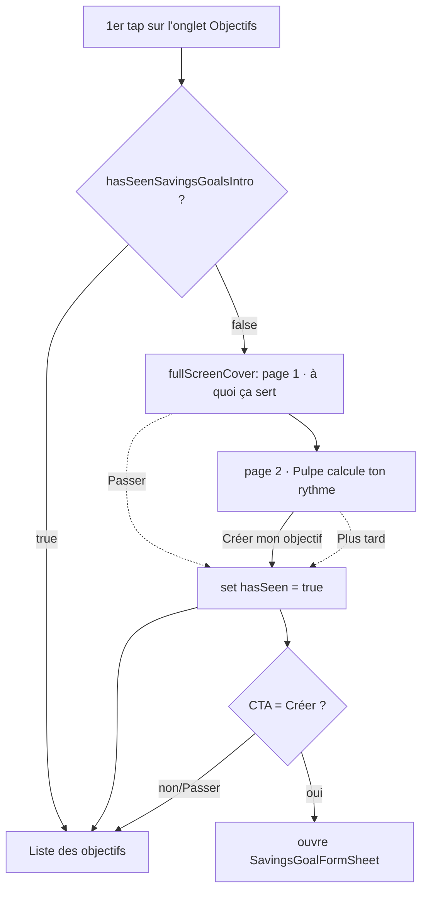

# Instruction: Flux d'intro + gating 1-fois

## Architecture projection

> Tree of the final files. ✅ create · ✏️ modify · ❌ delete

```txt
ios/Pulpe/Features/SavingsGoals/
├── Intro/
│   ├── SavingsGoalsIntroCover.swift        ✅ cover paginé (état, paging, chrome, callbacks, analytics)
│   ├── SavingsGoalsIntroPage.swift         ✅ modèle d'une page + vue page réutilisable (hero symbol, titre, corps, entrée animée)
│   └── SavingsGoalsIntroGate.swift         ✅ fonction pure `shouldPresentIntro(hasSeen:) -> Bool` (testable)
└── SavingsGoalsListView.swift              ✏️ @AppStorage gate + `.fullScreenCover` au 1er appear + CTA → création

ios/Pulpe/Core/Analytics/
└── AnalyticsEvent.swift                    ✏️ 3 cases : intro vue / complétée / passée
```

Aucune suppression. `ios/project.yml` (xcodegen) globbe le dossier `Features/` : les 3 fichiers sont pris automatiquement — régénérer avec `xcodegen generate --use-cache`.

## User Journey



## Wireframe

```txt
┌────────────────────────────────────────┐
│                            (1) Passer → │
│                                         │
│               (2)  ◎  hero              │
│                                         │
│          (3) Titre de la page           │
│       (4) Une ligne why/how, centré     │
│                                         │
│                (5)  ● ○                  │
│      ┌────────────────────────────┐     │
│      │  (6) Suivant / Commencer   │     │
│      └────────────────────────────┘     │
└────────────────────────────────────────┘
```

1. « Passer » (pages 1-2 seulement) → marque vu + dismiss.
2. Aperçu concret par page (carte objectif / lignes de plan réelles), pas une icône ; entrée animée (scale 0.92 + fade).
3. Titre de page (`PulpeTypography.stepTitle`).
4. Une ligne why/how, centrée, `Color.textTertiary` (`PulpeTypography.bodyLarge`).
5. Indicateur 2 points (vocabulaire `OnboardingProgressIndicator`, pas de compteur « x/y »).
6. Bouton `.primaryButtonStyle()` pleine largeur 54pt : « Suivant » (page 1) → « Créer mon objectif » (page 2).

**Contenu des 2 pages** — *montrer, pas raconter* : chaque page = un **aperçu concret** de la vraie feature au-dessus d'un titre + caption court.

| # | Aperçu (hero)                                                                                          | Titre                      | Caption                                                                  |
| - | ----------------------------------------------------------------------------------------------------- | -------------------------- | ------------------------------------------------------------------------ |
| 1 | `IntroGoalCardPreview` — carte objectif réaliste (nom, échéance, barre de progression, montant/cible) | Donne un cap à ton épargne | Fixe un objectif — une somme, une échéance — et suis-le sans calculer.    |
| 2 | `IntroPlanPreview` — 3 `GoalPlanMonthRow` réels (mock) : pointé → ce mois → à venir, cumul qui monte  | Pulpe calcule ton rythme   | Pulpe répartit le montant mois par mois — et tu l'ajustes quand tu veux.  |

> **Décision UX** : aperçus concrets plutôt qu'icône + slogan (retour utilisateur : l'icône-slogan « raconte sans montrer », on ne comprend pas). Le hero réutilise les vrais composants (`GoalPlanMonthRow`, `pulpeCard`, `PulpeChip`) avec données mock, montants dans la devise du user. Le **simulateur** et le **lien prévision→objectif** restent hors intro — non actionnables tant qu'aucun objectif n'existe (apple-design « montre le chemin commun d'abord »).

## Tasks to do

### `1)` Fonction pure du gate

> Isoler la décision « montrer l'intro ? » du SwiftUI pour la tester.

1. Créer `SavingsGoalsIntroGate.swift` : `enum SavingsGoalsIntroGate { static func shouldPresentIntro(hasSeen: Bool) -> Bool { !hasSeen } }`.
2. Exposer la clé `@AppStorage` comme constante partagée (`static let storageKey = "hasSeenSavingsGoalsIntro"`) pour éviter la string dupliquée entre la vue et un futur reset QA.

### `2)` Vue d'une page

> Une page = hero + titre + corps, entrée animée, reduce-motion aware.

1. Créer `SavingsGoalsIntroPage.swift` : un scaffold générique `SavingsGoalsIntroPageView<Preview: View>` (hero = un `@ViewBuilder preview`, titre, caption) + les 2 aperçus concrets `IntroGoalCardPreview` / `IntroPlanPreview` (réutilisent `pulpeCard`, `PulpeChip`, `GoalPlanMonthRow`).
2. Entrée échelonnée `opacity` + `offset(y:)` via `DesignTokens.Animation.entranceSpring`, délais = `index × DesignTokens.Animation.staggerStep` (0.05 s : hero 0 → titre 0.05 → corps 0.10), exemplar `CreateBudgetView` (`.delay(index*0.05 + base)`). **Scale d'entrée jamais depuis 0** (emil « never scale(0) ») : si scale, plancher ≥ 0.8 + opacité — jamais `scale(0)`.
3. **Reduce-motion ≠ zéro motion** (apple-design §14 / emil a11y) : `@Environment(\.accessibilityReduceMotion)` → supprimer `offset`/spring mais **garder un fondu d'opacité court** (`.easeOut(DesignTokens.Animation.fast)`), pas d'apparition sèche.
4. Réutiliser exclusivement `DesignTokens.Spacing/*`, `DesignTokens.Animation/*`, `PulpeTypography.*`, `Color.textPrimary/textTertiary` — aucune valeur brute (cf. règle no-magic-design-values ; si une valeur manque, l'ajouter au token, pas l'inliner).

### `3)` Cover paginé + chrome

> Le conteneur immersif qui enchaîne les 3 pages.

1. Créer `SavingsGoalsIntroCover.swift` : `TabView(selection:)` `.tabViewStyle(.page(indexDisplayMode: .never))` sur les 3 `IntroPage`, `@State currentIndex`. Le swipe entre pages est le paging natif `.page` — **interruptible + velocity de série** (apple-design §3), ne pas le ré-implémenter à la main.
2. Overlay chrome : indicateur 2 points custom (dernier point = page courante) + bouton primaire bas. **Échappatoire toujours dispo** (apple-design §16 agency/wayfinding) : « Passer » haut-droite page 1, et sur la page 2 (dernière) une sortie discrète « Plus tard » à côté du CTA (l'utilisateur qui a déjà des objectifs, créés sur le web, ne doit pas être forcé de créer).
3. Bouton primaire : « Suivant » avance `currentIndex` via `withAnimation(DesignTokens.Animation.stepTransition)` (token dédié aux transitions d'étape, pas `.smooth`) ; page 2 (dernière), libellé « Créer mon objectif » → `onComplete(createGoal: true)`. Press feedback déjà fourni par `.primaryButtonStyle()` (opacity-dim, idiome app) — **ne pas ajouter de `scale`** (romprait la cohérence).
4. « Passer » / « Plus tard » → `onComplete(createGoal: false)` (skipped). Fond `pulpeBackground()` (sobre, authentifié), pas de brand-glow.
5. `.trackScreen("SavingsGoals_Intro")` + `AnalyticsService.shared.capture(.savingsGoalsIntroViewed)` à l'apparition ; `.savingsGoalsIntroCompleted` / `.savingsGoalsIntroSkipped` selon la sortie.

### `4)` Événements analytics

> Suivre la découverte (funnel PostHog).

1. `AnalyticsEvent.swift` : ajouter `case savingsGoalsIntroViewed = "savings_goals_intro_viewed"`, `savingsGoalsIntroCompleted = "savings_goals_intro_completed"`, `savingsGoalsIntroSkipped = "savings_goals_intro_skipped"` (miroir de `welcomeScreenViewed`).

### `5)` Branchement dans la liste

> Déclencher le cover au 1er accès, une seule fois.

1. `SavingsGoalsListView` : `@AppStorage(SavingsGoalsIntroGate.storageKey) private var hasSeenIntro = false` + `@State private var showIntro = false`.
2. `.onAppear` (ou `.task`) : `showIntro = SavingsGoalsIntroGate.shouldPresentIntro(hasSeen: hasSeenIntro)` — indépendant du nombre d'objectifs et de l'état loading/erreur.
3. `.fullScreenCover(isPresented: $showIntro)` → `SavingsGoalsIntroCover { createGoal in hasSeenIntro = true; showIntro = false; if createGoal { isCreatingGoal = true } }`.
4. Régénérer le projet : `xcodegen generate --use-cache`.

## Test acceptance criteria

| Task | Acceptance criteria                                                                                                       |
| ---- | ------------------------------------------------------------------------------------------------------------------------ |
| 1    | `shouldPresentIntro(hasSeen: false) == true` et `shouldPresentIntro(hasSeen: true) == false`.                            |
| 2    | Chaque page affiche hero + titre + corps ; en reduce-motion l'entrée est un fondu d'opacité court (pas de slide/offset ni spring, mais pas d'apparition sèche non plus). |
| 3    | Le cover enchaîne 2 pages (swipe natif interruptible + « Suivant ») ; page 2 = « Créer mon objectif » + sortie « Plus tard » ; une échappatoire est atteignable sur chaque page. |
| 4    | Les 3 événements sont émis aux bons moments (vue à l'ouverture, completed vs skipped selon la sortie).                    |
| 5    | 1er accès à l'onglet Objectifs → cover ; après sortie, un 2e accès ne le remontre pas ; « Créer mon objectif » ouvre le form. |
