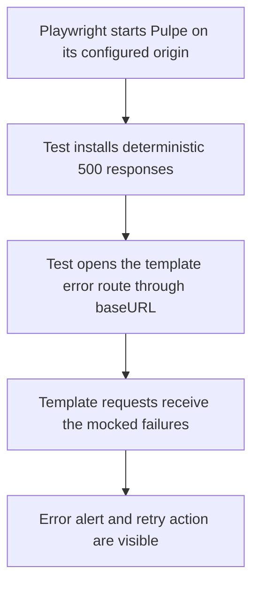

# Instruction: Make template error navigation hermetic

## Architecture projection

> Tree of the final files. ✅ create · ✏️ modify · ❌ delete

```txt
frontend/e2e/tests/features/
└── template-details-view.spec.ts  ✏️ resolve error-flow navigation through Playwright baseURL
```

## User Journey



## Tasks to do

### `1)` Remove the environment-coupled navigation

> Ensure the test always opens the Pulpe server owned by its Playwright configuration.

1. Keep the two error routes registered before navigation.
2. Replace the absolute `localhost:4200` page URL with the equivalent route resolved from Playwright `baseURL`.
3. Preserve the existing user-visible assertions for the error alert and retry action.
4. Do not change the CSP test's explicit localhost origin, the application component, global API mocks, or CI retry policy.

### `2)` Prove stability without retry masking

> Demonstrate deterministic behavior under the alternate origin that exposed the defect and in the complete feature suite.

1. Run the focused error scenario on a non-default Pulpe port with retries disabled and twenty repetitions.
2. Confirm every focused navigation remains on the configured Pulpe origin and every repetition reaches the mocked error state.
3. Run the complete `Feature Tests (Mocked)` project with retries disabled.
4. Run repository quality checks and inspect the final diff for unrelated changes.

## Test acceptance criteria

| Task | Acceptance criteria |
| ---- | ------------------- |
| 1 | The loading-error scenario resolves its navigation from Playwright `baseURL`; no fixed application origin remains in that scenario. |
| 1 | Both template endpoints still return deterministic failures before the page asserts its user-visible error state. |
| 1 | The alert contains `Une erreur est survenue`, and the enabled `Réessayer le chargement` action remains visible. |
| 2 | The focused scenario passes 20 out of 20 repetitions on a non-default port with zero retries. |
| 2 | The complete mocked feature project passes with zero retries. |
| 2 | Repository quality checks pass, and the implementation diff touches only the planned E2E spec. |
