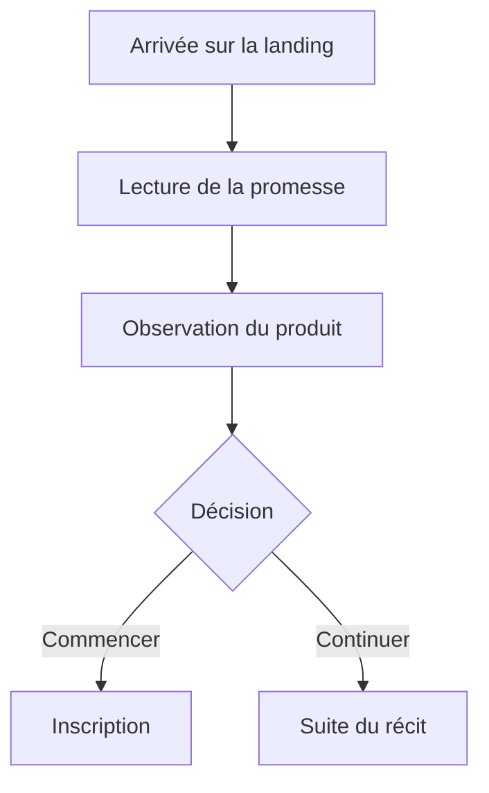

# Instruction: Fondation visuelle, navbar et hero

## Architecture projection

> Tree of the final files. ✅ create · ✏️ modify · ❌ delete

```txt
landing/
├── DESIGN.md ✏️
├── app/
│   ├── accessibility.test.tsx ✏️
│   └── globals.css ✏️
└── components/
    ├── sections/
    │   ├── Header.tsx ✏️
    │   └── Hero.tsx ✏️
    └── ui/
        ├── Button.tsx ✏️
        ├── Card.tsx ✏️
        ├── FadeIn.tsx ✏️
        ├── HeroDashboard.tsx ✏️
        └── Screenshot.tsx ✏️
```

## User Journey



## Wireframe

```txt
Desktop
┌─────────────────────────────────────────────────────┐
│ (1) Marque       navigation              action     │
├─────────────────────────────────────────────────────┤
│       (2) Repère · titre · explication · action     │
│                                                     │
│       (3) Démonstration produit large et visible    │
└─────────────────────────────────────────────────────┘

Mobile
┌──────────────────────────┐
│ (1) Marque          menu │
├──────────────────────────┤
│ (2) Titre · texte · action│
│ (3) Démonstration produit│
└──────────────────────────┘
```

## Tasks to do

### `1)` Poser la direction visuelle

> Adapter les mécanismes observés à la DA Pulpe.

1. Définir dans `globals.css` un champ vert radial doux pour le hero puis une transition tonale vers le contenu neutre, sans grille bidirectionnelle ni texture ajoutée.
2. Garder Poppins; limiter les titres à `letter-spacing: -0.04em`, équilibrer leurs retours et conserver des paragraphes de 65–75 caractères sur desktop.
3. Réserver le verre à la navbar et choisir, pour les autres surfaces, soit un contour discret soit une ombre courte et étagée, jamais un contour plein avec une large ombre diffuse.
4. Remplacer les rebonds par une courbe sans dépassement, des transitions ciblées de 150–300 ms et la pression existante à `scale(0.96)`.
5. Documenter uniquement ces règles landing durables dans `landing/DESIGN.md`, y compris leur variante `prefers-reduced-motion`.

### `2)` Fiabiliser les primitives visuelles

> Donner un rendu cohérent avant de recomposer les sections.

1. Faire de `FadeIn` une amélioration progressive: contenu visible sans JavaScript, animation sélective du hero, du produit et des vraies séquences seulement.
2. Ramener les cartes principales à 12–16 px de rayon, avec rayons imbriqués concentriques et sans effet vitré.
3. Conserver sur `Button` les transitions de propriétés explicites, le focus visible, la cible minimale de 44 px et la pression à `scale(0.96)`.
4. Harmoniser `HeroDashboard` et `Screenshot` avec des dimensions réservées, un contour `black/10`, une hiérarchie de rayons cohérente et aucun cumul bordure + ombre large.

### `3)` Recomposer la navbar

> Donner la priorité à la marque, aux ancres utiles et à une seule action.

1. Élargir le conteneur flottant, centrer les liens desktop et conserver l'état compact au scroll.
2. Transformer le mobile en barre marque/menu puis panneau de navigation lisible.
3. Préserver les routes, le tracking, la croix animée existante, le clavier, le focus, les cibles de 44 px et la fermeture au scroll.
4. Réserver un décalage aux ancres pour que le header sticky ne masque aucun titre.

### `4)` Recomposer le hero

> Afficher promesse, explication, action et preuve produit dans cet ordre.

1. Centrer le récit et conserver une seule action dominante; le lien vers la suite reste textuel et visuellement secondaire.
2. Placer `HeroDashboard` sous le copy comme démonstration large, avec des données de démonstration neutres et les preuves factuelles existantes.
3. Éviter toute moitié vide sur desktop et garantir que la preuve produit est visible avant l'animation comme après hydratation.
4. Supprimer la répétition des petits kickers en capitales; garder au plus une ligne de confiance réellement utile dans le hero.

## Test acceptance criteria

| Task | Acceptance criteria |
| ---- | ------------------- |
| 1 | Le fond coloré reste dans la zone émotionnelle et rejoint un contenu neutre sans rupture dure; aucun serif, violet, quadrillage décoratif ou grain supplémentaire n'est introduit. |
| 2 | Le contenu reste visible sans JavaScript; cartes, boutons et captures respectent rayons, focus, dimensions réservées et mouvement réduit sans nouvelle dépendance. |
| 3 | La navbar reste utilisable au clavier, lisible après scroll et sans débordement à 375 px; ses ancres ne sont pas couvertes et son action conserve l'URL et le tracking existants. |
| 4 | Le hero expose promesse, explication, action et produit dans cet ordre; la preuve ne dépend pas d'une animation et la composition reste pleine à 1440×900 comme à 390×844. |
