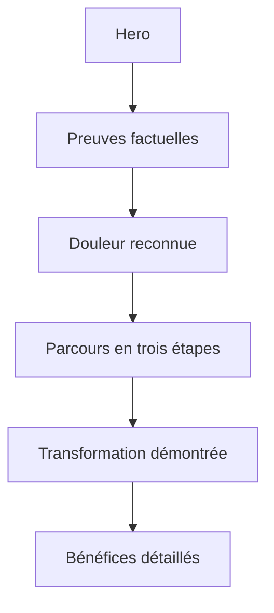

# Instruction: Récit principal et parcours en trois étapes

## Architecture projection

> Tree of the final files. ✅ create · ✏️ modify · ❌ delete

```txt
landing/
├── app/page.tsx ✏️
└── components/sections/
    ├── PainPoints.tsx ✏️
    ├── HowItWorks.tsx ✏️
    └── Solution.tsx ✏️
```

## User Journey



## Wireframe

```txt
Desktop
┌─────────────────────────────────────────────────────┐
│ (1) Preuve 1       preuve 2       preuve 3          │
├─────────────────────────────────────────────────────┤
│ (2) Situation dominante · contraste · 2 appuis      │
├─────────────────────────────────────────────────────┤
│ (3) Étape 1        étape 2        étape 3           │
├─────────────────────────────────────────────────────┤
│ (4) Transformation · preuve visuelle                │
└─────────────────────────────────────────────────────┘

Mobile
┌──────────────────────────────┐
│ (1) Preuves empilées         │
│ (2) Situation puis contraste │
│ (3) Étapes empilées          │
│ (4) Preuve visuelle          │
└──────────────────────────────┘
```

## Tasks to do

### `1)` Réordonner le récit

> Faire suivre le hero par preuve, problème, mécanisme puis transformation.

1. Réordonner les sections dans `page.tsx` sans changer leurs responsabilités externes.
2. Remplacer la grille uniforme de `PainPoints` par une situation vécue dominante, un contraste Pulpe et deux appuis factuels plus sobres.
3. Faire suivre chaque module par situation concrète → contraste précis → résultat, sans question rhétorique ou kicker en capitales systématique.
4. Utiliser uniquement des faits produit établis; ne créer ni chiffre, avis, note ou témoignage.

### `2)` Montrer le mécanisme en trois étapes

> Rendre l'usage compréhensible sans lire une liste de fonctionnalités.

1. Ramener `HowItWorks` à trois étapes orientées résultat.
2. Associer chaque étape à une capture existante et à un texte concis.
3. Réserver les marqueurs numérotés à cette vraie séquence; présenter les étapes en ligne sur desktop et séquentiellement sur mobile.
4. Animer au plus la progression utile entre les étapes, jamais chaque texte et chaque carte de la section.

### `3)` Créer la transition vers les bénéfices

> Faire de `Solution` une respiration qui prouve la transformation.

1. Conserver la vue annuelle comme preuve principale.
2. Centrer le texte sur le résultat utilisateur et conserver la respiration sans ajouter un second bloc de conversion dominant.

## Test acceptance criteria

| Task | Acceptance criteria |
| ---- | ------------------- |
| 1 | La lecture suit preuve → problème → mécanisme → résultat; le copy varie sa cadence, n'empile pas des cartes identiques et chaque affirmation est traçable à Pulpe. |
| 2 | Trois étapes sont visibles simultanément sur desktop et lues dans le bon ordre sur mobile; chaque visuel garde son ratio, ses dimensions réservées et son texte alternatif. |
| 3 | La transition sépare clairement explication et bénéfices, sans dupliquer le hero ni introduire un deuxième CTA dominant. |
