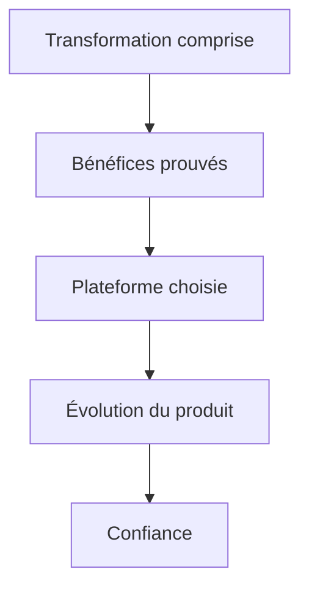

# Instruction: Bénéfices, plateformes et roadmap

## Architecture projection

> Tree of the final files. ✅ create · ✏️ modify · ❌ delete

```txt
landing/components/sections/
├── Features.tsx ✏️
├── Platforms.tsx ✏️
└── Roadmap.tsx ✏️
```

## User Journey



## Wireframe

```txt
Desktop
┌─────────────────────────────────────────────┐
│ (1) Bénéfice principal · grand visuel       │
├──────────────────────┬──────────────────────┤
│ (1) Bénéfice + visuel│ (1) Bénéfice + visuel│
└──────────────────────┴──────────────────────┘
┌──────────────────────────────┬───────────────┐
│ (2) Plateforme principale    │ alternatives  │
└──────────────────────────────┴───────────────┘
┌──────────────┬──────────────┬───────────────┐
│ (3) Livré    │ en cours     │ ensuite       │
└──────────────┴──────────────┴───────────────┘
```

## Tasks to do

### `1)` Transformer les fonctionnalités en preuves

> Remplacer la longue alternance sans retomber dans une grille de cartes générique.

1. Composer trois modules à partir des capacités et captures existantes: un bénéfice principal large puis deux preuves secondaires.
2. Suivre situation ou tension concrète → réponse Pulpe → résultat, en variant les ouvertures plutôt qu'en répétant une question.
3. Donner une hiérarchie asymétrique aux visuels et laisser certains contenus sur le fond de section au lieu d'encarter chaque élément.
4. Ancrer les captures sans multiplier ombres, animations, effets vitrés ou couleurs décoratives.

### `2)` Clarifier les plateformes

> Montrer immédiatement où Pulpe est utilisable.

1. Garder iOS comme plateforme principale et Web comme accès immédiat.
2. Maintenir Android comme information secondaire sans faux appel à l'action.
3. Éviter trois cartes de même poids: une plateforme dominante, une action Web claire et Android comme statut textuel.

### `3)` Compacter la roadmap

> Conserver la transparence produit sans casser le rythme de conversion.

1. Garder les trois états mais les présenter comme une progression compacte plutôt que trois cartes interchangeables.
2. Raccourcir chaque item à un bénéfice vérifiable.
3. Préserver le lien vers le changelog et des marqueurs accessibles qui ne dépendent pas uniquement de la couleur.

## Test acceptance criteria

| Task | Acceptance criteria |
| ---- | ------------------- |
| 1 | Les trois bénéfices ont une hiérarchie perceptible sur desktop et s'enchaînent à 375 px; aucun visuel n'est rogné, répété sans fonction ou caché avant animation. |
| 2 | iOS, Web et Android ont une hiérarchie explicite sans trois cartes équivalentes; chaque action mène vers sa destination existante. |
| 3 | Livré, en cours et ensuite forment une progression compacte et restent distinguables sans dépendre uniquement de la couleur. |
