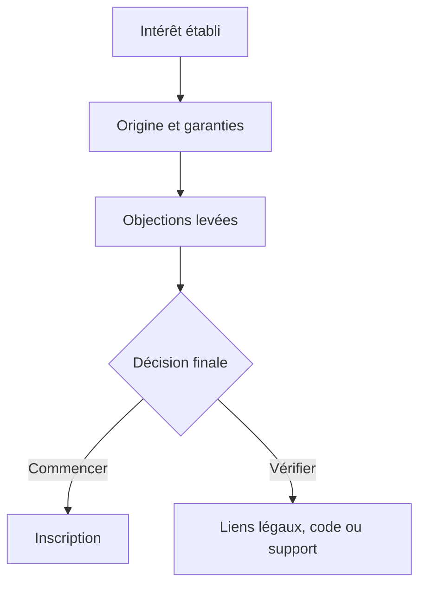

# Instruction: Confiance, conversion finale et cohérence SEO

## Architecture projection

> Tree of the final files. ✅ create · ✏️ modify · ❌ delete

```txt
landing/
├── app/layout.tsx ✏️
└── components/sections/
    ├── WhyFree.tsx ✏️
    ├── FAQ.tsx ✏️
    ├── FinalCTA.tsx ✏️
    └── Footer.tsx ✏️
```

## User Journey



## Wireframe

```txt
┌─────────────────────────────────────────────────────┐
│ (1) Origine du produit · garanties vérifiables      │
├─────────────────────────────────────────────────────┤
│ (2) Questions et réponses                           │
├─────────────────────────────────────────────────────┤
│ (3) Promesse finale · action                        │
├─────────────────────────────────────────────────────┤
│ (4) Marque · liens légaux · changelog · contact     │
└─────────────────────────────────────────────────────┘
```

## Tasks to do

### `1)` Humaniser la confiance

> Expliquer l'origine de Pulpe et ses garanties avec des faits.

1. Recomposer `WhyFree` comme note du créateur suivie des preuves confidentialité, hébergement et open source.
2. Supprimer toute citation, métrique, note, volume d'utilisateurs ou garantie qui ne peut pas être étayée.
3. Présenter ces preuves sans nouvelle rangée de cartes identiques ni effet vitré.

### `2)` Lever les objections

> Aligner la FAQ sur les hésitations révélées par le nouveau récit.

1. Garder les réponses courtes, directes et en tutoiement.
2. Préserver la sémantique, le clavier et les états de l'accordéon.
3. Vérifier que le header sticky ne couvre pas la question ciblée par une ancre ou le focus.

### `3)` Fermer le parcours

> Terminer par une promesse cohérente et une action unique.

1. Réécrire `FinalCTA` sans témoignage non vérifié et garder les garanties factuelles.
2. Simplifier le footer sans retirer les accès légaux, support, changelog et contact.
3. Aligner metadata, Open Graph, Twitter et JSON-LD dans `layout.tsx` sur la promesse finale.
4. Vérifier type-check, tests et build après restauration des dépendances existantes.
5. Valider exclusivement la landing sur `http://localhost:3001/` à 375×812, 390×844, 768×1024, 1024×768, 1440×900 et en paysage 844×390.
6. Contrôler à 200 % de zoom, au clavier et avec `prefers-reduced-motion`: aucun débordement horizontal, contenu masqué, ancre couverte ni saut dû à une image sans dimensions réservées.

## Test acceptance criteria

| Task | Acceptance criteria |
| ---- | ------------------- |
| 1 | La section confiance ne contient que des faits cohérents avec le dépôt et ne présente aucun témoignage comme preuve sans source. |
| 2 | Chaque question est actionnable au clavier, annonce correctement son état, n'est pas couverte par le header et reste lisible à 200 % de zoom. |
| 3 | La promesse visible, les metadata et le JSON-LD racontent le même bénéfice; les CTA conservent leur tracking; tests, type-check et build passent; la matrice responsive de `localhost:3001` ne révèle ni débordement ni contenu dépendant d'une animation. |
