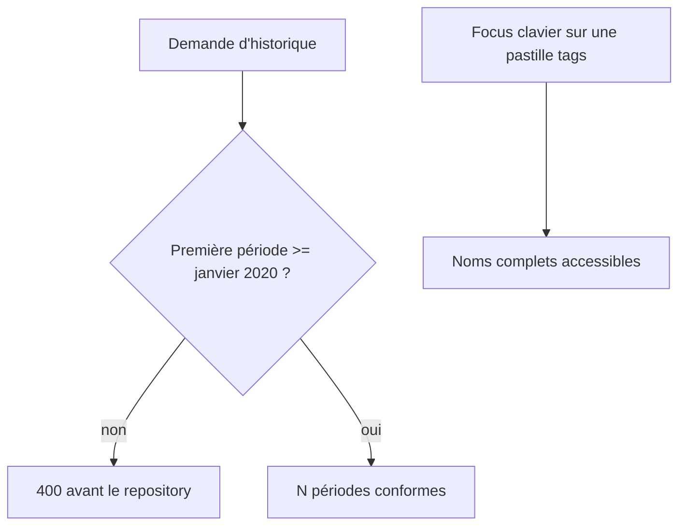

# Instruction: Fermer le contrat historique et l'accessibilité

## Architecture projection

> Tree of the final files. ✅ create · ✏️ modify · ❌ delete

```txt
shared/
├── schemas.ts                                                       ✏️ borner la première période et actualiser le commentaire tags
└── src/tag-schema.spec.ts                                           ✏️ reproduire les fenêtres minimale invalide et valide
frontend/projects/webapp/src/app/ui/tag-indicator/
├── tag-indicator.ts                                                 ✏️ rendre le tooltip focusable et sémantique
└── tag-indicator.spec.ts                                            ✏️ couvrir clavier, rôle et noms accessibles
```

## User Journey



## Tasks to do

### `1)` Reproduire et fermer la frontière temporelle

> Une requête acceptée ne doit jamais produire une réponse hors schéma.

1. Ajouter d'abord le test qui rejette `months=24`, `endMonth=1`, `endYear=2020`.
2. Ajouter le voisin valide minimal: 24 mois finissant en décembre 2021, donc commençant en janvier 2020.
3. Raffiner `tagHistoryQuerySchema` à partir de l'index de la première période, avec une erreur attachée à la fenêtre et sans modifier les horizons autorisés.

### `2)` Rendre l'indicateur de tags utilisable au clavier

> Les noms cachés dans le tooltip doivent être atteignables sans souris.

1. Écrire le test d'attributs avant la correction.
2. Reprendre le pattern existant des badges avec tooltip: rôle non interactif adapté, `tabindex="0"`, label complet et focus visible conservé.
3. Garder le comportement vide, tactile et compact inchangé.

### `3)` Supprimer la documentation périmée

> Les commentaires décrivent le code présent, pas d'anciennes PRs futures.

1. Mettre le commentaire des schemas tags au présent.
2. Conserver uniquement les invariants utiles: plaintext du nom, unicité utilisateur et junctions prises en charge.

## Test acceptance criteria

| Task | Acceptance criteria |
| --- | --- |
| 1 | La fenêtre 24 mois finissant en janvier 2020 est rejetée par validation avant toute lecture repository. |
| 1 | La fenêtre minimale valide commence exactement en janvier 2020 et les horizons 3/6/12/24 nominaux restent acceptés. |
| 2 | Une pastille avec tags reçoit le focus clavier, expose tous les noms et déclenche le même tooltip qu'au hover/touch; aucune pastille n'est rendue sans tag. |
| 3 | Aucun commentaire partagé n'annonce encore `category` ou les junctions comme un travail futur. |
