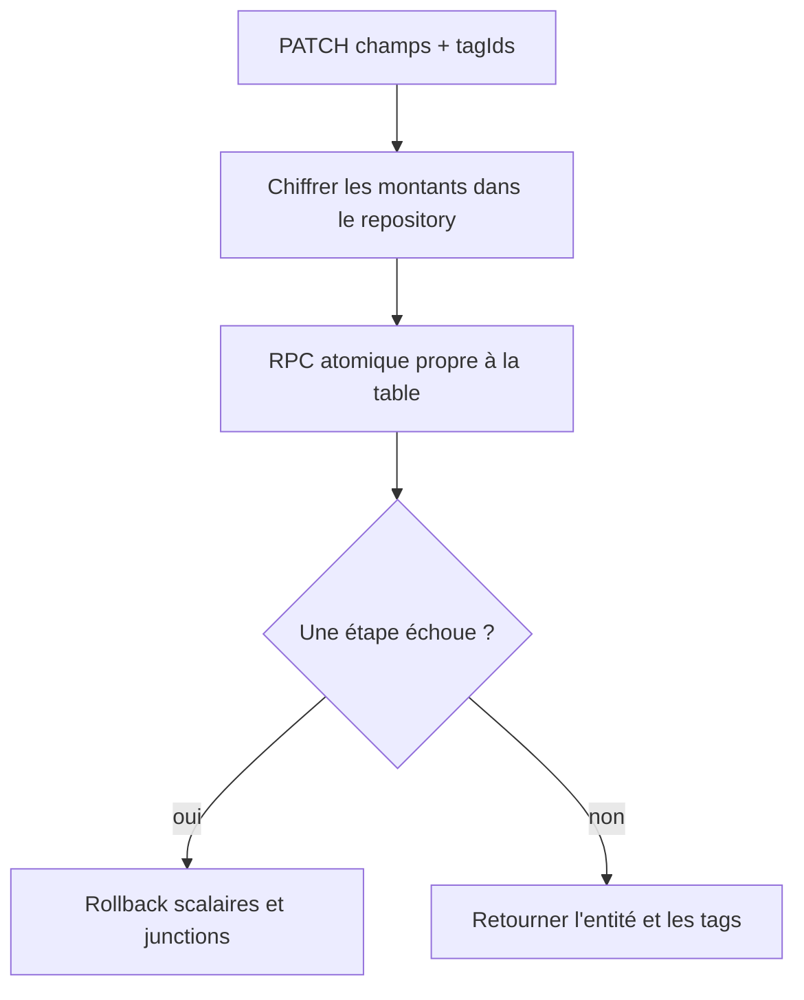

# Instruction: Rendre les mises à jour unitaires atomiques

## Architecture projection

> Tree of the final files. ✅ create · ✏️ modify · ❌ delete

```txt
backend-nest/
├── supabase/migrations/
│   └── 20260715140000_atomic_tagged_entity_updates.sql              ✅ trois RPCs scalaires + tags transactionnels
└── src/
    ├── common/utils/
    │   ├── tag-links.util.ts                                       ✏️ centraliser le mapping d'erreur des RPCs atomiques
    │   └── tag-links.util.spec.ts                                  ✏️ couvrir erreurs parent, tag et DB
    ├── modules/
    │   ├── transaction/infrastructure/persistence/
    │   │   ├── supabase-transaction.repository.ts                  ✏️ remplacer les deux écritures par un RPC
    │   │   └── supabase-transaction.repository.spec.ts             ✏️ reproduire les deux ordres d'échec
    │   ├── budget-line/infrastructure/persistence/
    │   │   ├── supabase-budget-line.repository.ts                  ✏️ remplacer les deux écritures par un RPC
    │   │   └── supabase-budget-line.repository.spec.ts             ✏️ préserver erreurs objectif et doublon
    │   ├── budget-template/infrastructure/persistence/
    │   │   ├── supabase-budget-template.repository.ts              ✏️ rendre updateLine atomique
    │   │   └── supabase-budget-template.repository.spec.ts         ✏️ couvrir rollback et tags-only
    │   └── tag/atomic-tagged-entity-updates.integration.spec.ts     ✅ prouver rollback et RLS sur Supabase local
    └── types/database.types.ts                                     ✏️ régénérer les signatures RPC
```

## User Journey



## Tasks to do

### `1)` Écrire les reproductions avant les RPCs

> Les deux directions de mutation partielle doivent échouer avant la correction.

1. Pour transaction, budget-line et template-line, couvrir: erreur tags après patch scalaire et erreur scalaire après tags valides.
2. Couvrir séparément les patches tags-only et scalaires-only.
3. Préparer une intégration locale avec deux utilisateurs pour vérifier rollback et IDOR réels, pas seulement les mocks Supabase.

### `2)` Ajouter trois fonctions SQL explicites

> Chaque fonction applique le patch DB déjà chiffré et remplace les tags dans une transaction PostgreSQL.

1. Créer `update_transaction_with_tags`, `update_budget_line_with_tags` et `update_template_line_with_tags` en `SECURITY INVOKER`, tables qualifiées et `search_path` fermé.
2. Préserver la distinction clé absente / clé présente à `null` dans le JSONB et ne modifier que les colonnes déjà autorisées par chaque patch domaine.
3. Vérifier l'existence visible du parent, appliquer le patch, remplacer la junction, puis retourner la ligne mise à jour; toute erreur non interceptée annule l'ensemble.
4. Révoquer `PUBLIC`/`anon`, accorder uniquement `authenticated`/`service_role` et conserver les SQLSTATE nécessaires au mapping métier.

### `3)` Basculer les repositories sur les RPCs

> Aucun chemin avec `tagIds` ne doit encore effectuer deux requêtes mutantes.

1. Produire le patch chiffré avant l'appel SQL; ne jamais envoyer de montant clair.
2. Utiliser le RPC atomique lorsque `tagIds` est présent, y compris tags-only; conserver l'update direct existant lorsque `tagIds` est absent.
3. Centraliser dans `tag-links.util.ts` le mapping parent absent, tag absent/étranger, doublon, objectif d'épargne invalide et erreur DB sans écraser les erreurs existantes.
4. Régénérer les types Supabase depuis la base locale après migration.

## Test acceptance criteria

| Task | Acceptance criteria |
| --- | --- |
| 1 | Pour les trois entités, une erreur scalaire laisse les tags précédents intacts et une erreur tags laisse toutes les colonnes précédentes intactes. |
| 2 | Les patches tags-only, scalaires-only et mixtes retournent la même shape métier et les mêmes `tagIds` qu'avant. |
| 2 | Un parent absent/étranger et un tag absent/étranger restent indiscernables entre tenants; aucun compte ne peut modifier l'entité ou les tags d'un autre. |
| 3 | Les erreurs 404/409/500 et `ERR_SAVINGS_GOAL_NOT_FOUND` gardent leur contrat actuel après passage par RPC. |
| 3 | Les payloads SQL contiennent uniquement les ciphertexts produits par `ENCRYPTION_PORT`; le round-trip déchiffré reste exact. |
| 3 | La migration complète et le dry-run passent, puis `database.types.ts` expose les trois fonctions sans cast de signature inventé. |
