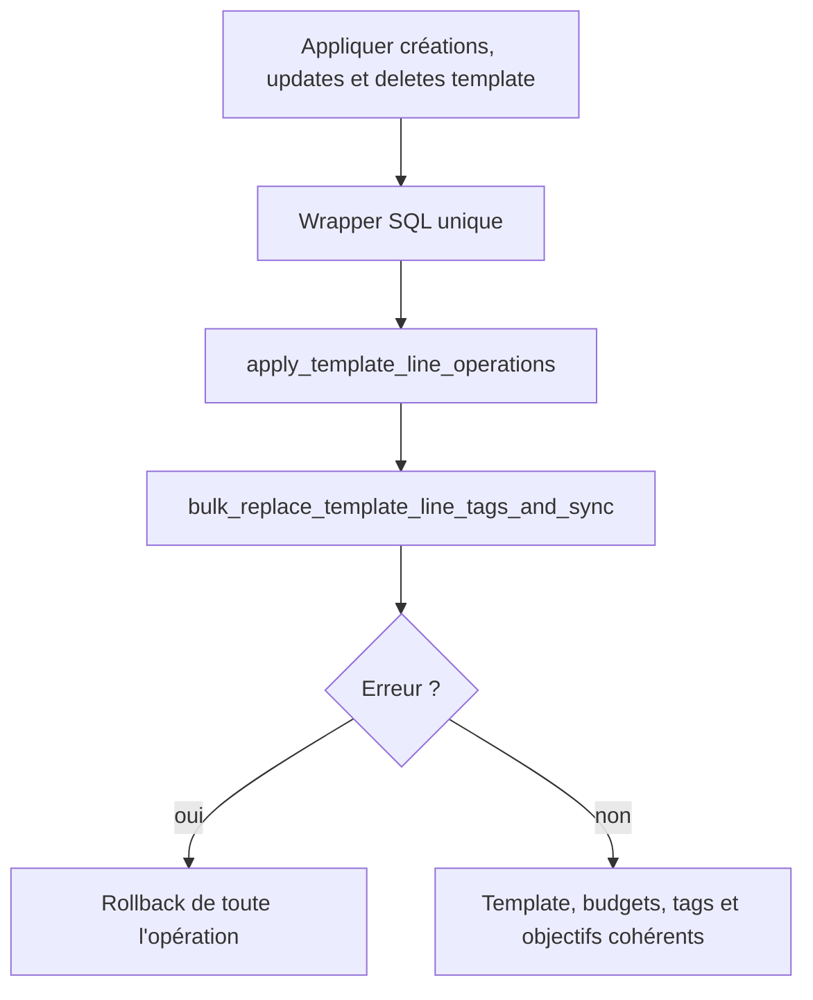

# Instruction: Rendre le bulk template atomique

## Architecture projection

> Tree of the final files. ✅ create · ✏️ modify · ❌ delete

```txt
backend-nest/
├── supabase/migrations/
│   └── 20260715150000_atomic_template_line_operations_with_tags.sql ✅ wrapper transactionnel du bulk
└── src/
    ├── modules/budget-template/
    │   ├── domain/budget-template.entity.ts                         ✏️ documenter le transport atomique des tags
    │   ├── infrastructure/persistence/
    │   │   ├── supabase-budget-template.repository.ts               ✏️ remplacer les deux RPCs + compensation par le wrapper
    │   │   └── supabase-budget-template.repository.spec.ts          ✏️ prouver un seul appel et le mapping d'erreur
    │   └── savings-goal-propagation.integration.spec.ts              ✏️ rollback template, budgets, tags et objectif
    └── types/database.types.ts                                      ✏️ régénérer la signature du wrapper
```

## User Journey



## Tasks to do

### `1)` Reproduire la compensation incomplète

> Un échec tags après update/delete ne doit laisser aucune mutation PUL-12 ou PUL-18.

1. Ajouter une intégration qui combine update, delete, création, propagation budget et tag étranger invalide.
2. Après l'erreur, relire template lines, budget lines, junctions et `savings_goal_id`; toutes les valeurs doivent être celles d'avant.
3. Conserver un test nominal où tags et objectif d'épargne sont propagés ensemble.

### `2)` Composer les RPCs dans une transaction englobante

> Le wrapper réutilise les fonctions durcies au lieu de dupliquer leur logique.

1. Créer `apply_template_line_operations_with_tags` avec les cinq payloads existants plus les paires de tags.
2. Appeler successivement `apply_template_line_operations` puis `bulk_replace_template_line_tags_and_sync` sans capturer leurs erreurs; retourner les budgets affectés du premier appel.
3. Exécuter le wrapper avec les droits de l'appelant afin que les guards du RPC PUL-12 et la RLS des junctions PUL-18 restent tous deux actifs.
4. Appliquer les mêmes grants restreints que les deux fonctions composées.

### `3)` Supprimer la compensation applicative

> Le repository effectue un seul appel mutant et ne tente plus de réparer partiellement la base.

1. Envoyer payloads scalaires chiffrés et paires de tags au wrapper dans un seul `supabase.rpc`.
2. Retirer le second appel tags, la suppression compensatoire et le warn de compensation devenus morts.
3. Conserver le refetch final, le résumé de propagation et les mappings `TAG_NOT_FOUND`, objectif d'épargne et erreur template.
4. Régénérer les types Supabase après la migration.

## Test acceptance criteria

| Task | Acceptance criteria |
| --- | --- |
| 1 | Un échec tags annule créations, updates, deletes et propagations déjà exécutés sur template_line et budget_line. |
| 1 | Après rollback, tags et `savings_goal_id` sont strictement ceux d'avant sur le template et chaque budget concerné. |
| 2 | Le chemin nominal propage dans la même opération champs chiffrés, FX, objectif d'épargne et tags uniquement vers les lignes non ajustées manuellement. |
| 2 | Un template ou budget étranger et un tag étranger échouent sans révéler ni modifier les données de l'autre compte. |
| 3 | Le repository n'émet qu'un appel mutant pour le bulk et ne contient plus de branche de compensation tags. |
| 3 | Les erreurs métier, la liste des budgets affectés et le refetch des lignes créées/mises à jour restent inchangés. |
