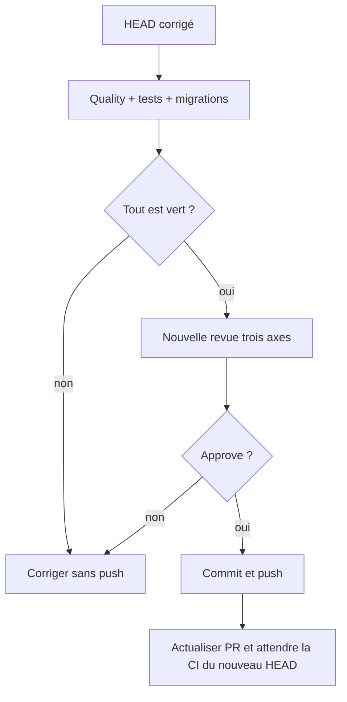

# Instruction: Valider et remettre la PR à niveau

## User Journey

## Tasks to do

### `1)` Vérifier les régressions au bon niveau

> Les suites tags ne suffisent pas: les écritures touchent chiffrement, templates, objectifs et lissage.

1. Exécuter les tests ciblés à chaque phase, puis `pnpm quality` et `pnpm test` séquentiellement.
2. Exécuter toute l'intégration backend sur Supabase local, notamment PUL-12/PUL-17/PUL-18.
3. Exécuter le dry-run des migrations et l'E2E historique tags.
4. Confirmer `git diff --check` et l'absence de changement hors plan.

### `2)` Refaire la revue avant livraison

> Les cinq avertissements et le point mineur doivent être fermés par preuve, pas seulement déplacés.

1. Relancer la revue code, fonctionnelle et pertinence sur `origin/preview...HEAD`.
2. Exiger 100% des critères du présent plan et aucun warning restant.
3. Ne passer le plan en `reviewed` que sur verdict `approve`.

### `3)` Mettre à jour la PR distante

> GitHub doit représenter exactement le HEAD validé localement.

1. Après approbation uniquement, créer un commit atomique des corrections puis pousser la branche autorisée.
2. Actualiser le titre/body de la PR avec l'historique multi-mois, l'atomicité, l'intégration objectifs d'épargne et les compteurs réels.
3. Vérifier que la PR cible toujours `preview`, que son SHA égale le HEAD local et que tous les checks du nouveau SHA sont terminés avec succès.

## Test acceptance criteria

| Task | Acceptance criteria |
| --- | --- |
| 1 | Quality, tests unitaires, intégrations complètes, migration dry-run et E2E historique passent séquentiellement sur le même HEAD. |
| 1 | Les suites objectifs d'épargne et lissage restent vertes avec les nouvelles transactions tags. |
| 2 | La nouvelle revue vérifie 100% des critères et rend `approve` sans finding warning ou critical. |
| 3 | `origin/maximedesogus/pul-18-pouvoir-ajouter-des-tags-par-depense` pointe sur le HEAD validé et la PR #502 décrit le périmètre réellement livré. |
| 3 | Les checks GitHub du nouveau HEAD sont verts et l'état de merge vers `preview` est propre. |
