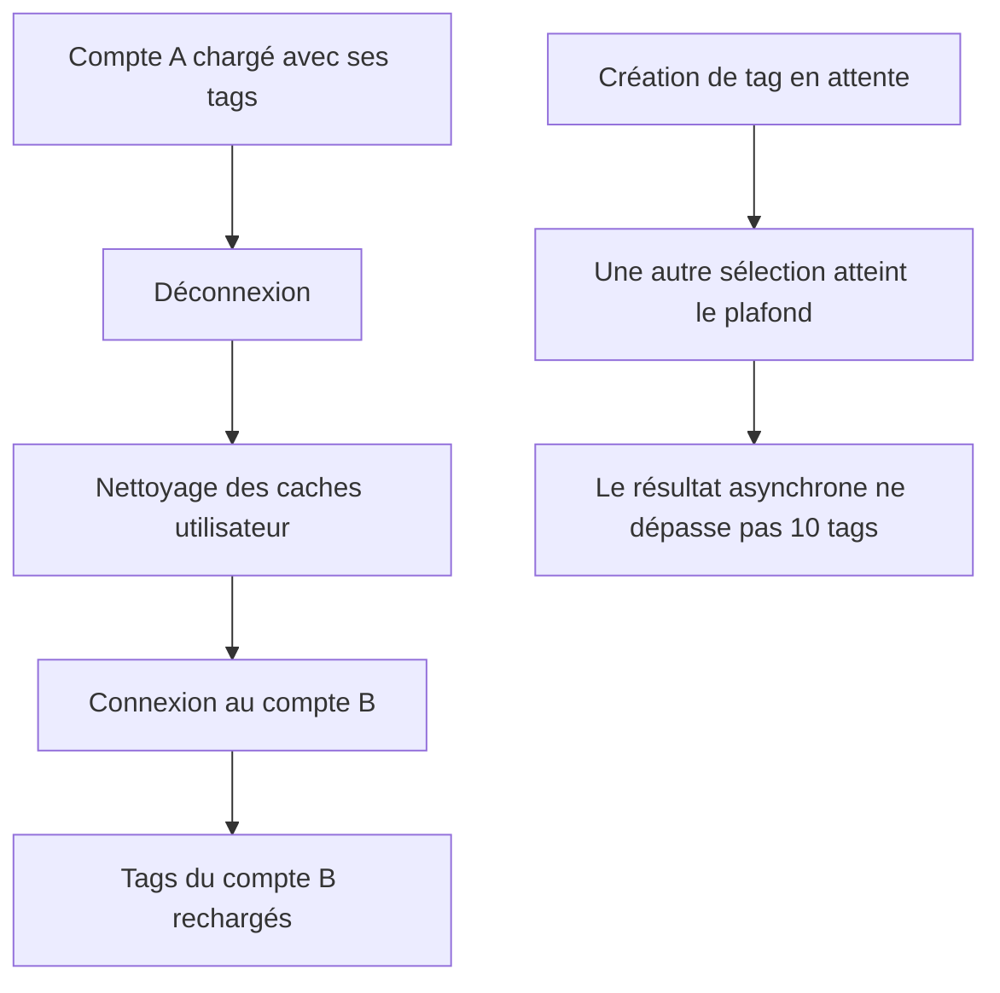

# Instruction: Isolation de session et validation aux frontières

## Architecture projection

> Tree of the final files. ✅ create · ✏️ modify · ❌ delete

```txt
frontend/projects/webapp/src/app/
├── core/auth/
│   ├── auth-cleanup.service.ts ✏️
│   └── auth-cleanup.service.spec.ts ✏️
├── core/tag/tag-store.spec.ts ✏️
└── pattern/tag-picker/
    ├── tag-picker.ts ✏️
    └── tag-picker.spec.ts ✏️
backend-nest/src/modules/tag/infrastructure/persistence/
├── supabase-tag.repository.ts ✏️
└── supabase-tag.repository.spec.ts ✏️
```

## User Journey



## Tasks to do

### `1)` Vider le cache tags au changement de session

> Garantir qu'aucun nom ni ID de tag ne survive à une déconnexion.

1. Écrire la reproduction compte A → cleanup → compte B.
2. Injecter `TagApi` dans `AuthCleanupService` et appeler `clearCache()` via `#safeCleanup`.
3. Vérifier que la ressource root recharge après le clear et qu'une erreur de cleanup n'interrompt pas les autres nettoyages.

### `2)` Rendre le 404 tag cohérent

> Distinguer un tag absent ou masqué par RLS d'une panne de mise à jour.

1. Reproduire le chemin réel de `.single()`: `{ data: null, error: { code: 'PGRST116' } }` retourne actuellement `TAG_UPDATE_FAILED`.
2. Mapper `PGRST116` et l'absence de donnée vers `TAG_NOT_FOUND` avant le traitement générique des erreurs.
3. Verrouiller séparément les trois branches par tests: 404 pour `PGRST116`, 409 pour `23505`, 500 pour une erreur Supabase réelle.

### `3)` Expliciter la suppression idempotente

> Conserver le contrat de suppression existant sans confondre absence et panne de base de données.

1. Ajouter un test où Supabase supprime zéro ligne sans erreur et vérifier que `delete` se résout normalement.
2. Conserver `TAG_DELETE_FAILED` uniquement pour une erreur Supabase réelle.
3. Ne pas ajouter de prélecture: un tag absent ou masqué par RLS reste un succès idempotent et ne devient pas un oracle d'existence.

### `4)` Fermer la course du plafond de tags

> Ne jamais écrire plus de `MAX_TAGS_PER_TRANSACTION` après un await.

1. Reproduire la création asynchrone concurrente avec une sélection qui atteint 10 entre-temps.
2. Revalider le plafond dans le point d'attache final commun.
3. Préserver le rejet des doublons et les créations réussies sous le plafond.

## Test acceptance criteria

| Task | Acceptance criteria |
| ---- | ------------------- |
| 1 | Après logout, le cache tags est vide; la session suivante effectue une nouvelle lecture et n'affiche aucun tag de la session précédente. |
| 1 | Une exception de `TagApi.clearCache()` est journalisée sans empêcher le nettoyage budget, objectifs d'épargne, stockage et analytics. |
| 2 | Le test `PGRST116` prouve que `PATCH /tags/:id` retourne `ERR_TAG_NOT_FOUND`/404 pour un tag absent ou étranger; les tests dédiés conservent 409 pour un nom dupliqué et 500 uniquement pour une erreur Supabase réelle. |
| 3 | `DELETE /tags/:id` reste un succès lorsque zéro ligne est visible, tandis qu'une erreur Supabase retourne `ERR_TAG_DELETE_FAILED`; aucune prélecture d'existence n'est ajoutée. |
| 4 | Une création résolue après que la sélection a atteint 10 tags ne produit jamais un onzième ID; le chemin nominal continue d'attacher le tag créé. |
