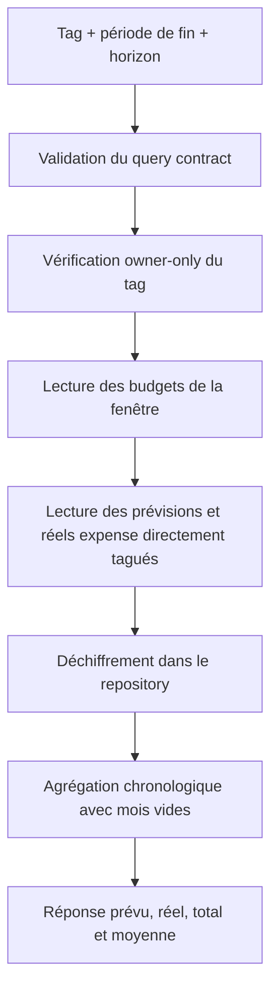

# Instruction: Contrat et agrégation backend de l'historique

## Architecture projection

> Tree of the final files. ✅ create · ✏️ modify · ❌ delete

```txt
shared/
├── schemas.ts ✏️
└── src/tag-schema.spec.ts ✏️
backend-nest/src/modules/tag/
├── application/
│   ├── get-tag-history.use-case.ts ✅
│   └── get-tag-history.use-case.spec.ts ✅
├── domain/
│   ├── tag.entity.ts ✏️
│   └── ports/tag-repository.port.ts ✏️
├── infrastructure/
│   ├── http/
│   │   ├── dto/tag-swagger.dto.ts ✏️
│   │   └── tag.controller.ts ✏️
│   ├── mappers/tag.mapper.ts ✏️
│   └── persistence/
│       ├── supabase-tag.repository.ts ✏️
│       └── supabase-tag.repository.spec.ts ✏️
├── tag-history.integration.spec.ts ✅
└── tag.module.ts ✏️
```

## User Journey



## Tasks to do

### `1)` Définir le contrat partagé

> Rendre la fenêtre et le read model explicites et validés au runtime.

1. Ajouter un query schema coercitif pour `months ∈ {3,6,12,24}`, `endMonth` et `endYear`.
2. Ajouter les schemas `TagHistoryMonth`, `TagHistory` et la success response.
3. Exposer par mois `plannedAmount` et `actualAmount`, puis `totalPlanned`, `totalActual`, `monthlyAverageActual` et `actualToPlannedPercent` nullable.
4. Calculer la moyenne sur les N périodes, zéros inclus, et ne pas plafonner le ratio réel/prévu au-dessus de 100 %.

### `2)` Lire et agréger les montants chiffrés

> Construire une timeline expense bornée sans somme SQL sur ciphertext.

1. Ajouter au port une lecture des contributions directement liées au tag et à des budgets de la fenêtre.
2. Vérifier le tag via `findById`, récupérer les budgets RLS-scopés, puis les lignes/transactions `kind=expense` via leurs junctions.
3. Déchiffrer dans le repository et agréger dans le use case avec `periodIndex`/`periodFromIndex`.
4. Remplir chaque période absente avec zéro et calculer les agrégats sans division par zéro.

### `3)` Exposer et sécuriser l'endpoint

> Servir l'historique par le module tag sans contourner Clean Architecture.

1. Ajouter `GET /tags/:id/history` avant `GET /tags/:id` dans le controller.
2. Mapper le résultat domaine vers le DTO partagé et documenter Swagger.
3. Enregistrer use case et logger dans `TagModule`.
4. Couvrir sur Supabase local chiffrement, RLS deux comptes, trous mensuels et borne multi-année.

## Test acceptance criteria

| Task | Acceptance criteria |
| ---- | ------------------- |
| 1 | Les horizons 3, 6, 12 et 24 sont acceptés; toute autre valeur, mois ou année invalide produit une réponse 400 avant le repository. |
| 2 | La réponse contient exactement N périodes chronologiques terminant sur le budget demandé, y compris les périodes sans budget ou sans montant à zéro. |
| 2 | `plannedAmount` somme uniquement les prévisions `expense` directement liées; `actualAmount` somme uniquement les transactions `expense` directement liées, sans héritage entre les deux junctions. |
| 2 | Un même item multi-tagué compte une fois dans l'historique de chaque tag concerné, jamais deux fois dans l'historique d'un même tag. |
| 2 | Les totaux, la moyenne mensuelle sur N périodes et le ratio réel/prévu non plafonné sont calculés après déchiffrement; le ratio vaut `null` lorsque le prévu total vaut zéro. |
| 3 | Le propriétaire reçoit son historique; un tag absent ou appartenant à un autre compte retourne 404 sans révéler son existence ni ses montants. |
| 3 | L'intégration PUL-12 reste verte et aucune requête d'historique ne modifie les objectifs d'épargne ou les budgets. |
