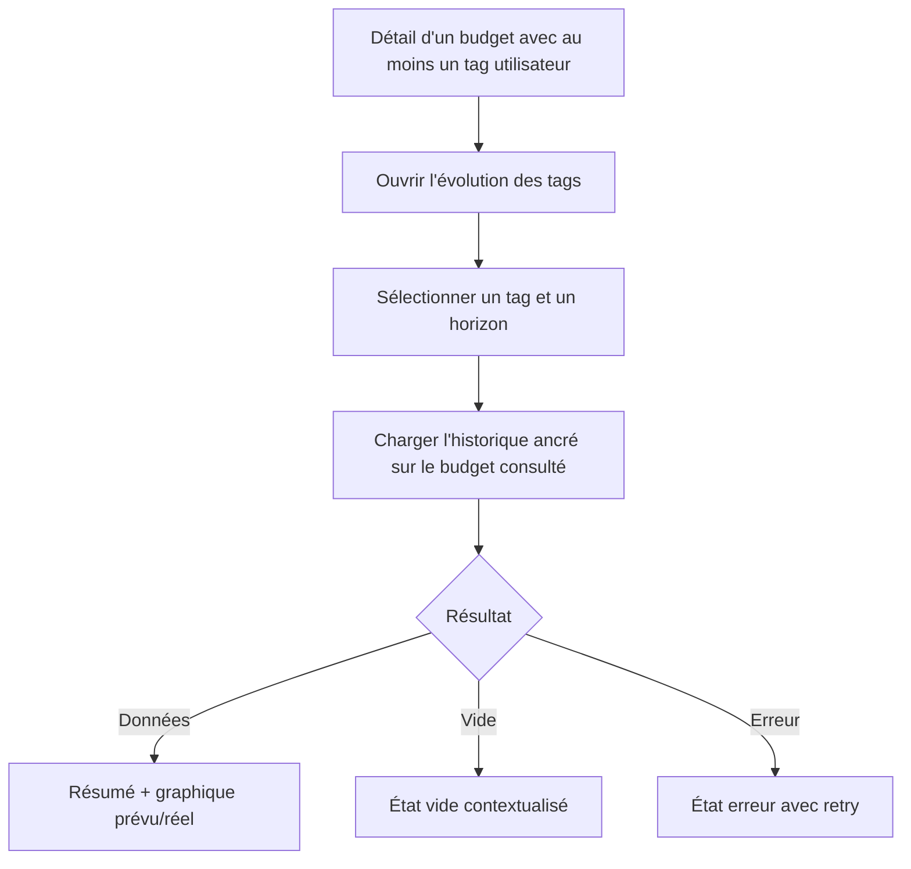

# Instruction: Dialog web d'évolution par tag

## Architecture projection

> Tree of the final files. ✅ create · ✏️ modify · ❌ delete

```txt
frontend/projects/webapp/
├── public/i18n/fr.json ✏️
└── src/app/
    ├── core/tag/
    │   ├── tag-api.ts ✏️
    │   └── tag-api.spec.ts ✏️
    └── feature/budget/budget-details/
        ├── budget-details-dialog.service.ts ✏️
        └── components/
            ├── budget-items-container.ts ✏️
            ├── budget-items-container.spec.ts ✏️
            └── tag-history/
                ├── tag-history-dialog.ts ✅
                ├── tag-history-dialog.spec.ts ✅
                ├── tag-history-chart.ts ✅
                └── tag-history-chart.spec.ts ✅
```

## User Journey



## Wireframe

```txt
┌─────────────────────────────────────────────────────────┐
│ (1) En-tête du dialog                         [Fermer]   │
├─────────────────────────────────────────────────────────┤
│ (2) Sélecteur de tag      (3) Sélecteur de période      │
├─────────────────────────────────────────────────────────┤
│ (4) Résumé : total · moyenne mensuelle · total prévu    │
├─────────────────────────────────────────────────────────┤
│ (5) Graphique mensuel : prévu / réel                    │
│                                                         │
├─────────────────────────────────────────────────────────┤
│ (6) État contextuel : chargement · vide · erreur        │
└─────────────────────────────────────────────────────────┘
```

## Tasks to do

### `1)` Brancher une lecture fraîche depuis le détail budget

> Ouvrir l'historique sans introduire un cache croisé difficile à invalider.

1. Ajouter `TagApi.getHistory$()` avec validation de la réponse partagée.
2. Ajouter une action secondaire près du titre des enveloppes lorsque le TagStore contient au moins un tag.
3. Ouvrir le dialog avec la liste des tags, le tag sélectionné lorsqu'il est unique et la période du budget consulté.
4. Utiliser `resource()` dans le dialog pour recharger à chaque ouverture et changement de paramètres.

### `2)` Construire le dialog et ses états

> Permettre une lecture claire sur desktop et mobile sans modifier la route.

1. Ajouter un sélecteur de tag unique et un choix 3/6/12/24 mois.
2. Afficher total réel, moyenne mensuelle, total prévu et ratio lorsqu'il existe.
3. Fournir chargement, vide, erreur avec retry et conservation de la sélection.
4. Ajouter les libellés Transloco en tutoiement et les `data-testid` utiles.

### `3)` Visualiser prévu et réel de façon accessible

> Réutiliser l'infrastructure Chart.js sans cacher l'information aux lecteurs d'écran.

1. Afficher les périodes dans l'ordre, prévu en neutre et réel en couleur expense.
2. Respecter `AmountsVisibilityService`, le thème et `prefers-reduced-motion`.
3. Ajouter une phrase `aria-live` qui résume tag, horizon, total et moyenne.
4. Garder les mois à zéro visibles pour préserver la forme de la progression.

## Test acceptance criteria

| Task | Acceptance criteria |
| ---- | ------------------- |
| 1 | L'action reste disponible lorsqu'un utilisateur possède des tags même si le budget courant n'a aucun item tagué. |
| 1 | Le dialog s'ancre sur le mois/année du budget consulté; un tag filtré unique est présélectionné, sinon le premier tag utilisateur l'est. |
| 1 | Chaque ouverture et chaque changement tag/horizon déclenche une lecture fraîche avec les bons query params. |
| 2 | Les horizons 3/6/12/24 mettent à jour le résumé et le graphique; chargement, vide, erreur et retry sont distinguables et accessibles. |
| 2 | Sur mobile, le contenu du dialog reste consultable sans débordement horizontal ni CTA masqué. |
| 3 | Le graphique affiche exactement les périodes retournées et les deux séries; les montants masqués ne paraissent ni dans les cartes, ni les tooltips, ni la phrase accessible. |
| 3 | Le thème clair/sombre et la réduction de mouvement n'altèrent ni la lisibilité ni les valeurs. |
