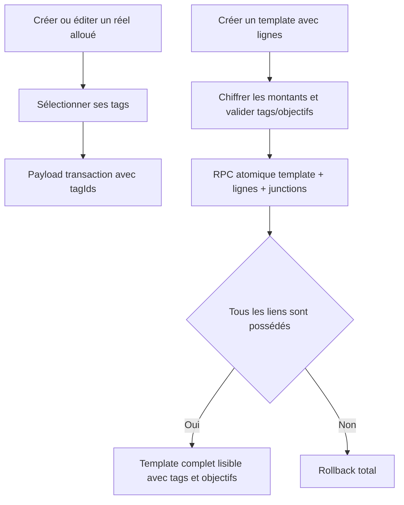

# Instruction: Écritures complètes et atomiques

## Architecture projection

> Tree of the final files. ✅ create · ✏️ modify · ❌ delete

```txt
frontend/projects/webapp/src/app/feature/budget/budget-details/
├── budget-details-dialog.service.ts ✏️
├── budget-details-dialog.service.spec.ts ✅
└── allocated-transactions/create-dialog/
    ├── form.ts ✏️
    └── form.spec.ts ✏️
backend-nest/
├── src/modules/budget-template/
│   ├── application/
│   │   ├── create-template.use-case.ts ✏️
│   │   └── create-template.use-case.spec.ts ✏️
│   ├── create-template-with-tags.integration.spec.ts ✅
│   └── infrastructure/persistence/
│       ├── schemas/
│       │   ├── rpc-payload.schemas.ts ✏️
│       │   └── rpc-payload.schemas.spec.ts ✏️
│       ├── supabase-budget-template.repository.ts ✏️
│       └── supabase-budget-template.repository.spec.ts ✏️
└── supabase/migrations/
    └── 20260715130000_create_template_with_lines_tags.sql ✅
```

## User Journey



## Tasks to do

### `1)` Taguer les réels alloués

> Offrir la même capacité de tagging à tous les flux de transaction.

1. Ajouter `tagIds` et `TagPicker` au modèle de création allouée.
2. Inclure `tagIds` dans `transactionCreateFromFormSchema` et les tests de soumission.
3. Retirer `tags` des champs masqués à l'édition tout en gardant `kind` verrouillé.
4. Tester la configuration de dialog et la conservation des tags existants.

### `2)` Transporter les tags pendant la création complète d'un template

> Ne plus accepter puis perdre silencieusement `lines[].tagIds`.

1. Copier `tagIds` dans `TemplateLineRpcInput` depuis le use case.
2. Ajouter `tag_ids` au payload chiffré et au schéma Zod RPC strict.
3. Préserver `savings_goal_id`, FX et les champs chiffrés existants.

### `3)` Écrire template, lignes et tags dans une transaction

> Garantir zéro template partiel et zéro lien cross-tenant.

1. Remplacer le corps de `create_template_with_lines` dans une nouvelle migration additive.
2. Vérifier explicitement chaque tag contre `p_user_id` avant toute insertion de junction, car l'RPC est `SECURITY DEFINER`.
3. Capturer l'ID de chaque ligne, insérer ses junctions et conserver le guard `auth.uid() = p_user_id` ainsi que les grants durcis.
4. Mapper le refus de tag vers `TAG_NOT_FOUND` sans masquer les erreurs objectifs d'épargne.

## Test acceptance criteria

| Task | Acceptance criteria |
| ---- | ------------------- |
| 1 | La création d'un réel alloué transmet les tags choisis; son édition affiche les tags existants et transmet les ajouts/suppressions sans permettre de changer le kind. |
| 2 | `POST /budget-templates` avec `lines[].tagIds` relit les mêmes IDs après création; l'absence de `tagIds` conserve le comportement actuel. |
| 2 | Une ligne `saving` peut porter simultanément `savingsGoalId` et `tagIds`; les deux familles de liens survivent à la génération du budget. |
| 3 | Un tag absent ou étranger annule template, lignes et junctions dans la même transaction et retourne l'erreur métier attendue. |
| 3 | Le guard IDOR, les grants, les métadonnées FX et le chiffrement des montants restent identiques à la version durcie actuelle. |
| 3 | La migration s'applique sur une base locale complète et les tests d'intégration PUL-12/PUL-18 restent verts ensemble. |
