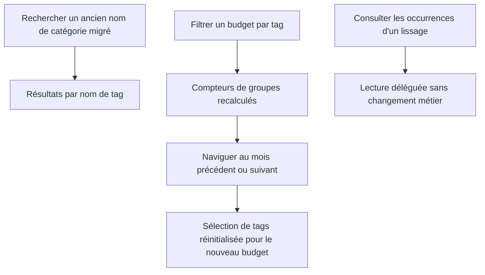

# Instruction: Recherche, filtres et santé des repositories

## Architecture projection

> Tree of the final files. ✅ create · ✏️ modify · ❌ delete

```txt
backend-nest/src/modules/
├── transaction/infrastructure/persistence/
│   ├── supabase-transaction.repository.ts ✏️
│   └── supabase-transaction.repository.spec.ts ✏️
└── budget-line/
    ├── budget-line.module.ts ✏️
    └── infrastructure/persistence/
        ├── supabase-budget-line.repository.ts ✏️
        ├── supabase-budget-line.repository.spec.ts ✏️
        ├── supabase-budget-line-spread.reader.ts ✅
        └── supabase-budget-line-spread.reader.spec.ts ✅
frontend/
├── e2e/tests/features/tags-history.spec.ts ✅
└── projects/webapp/src/app/feature/budget/budget-details/
    ├── components/
    │   ├── budget-items-container.ts ✏️
    │   └── budget-items-container.spec.ts ✏️
    └── view-models/
        ├── tag-filter.util.ts ✏️
        └── tag-filter.util.spec.ts ✏️
```

## User Journey



## Tasks to do

### `1)` Restaurer la recherche par classification

> Rendre les catégories migrées retrouvables sous forme de tags.

1. Reproduire une recherche qui ne matche que le nom d'un tag lié.
2. Résoudre les IDs de transactions via `tag` + `transaction_tag` sous RLS, puis les combiner au filtre `name` sans dupliquer les résultats.
3. Préserver le filtre années, le tri, la limite 25 et la recherche nominale existante.

### `2)` Stabiliser le filtre entre budgets

> Éviter un écran vide impossible à débloquer après navigation mensuelle.

1. Lier la sélection à l'ID du budget et la réinitialiser uniquement lorsque cet ID change.
2. Conserver la sélection lors d'un simple reload du même budget.
3. Recalculer `GroupHeaderTableItem.metadata.itemCount` après filtrage et supprimer les groupes vides.

### `3)` Extraire la lecture des occurrences PUL-17

> Repasser sous le plafond du repository sans refactor spéculatif.

1. Déplacer lecture, déchiffrement, somme de transactions et mapping des occurrences spread dans un reader injecté dédié.
2. Laisser `SupabaseBudgetLineRepository` déléguer les méthodes du port sans changer leurs signatures.
3. Enregistrer le reader dans le module et déplacer les tests concernés.
4. Mesurer les trois repositories; arrêter dès que budget-line est inférieur ou égal à 1 000 lignes.

### `4)` Vérifier le parcours complet

> Prouver le tagging, l'historique et la coexistence PUL-12 sur la branche fusionnée.

1. Ajouter un E2E mocked: ouvrir un budget, ouvrir l'historique, changer d'horizon et vérifier résumé/graphique.
2. Vérifier qu'un test de régression reproduit chaque écart corrigé: cache inter-session, `PGRST116`, suppression idempotente, plafond asynchrone, écritures de tags, recherche, filtre et agrégation multi-mois.
3. Exécuter les specs ciblées, intégrations Supabase, migration dry-run, quality et suite web.
4. Rejouer les tests objectifs d'épargne, propagation template et lissage touchés par les extractions.

## Test acceptance criteria

| Task | Acceptance criteria |
| ---- | ------------------- |
| 1 | Une recherche par nom de tag retourne les transactions liées, respecte les années et l'isolation utilisateur, sans doublon lorsqu'un nom et plusieurs tags correspondent. |
| 1 | Les recherches par nom de transaction et les résultats sans tag restent inchangés. |
| 2 | Après navigation précédent/suivant, aucun ID absent du nouveau budget ne reste sélectionné et le filtre reste utilisable même si le nouveau budget n'a aucun tag. |
| 2 | Chaque header affiche le nombre exact de lignes conservées et disparaît lorsque ce nombre vaut zéro. |
| 3 | Les occurrences de lissage conservent montants déchiffrés, consommation, compte de transactions, erreurs métier et isolation RLS. |
| 3 | `supabase-budget-line.repository.ts` contient au plus 1 000 lignes sans nouvelle extraction hors périmètre. |
| 4 | Le parcours E2E historique passe avec 3 puis 12 mois, y compris les périodes à zéro et le masquage des montants. |
| 4 | Chaque écart fonctionnel corrigé possède une reproduction automatisée au niveau le plus bas pertinent; aucun correctif ne repose uniquement sur le E2E nominal. |
| 4 | Quality, tests unitaires, intégrations, migration dry-run, objectifs d'épargne et lissage sont tous verts sur le HEAD final. |
