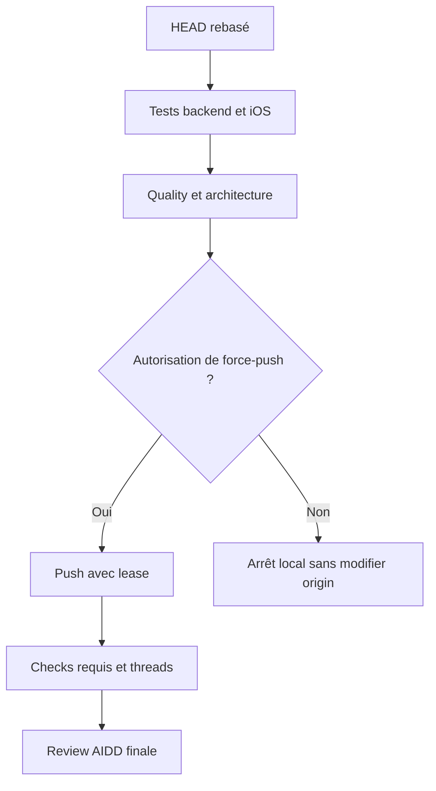

# Instruction: Revalider et conclure la PR

## Architecture projection

> Tree of the final files. ✅ create · ✏️ modify · ❌ delete

```txt
.
└── aidd_docs/tasks/2026_07/2026_07_15_pul_186_preview_sync/
    └── ✅ review.md — verdict final sur le HEAD rebasé et les checks courants
```

## User Journey



## Tasks to do

### `1)` Reprouver les invariants fonctionnels

> Valider le même comportement fail-open après intégration de preview.

1. Exécuter les tests payload et contrôleur What's New, puis le type-check et `lint:arch` backend.
2. Exécuter SwiftLint et les tests iOS ciblant `WhatsNewStore` et `RootViewLifecycle`.
3. Exécuter `pnpm quality` sur le monorepo.
4. Vérifier explicitement : version sans note, métadonnée invalide, erreur réseau, annulation et dismissal restent sans crash ni blocage utilisateur.

### `2)` Publier le HEAD rebasé sans écraser de travail concurrent

> Mettre à jour la PR uniquement après accord explicite.

1. Demander l'autorisation de force-push et ne rien publier sans réponse positive.
2. Re-fetcher origin juste avant le push et utiliser `git push --force-with-lease` sur la seule branche PUL-186.
3. Attendre les checks du nouveau HEAD ; exiger tous les checks requis verts.
4. Si un check optionnel échoue sans finding de code, le qualifier avec son log au lieu de modifier PUL-186 pour contourner l'automatisation.

### `3)` Fermer la review sur l'état distant courant

> Produire un verdict qui correspond au HEAD et à la cible réellement évalués.

1. Vérifier le SHA distant, le merge-base avec `preview`, l'état `MERGEABLE` et les checks requis.
2. Vérifier qu'aucun thread non obsolète et actionnable ne reste ouvert.
3. Rejouer `aidd-dev:05-review` sur les trois axes et écrire `review.md` dans ce dossier.
4. Conclure uniquement avec zéro finding critique ou warning ; l'écart d'architecture mineur peut rester documenté sans bloquer le verdict.

## Test acceptance criteria

| Task | Acceptance criteria |
| --- | --- |
| 1 | Les tests backend/iOS ciblés, `lint:arch`, SwiftLint et `pnpm quality` passent sur un unique SHA rebasé. |
| 1 | Les réponses absentes ou invalides et les erreurs réseau/annulations restent fail-open : aucune sheet incohérente, aucun crash, marqueur avancé uniquement sur réponse vide ou dismissal. |
| 2 | Origin n'est modifié qu'après autorisation, par un `--force-with-lease` dont le remote attendu n'a pas changé. |
| 2 | Le nouveau HEAD distant possède tous ses checks requis verts ; tout échec optionnel est distingué d'un finding de code par une preuve de log. |
| 3 | La PR est `MERGEABLE`, basée sur la `preview` courante, et ne contient aucun thread actionnable ouvert. |
| 3 | La review finale conclut `approve` avec zéro finding critique ou warning. |
