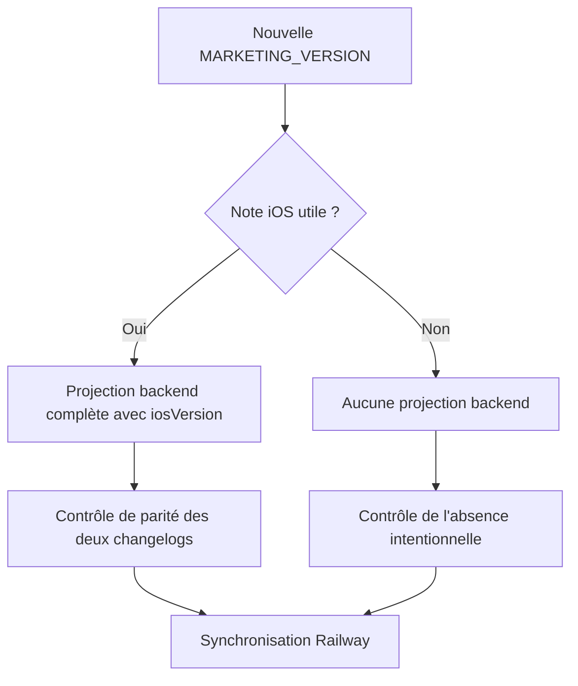

# Instruction: Fermer les invariants de données et de release

## Architecture projection

> Tree of the final files. ✅ create · ✏️ modify · ❌ delete

```txt
.
├── .claude/skills/update-changelog/references/
│   └── ✏️ ios-release.md
└── backend-nest/src/modules/whats-new/
    ├── ✏️ releases-data.ts
    ├── ✏️ whats-new-payload.ts
    └── ✏️ whats-new-payload.spec.ts
```

## User Journey



## Tasks to do

### `1)` Rendre la projection backend stricte

> Empêcher qu'une note iOS disparaisse silencieusement faute de version.

1. Rendre `iosVersion` obligatoire dans `WhatsNewReleaseEntry`.
2. Simplifier `isIosUserFacing()` pour ne filtrer que la plateforme et la présence de contenu utile.
3. Retirer le test qui construit une entrée désormais interdite et conserver les cas release technique, autre plateforme et plage sans note.
4. Conserver la validation du dataset complet et le regroupement par version marketing.

### `2)` Rendre la procédure cohérente avec une release sans note

> Autoriser explicitement zéro note sans affaiblir la vérification des projections existantes.

1. Harmoniser l'introduction, les règles de curation et le préflight Railway dans `ios-release.md`.
2. Exiger la parité landing/backend lorsqu'une projection est créée.
3. Exiger uniquement la version canonique landing et l'absence intentionnelle de projection lorsque zéro item est retenu.
4. Maintenir la synchronisation de `LATEST_IOS_VERSION` dans les deux branches, avec ou sans note.

## Test acceptance criteria

| Task | Acceptance criteria |
| --- | --- |
| 1 | Une projection backend sans `iosVersion` échoue au type-check au lieu d'être ignorée à l'exécution. |
| 1 | Une version iOS sans entrée backend renvoie toujours une liste vide, tandis qu'une projection complète reste servie et agrégée. |
| 2 | La procédure mène une version marketing sans note jusqu'à la synchronisation Railway sans exiger une fausse seconde copie. |
| 2 | Dès qu'une note iOS existe, la même `iosVersion` reste obligatoire dans le changelog landing et sa projection backend. |
