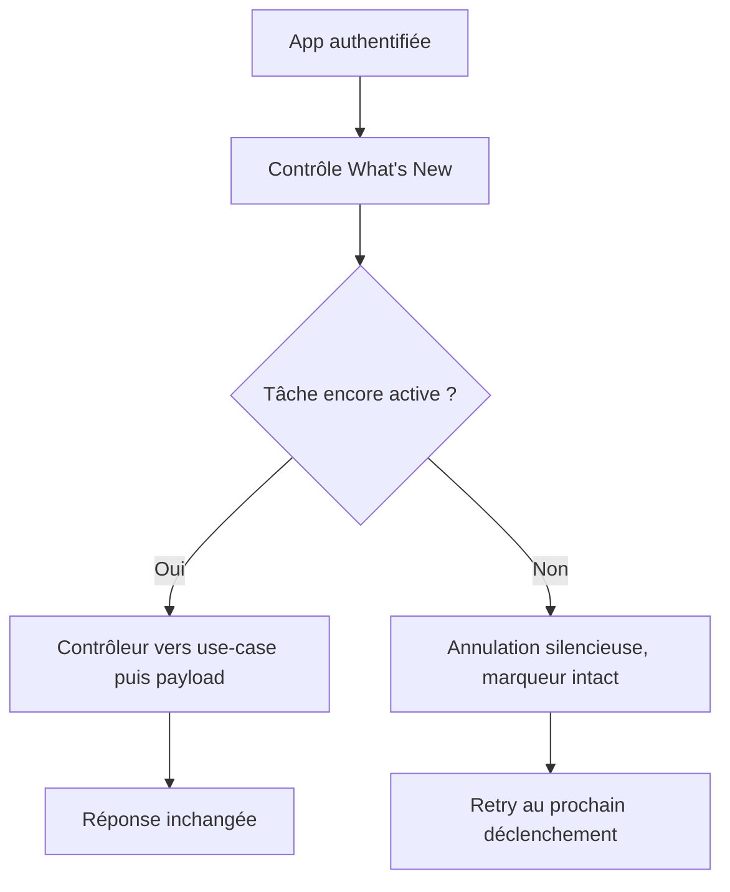

# Instruction: Aligner le flux backend et l'annulation iOS

## Architecture projection

> Tree of the final files. ✅ create · ✏️ modify · ❌ delete

```txt
.
├── backend-nest/src/modules/whats-new/
│   ├── ✅ application/get-ios-whats-new.use-case.ts
│   ├── ✏️ whats-new.controller.ts
│   ├── ✏️ whats-new.controller.spec.ts
│   └── ✏️ whats-new.module.ts
└── ios/Pulpe/Domain/Store/
    └── ✏️ WhatsNewStore.swift
```

## User Journey



## Tasks to do

### `1)` Introduire la frontière application minimale

> Faire déléguer le contrôleur sans réorganiser le module complet.

1. Créer un use-case injectable avec un unique `execute(query)` qui appelle le builder pur existant.
2. Injecter le use-case dans le contrôleur et l'enregistrer dans le module.
3. Adapter le montage du test contrôleur à cette dépendance.
4. Ne modifier ni le contrat HTTP, ni le payload, ni l'authentification.

### `2)` Distinguer une annulation d'un échec réseau

> Garder les logs d'erreur réservés aux échecs réels.

1. Utiliser le helper projet `isCancellationOrURLCancellation` pour couvrir Swift `CancellationError` et l'annulation URLSession.
2. Terminer silencieusement une tâche annulée sans avancer `lastSeenVersion`.
3. Préserver le fail-open et le retry pour les autres erreurs.

## Test acceptance criteria

| Task | Acceptance criteria |
| --- | --- |
| 1 | L'endpoint authentifié produit exactement le même payload en passant par le use-case enregistré par NestJS. |
| 1 | Le contrôleur ne contient plus d'appel direct au builder métier. |
| 2 | Une annulation de tâche ou URLSession ne produit pas de log `[WHATS_NEW] failed`, ne présente rien et ne modifie pas le marqueur. |
| 2 | Une erreur réseau réelle conserve le marqueur et reste journalisée pour permettre un retry ultérieur. |
