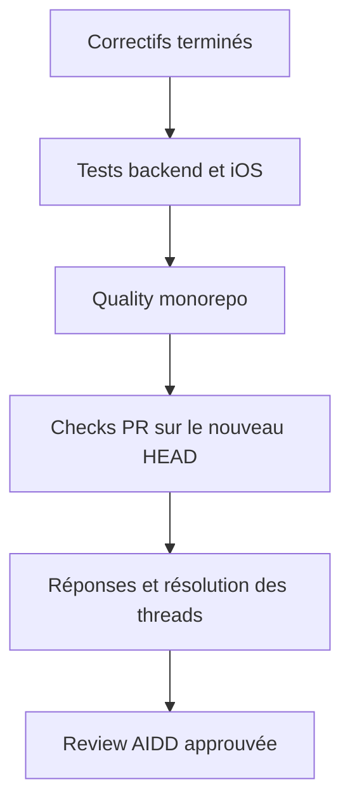

# Instruction: Prouver le correctif et conclure la PR

## Architecture projection

> Tree of the final files. ✅ create · ✏️ modify · ❌ delete

```txt
.
└── aidd_docs/tasks/2026_07/2026_07_15_pul_186_review_fixes/
    └── ✅ review.md
```

## User Journey



## Tasks to do

### `1)` Valider les comportements touchés

> Prouver les invariants sans rejouer des suites sans rapport.

1. Exécuter les tests payload et contrôleur du module What's New.
2. Exécuter le type-check, l'architecture backend et `pnpm quality`.
3. Exécuter SwiftLint et les tests iOS ciblant `WhatsNewStore` et le lifecycle.
4. Vérifier le merge avec la `preview` courante et attendre les checks GitHub du nouveau HEAD.

### `2)` Fermer la boucle de review

> Donner une conclusion vérifiable à chaque discussion non obsolète.

1. Répondre aux threads corrigés avec le fichier, la ligne ou le test probant.
2. Résoudre les suggestions devenues obsolètes : taille du dataset et réutilisation de `semverString`.
3. Relancer la review AIDD code, fonctionnelle et pertinence dans `review.md`.
4. Ne déclarer la PR mergeable qu'avec zéro warning, aucun thread actionnable ouvert et tous les checks requis verts.

## Test acceptance criteria

| Task | Acceptance criteria |
| --- | --- |
| 1 | Les tests ciblés backend/iOS, l'architecture et la quality passent sur le même commit que celui évalué par GitHub. |
| 1 | La PR reste `CLEAN` face à la `preview` courante et tous les checks requis sont verts. |
| 2 | Chaque discussion non obsolète contient une correction vérifiée ou une décision motivée avant résolution. |
| 2 | La review finale conclut `approve` avec zéro finding critique ou warning. |
