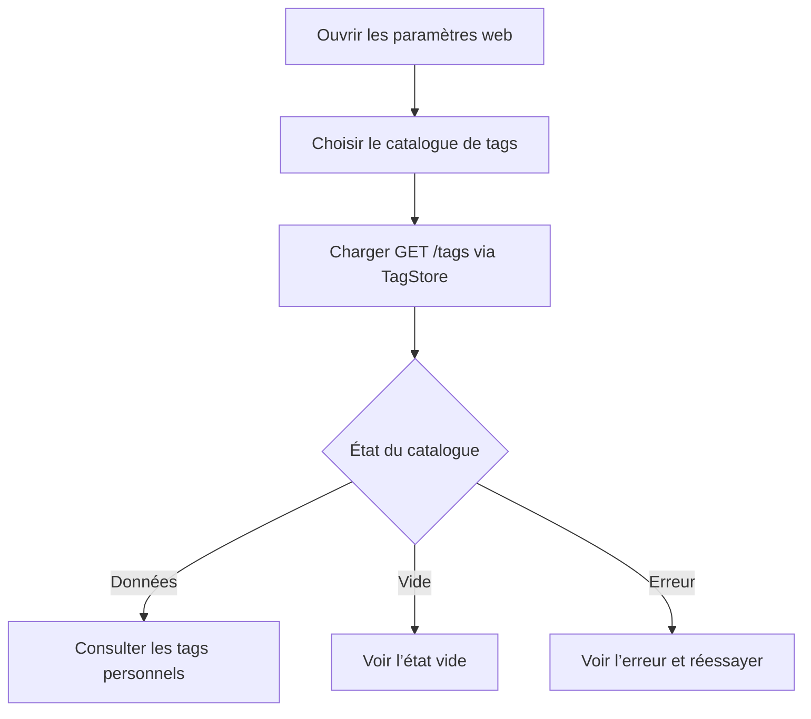

# Instruction: Catalogue web dans les paramètres

## Architecture projection

> Tree of the final files. ✅ create · ✏️ modify · ❌ delete

```txt
frontend/projects/webapp/
├── public/i18n/fr.json                                                       ✏️ libellés de navigation, liste et états
└── src/app/
    ├── core/routing/routes-constants.ts                                      ✏️ route et titre du catalogue
    └── feature/settings/
        ├── settings-page.ts                                                  ✏️ entrée vers le catalogue
        ├── settings-page.spec.ts                                             ✏️ régression sur l’entrée accessible
        ├── settings.routes.ts                                                ✏️ route enfant /settings/tags
        ├── tags-settings-page.ts                                             ✅ page de consultation basée sur TagStore
        └── tags-settings-page.spec.ts                                        ✅ états et rendu de la liste
```

Aucune suppression de fichier. Aucun changement backend.

## User Journey



## Wireframe

```txt
Paramètres
┌──────────────────────────────────────────────┐
│ (1) En-tête de page                          │
├──────────────────────────────────────────────┤
│ (2) Préférences du compte                    │
├──────────────────────────────────────────────┤
│ (3) Organisation                             │
│     [icône] Catalogue de tags       [>]      │
├──────────────────────────────────────────────┤
│ (4) Sécurité / zone sensible                 │
└──────────────────────────────────────────────┘

Catalogue de tags
┌──────────────────────────────────────────────┐
│ (5) En-tête · titre · compteur               │
├──────────────────────────────────────────────┤
│ (6) Liste                                    │
│     [icône tag] Nom                          │
│     [icône tag] Nom                          │
│     [icône tag] Nom                          │
├──────────────────────────────────────────────┤
│ (7) Zone d’état alternatif                   │
└──────────────────────────────────────────────┘
```

1. En-tête : contexte de la page Paramètres.
2. Préférences : contenu actuel inchangé.
3. Organisation : point d’entrée vers le catalogue.
4. Sections existantes : ordre et contenu conservés.
5. En-tête du catalogue : identité de l’écran et volume chargé.
6. Liste : tags personnels renvoyés par le backend.
7. Zone alternative : chargement, erreur ou catalogue vide.

## Tasks to do

### `1)` Exposer la sous-route des tags

> Rendre le catalogue accessible depuis Paramètres sans ajouter une entrée globale au shell.

1. Transformer les routes Settings en groupe parent avec pages index et tags.
2. Ajouter le titre, le breadcrumb et les constantes de route nécessaires.
3. Ajouter dans la page Paramètres une ligne de navigation accessible vers `/settings/tags`.
4. Conserver les sections Compte, Sécurité et Zone de danger inchangées.

### `2)` Afficher le catalogue backend

> Réutiliser le `TagStore` racine existant et ne créer aucune persistance cliente parallèle.

1. Créer une page standalone OnPush conforme aux pages de liste existantes.
2. Afficher le compteur et les noms renvoyés par `TagStore.tags`.
3. Gérer explicitement chargement initial, erreur avec retry et liste vide.
4. Ne proposer ni création, ni renommage, ni suppression sur cet écran.

### `3)` Couvrir le parcours web

> Protéger la navigation et les états observables de la page.

1. Tester la présence et la destination de l’entrée Paramètres.
2. Tester les états chargement, erreur, vide et liste peuplée.
3. Ajouter les libellés français avec tutoiement et attributs accessibles.

## Test acceptance criteria

| Task | Acceptance criteria |
| ---- | ------------------- |
| 1 | Depuis `/settings`, une entrée identifiable au clavier et par lecteur d’écran ouvre `/settings/tags`; les autres sections restent présentes. |
| 2 | `/settings/tags` affiche tous les tags du `TagStore` et leur nombre, sans requête ni stockage distinct de `GET /tags`. |
| 2 | Un chargement, une erreur récupérable et un catalogue vide produisent chacun un état compréhensible et distinct. |
| 2 | Aucun contrôle de création, renommage ou suppression n’est affiché. |
| 3 | La page reste lisible sur largeur mobile et desktop, et les tests du parcours passent. |
