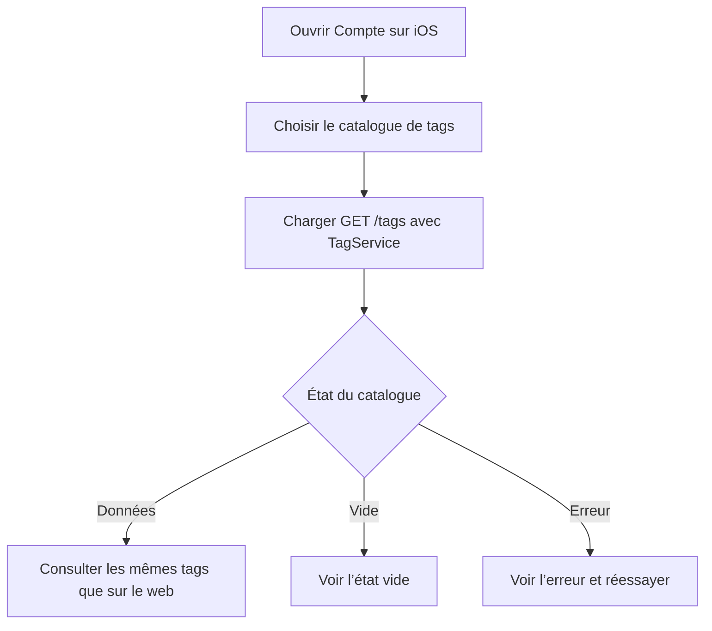

# Instruction: Catalogue iOS connecté au même backend

## Architecture projection

> Tree of the final files. ✅ create · ✏️ modify · ❌ delete

```txt
ios/
├── Pulpe/
│   ├── Core/Network/Endpoints.swift                                          ✏️ endpoint GET /tags
│   ├── Domain/Models/Tag.swift                                               ✅ contrat Codable du tag backend
│   ├── Domain/Services/TagService.swift                                      ✅ service de lecture testable
│   └── Features/Account/
│       ├── AccountView.swift                                                 ✏️ entrée de navigation Tags
│       ├── TagsSettingsView.swift                                            ✅ écran SwiftUI de consultation
│       └── TagsSettingsViewModel.swift                                       ✅ chargement et états d’écran
└── PulpeTests/
    ├── Domain/Services/TagServiceTests.swift                                 ✅ endpoint et décodage du catalogue
    └── Features/Account/TagsSettingsViewModelTests.swift                     ✅ succès, vide et erreur
```

Aucune suppression de fichier. `ios/project.yml` inclut déjà automatiquement les nouveaux fichiers sous `Pulpe` et `PulpeTests`.

## User Journey



## Wireframe

```txt
Compte
┌──────────────────────────────────────────────┐
│ (1) Navigation                              │
├──────────────────────────────────────────────┤
│ (2) Profil                                  │
├──────────────────────────────────────────────┤
│ (3) Paramètres de l’application             │
│     Sécurité                         [>]     │
│     Préférences                      [>]     │
│     Catalogue de tags                [>]     │
├──────────────────────────────────────────────┤
│ (4) Autres sections existantes              │
└──────────────────────────────────────────────┘

Catalogue de tags
┌──────────────────────────────────────────────┐
│ (5) Barre de navigation                     │
├──────────────────────────────────────────────┤
│ (6) Liste                                   │
│     [icône tag] Nom                         │
│     [icône tag] Nom                         │
│     [icône tag] Nom                         │
├──────────────────────────────────────────────┤
│ (7) Zone d’état alternatif                  │
└──────────────────────────────────────────────┘
```

1. Navigation : écran Compte existant.
2. Profil : contenu actuel inchangé.
3. Paramètres : nouvelle entrée au même niveau que Préférences.
4. Support, légal et déconnexion restent inchangés.
5. Navigation du catalogue : retour natif et titre.
6. Liste : catalogue personnel renvoyé par le backend.
7. Zone alternative : chargement, erreur ou catalogue vide.

## Tasks to do

### `1)` Ajouter le contrat de lecture iOS

> Décoder le catalogue existant sans stockage local parallèle.

1. Définir le modèle `Tag` selon la réponse backend actuelle.
2. Ajouter l’endpoint `tags` mappé sur `GET /tags`.
3. Créer un protocole de service testable et son implémentation `APIClient`.
4. Vérifier le décodage des dates ISO et la route appelée.

### `2)` Construire l’écran de consultation

> Présenter un état simple et natif autour du chargement réseau.

1. Créer un view-model `@Observable @MainActor` avec données, chargement et erreur.
2. Charger à l’ouverture et permettre un retry après échec.
3. Afficher la liste, le compteur et un état vide dans une `List` conforme au design iOS.
4. Respecter Dynamic Type, les cibles de 44 pt et les libellés VoiceOver.

### `3)` Relier l’écran au compte

> Ajouter une sous-entrée cohérente avec Sécurité et Préférences.

1. Ajouter la ligne Tags dans `appSettingsSection`.
2. Utiliser la navigation native existante vers `TagsSettingsView`.
3. Conserver le reste de `AccountView` inchangé.

### `4)` Maintenir la frontière du périmètre

> Livrer la consultation cross-platform sans masquer un chantier d’intégration plus large.

1. Ne pas ajouter de cache persistant local ; le backend reste autoritaire.
2. Ne pas ajouter de création, renommage ou suppression iOS dans ce plan.
3. Ne pas modifier les formulaires ou modèles Transaction/BudgetLine pour afficher ou éditer leurs `tagIds` dans ce plan.

## Test acceptance criteria

| Task | Acceptance criteria |
| ---- | ------------------- |
| 1 | Le client iOS appelle `/tags`, décode les identifiants, noms et dates, puis expose le catalogue utilisateur sans copie persistante locale. |
| 2 | L’écran affiche les mêmes noms que le web et distingue chargement, erreur récupérable, vide et liste peuplée. |
| 2 | Le contenu reste utilisable avec Dynamic Type et VoiceOver. |
| 3 | Depuis Compte, une ligne Tags ouvre l’écran dans le `NavigationStack` existant. |
| 4 | Aucun contrôle de mutation ni intégration des tags aux entités financières iOS n’est introduit. |
