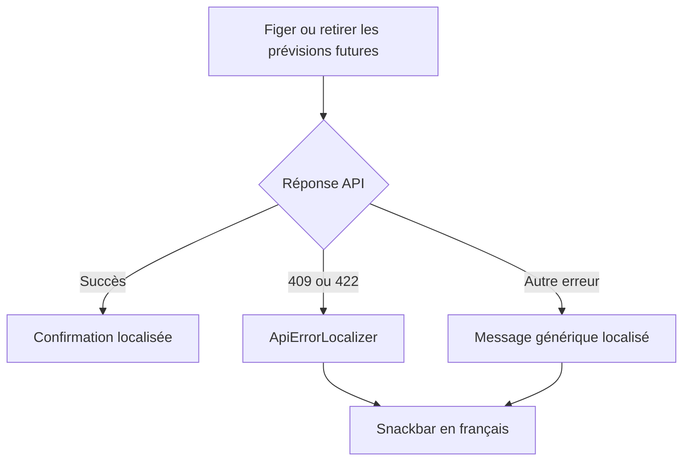

# Instruction: Webapp — localiser les erreurs d'arrêt de génération

## Architecture projection

> Tree of the final files. ✅ create · ✏️ modify · ❌ delete

```txt
.
└── frontend/projects/webapp/src/app/feature/savings-goals/detail/
    ├── ✏️ savings-goal-detail-page.ts       # route les erreurs generation-stop vers la localisation centrale
    └── ✏️ savings-goal-detail-page.spec.ts  # reproduit 409/422 et protège le succès existant
```

## User Journey



## Tasks to do

### `1)` Verrouiller la régression avant le correctif

> Reproduire le message serveur anglais depuis le parcours réel de la page détail.

1. Étendre les mocks existants du store et du dialog pour piloter le parcours generation-stop depuis la carte advisory.
2. Ajouter un test paramétré 409/422 avec `ApiError` et vérifier le texte français attendu, jamais `error.message`.
3. Ajouter le cas d'échec du chargement des candidates : un `ApiError` non mappé affiche le fallback localisé.
4. Conserver un cas succès qui vérifie le payload `mode` + `budgetLineIds` et la confirmation localisée.

### `2)` Centraliser le chemin d'erreur localisé

> Faire passer les deux catches generation-stop par le même traitement que l'application du simulateur.

1. Renommer `#showApplyError` en `#showLocalizedApiError` pour refléter ses deux consommateurs.
2. Utiliser ce helper dans `#proposeGenerationStop`, `#applyGenerationStopDecision` et `onApplyPlan`.
3. Garder la règle existante : `isApiError` → `ApiErrorLocalizer`, sinon `common.error`.
4. Ne modifier ni `ApiErrorLocalizer` ni `fr.json` : les deux mappings et traductions generation-stop existent déjà.

## Test acceptance criteria

| Task | Acceptance criteria |
| ---- | ------------------- |
| 1 | Un 409 `SAVINGS_GOAL_GENERATION_STOP_CONFLICT` affiche « Ces prévisions ont changé entre-temps — recharge la liste et réessaie », pas le message backend anglais. |
| 1 | Un 422 `SAVINGS_GOAL_GENERATION_STOP_LINE_INVALID` affiche la traduction dédiée, pas le message backend anglais. |
| 1 | Un échec API non mappé pendant le chargement des candidates affiche le fallback français et ne divulgue pas `error.message`. |
| 1 | Le succès freeze/remove envoie toujours les ids affichés et conserve la snackbar de confirmation. |
| 2 | Les erreurs du simulateur restent localisées après le renommage du helper. |
