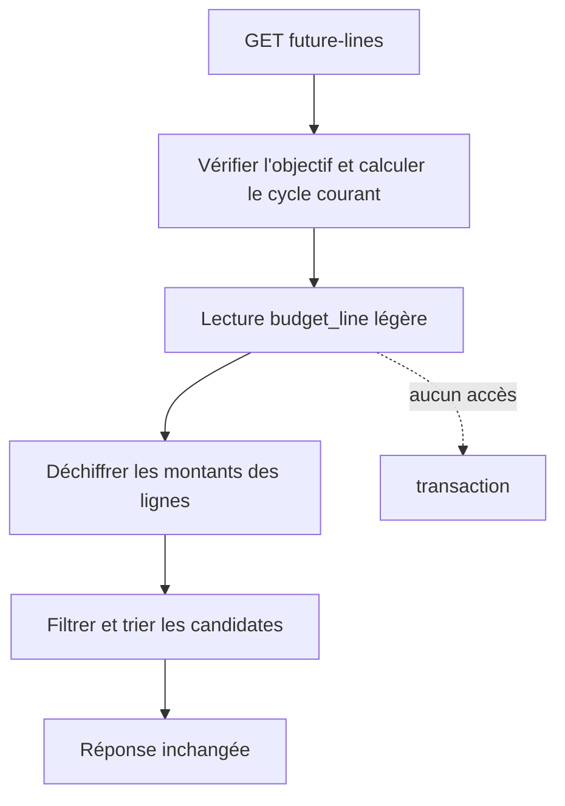

# Instruction: Backend — alléger la lecture des prévisions futures

## Architecture projection

> Tree of the final files. ✅ create · ✏️ modify · ❌ delete

```txt
.
└── backend-nest/src/modules/savings-goal/
    ├── application/
    │   ├── ✏️ get-savings-goal-future-lines.use-case.ts       # consomme la lecture line-only
    │   └── ✏️ get-savings-goal-future-lines.use-case.spec.ts  # prouve les filtres et le nouveau port
    ├── domain/ports/
    │   └── ✏️ savings-goal-repository.port.ts                  # expose findFutureLinkedLines
    └── infrastructure/persistence/
        ├── ✏️ supabase-savings-goal.repository.ts       # lit/déchiffre les lignes sans transactions
        └── ✏️ supabase-savings-goal.repository.spec.ts  # vérifie zéro requête transaction
```

## User Journey



## Tasks to do

### `1)` Prouver l'absence du round-trip inutile

> Écrire les tests avant de remplacer la lecture lourde.

1. Faire attendre au test du use-case le nouveau port `findFutureLinkedLines` et vérifier que `findLinkedContributions` n'est plus appelé.
2. Ajouter un test repository qui vérifie le mapping/déchiffrement des lignes et l'absence totale de requête sur `transaction`.
3. Garder les tests de sélection métier : non pointée, non ajustée, cycle courant ou futur, sans borne à `target_date`.

### `2)` Ajouter la lecture line-only au repository

> Exposer les mêmes lignes déchiffrées sans charger leurs transactions.

1. Ajouter `findFutureLinkedLines(goalId): Promise<LinkedSavingLine[]>` au port, documenté comme source line-only dont la qualification temporelle reste dans le use-case.
2. Déplacer le SELECT `budget_line` et son mapping déchiffré dans cette méthode publique dédiée.
3. Faire déléguer `findLinkedContributions` à cette lecture avant son chargement de transactions afin de conserver une seule implémentation du SELECT/mapping.
4. Préserver `SAVINGS_GOAL_FETCH_FAILED` pour une erreur de lignes et `TRANSACTION_FETCH_FAILED` pour le seul flux qui demande encore les transactions.

### `3)` Basculer le GET future-lines sur le nouveau port

> Supprimer le coût transaction sans changer les critères fonctionnels.

1. Remplacer `findLinkedContributions` par `findFutureLinkedLines` dans le use-case.
2. Conserver `findById`, le calcul payDay-aware, les gardes `checkedAt`/`isManuallyAdjusted`, le tri chronologique et l'absence de borne à l'échéance.
3. Vérifier les specs ciblées backend puis le gate `pnpm quality` commun aux deux phases.

## Test acceptance criteria

| Task | Acceptance criteria |
| ---- | ------------------- |
| 1 | Le use-case future-lines dépend exclusivement de la lecture line-only pour ses prévisions liées. |
| 1 | Un appel future-lines n'émet aucun SELECT `transaction` et ne déchiffre aucun montant de transaction. |
| 2 | Les montants de `budget_line` restent déchiffrés et les champs `checkedAt`, `isManuallyAdjusted`, `month` et `year` restent identiques. |
| 2 | `findLinkedContributions` continue de retourner ses transactions déchiffrées pour la progression et le simulateur. |
| 3 | Le GET retourne toujours exactement les lignes liées, non pointées, non ajustées, du cycle courant et au-delà, y compris après `target_date`. |
