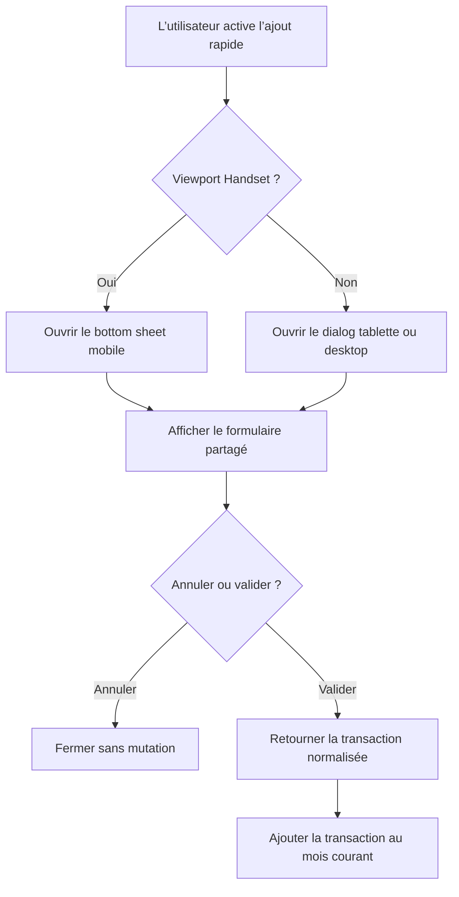

# Instruction: Livrer et vérifier la surface adaptative d’ajout rapide

## Architecture projection

> Tree of the final files. ✅ create · ✏️ modify · ❌ delete

```txt
frontend/
├── e2e/tests/features/
│   └── ✏️ current-month-transactions.spec.ts
└── projects/webapp/src/
    ├── app/
    │   ├── feature/current-month/
    │   │   ├── ✏️ current-month.routes.ts
    │   │   ├── ✏️ current-month.spec.ts
    │   │   ├── ✏️ current-month.ts
    │   │   ├── components/
    │   │   │   ├── ✏️ add-transaction-bottom-sheet.spec.ts
    │   │   │   ├── ✏️ add-transaction-bottom-sheet.ts
    │   │   │   ├── ✅ add-transaction-dialog.ts
    │   │   │   ├── ✅ add-transaction-form.spec.ts
    │   │   │   └── ✅ add-transaction-form.ts
    │   │   └── services/
    │   │       ├── ✅ add-transaction-dialog.service.spec.ts
    │   │       └── ✅ add-transaction-dialog.service.ts
    │   └── styles/
    │       └── ✏️ _dialogs.scss
```

## User Journey



## Wireframe

### Tablette

```txt
┌──────────────────────────────────────────────────────────────┐
│ (1) En-tête : titre · contexte                     [fermer]  │
├──────────────────────────────┬───────────────────────────────┤
│ (2) Saisie principale        │ (3) Détails de transaction    │
│ [champ montant]              │ [champ description]           │
│ [grille de montants rapides] │ [sélecteur de type]           │
│                              │ [champ notes]                  │
├──────────────────────────────┴───────────────────────────────┤
│ (4) Métadonnées : [date]                    [statut + toggle] │
├──────────────────────────────────────────────────────────────┤
│ (5) Actions                                 [retour] [valider]│
└──────────────────────────────────────────────────────────────┘
```

1. En-tête : identifie la tâche et fournit une sortie explicite.
2. Saisie principale : regroupe le montant et ses raccourcis.
3. Détails : regroupe les champs descriptifs dans l’ordre de lecture.
4. Métadonnées : rassemble les informations secondaires sans allonger une colonne.
5. Actions : garde les décisions finales visibles hors de la zone scrollable.

### Desktop

```txt
┌──────────────────────────────────────────────────────────────────────┐
│ (1) En-tête : titre · contexte                             [fermer]  │
├─────────────────────────────────┬────────────────────────────────────┤
│ (2) Saisie principale           │ (3) Détails de transaction         │
│ [champ montant]                 │ [champ description]                │
│ [grille de montants rapides]    │ [sélecteur de type]                │
│                                 │ [champ notes]                       │
├─────────────────────────────────┴────────────────────────────────────┤
│ (4) Métadonnées : [date]                            [statut + toggle] │
├──────────────────────────────────────────────────────────────────────┤
│ (5) Actions                                         [retour] [valider]│
└──────────────────────────────────────────────────────────────────────┘
```

1. En-tête : conserve une hiérarchie courte adaptée à une tâche rapide.
2. Saisie principale : donne la priorité au montant sans étirer le formulaire.
3. Détails : utilise la largeur disponible sans ajouter de contenu.
4. Métadonnées : forme une rangée secondaire commune aux deux colonnes.
5. Actions : reste ancrée au bas du dialog et alignée sur la fin.

## Tasks to do

### `1)` Verrouiller le défaut responsive

> Reproduire le mauvais conteneur avant de modifier l’implémentation.

1. Ajouter dans `current-month-transactions.spec.ts` un scénario tablette `768 × 1024` qui échoue tant que le FAB ouvre un bottom sheet.
2. Couvrir aussi un desktop `1440 × 900` et un handset `390 × 844` : dialog pour les deux grands viewports, bottom sheet pour le handset.
3. Vérifier que le bouton de validation est visible dans le viewport dès l’ouverture sur tablette et desktop.

### `2)` Séparer le formulaire de ses conteneurs adaptatifs

> Réutiliser le pattern dialog + bottom sheet + formulaire partagé déjà présent dans la feature budget.

1. Déplacer modèle, Signal Form, validations, conversion, état de soumission et construction de `TransactionFormData` dans `AddTransactionForm`.
2. Exposer uniquement `created`, `canSubmit`, `isSubmitting`, `submit()` et `focusAmount()` aux wrappers.
3. Réduire `AddTransactionBottomSheet` au chrome mobile : poignée, en-tête, formulaire partagé et actions.
4. Créer `AddTransactionDialog` avec les primitives `mat-dialog-title`, `mat-dialog-content` et `mat-dialog-actions` afin que seules les données du formulaire scrollent.
5. Créer `AddTransactionDialogService`, scoped dans `current-month.routes.ts`, qui choisit `MatBottomSheet` pour `Breakpoints.Handset` et `MatDialog` sinon, puis retourne un résultat unique au dashboard.
6. Remplacer l’ouverture directe dans `current-month.ts` par le service sans déplacer la mutation vers ce service.

#### Surface adaptative

| Before | After |
| --- | --- |
| `current-month.ts` ouvre `AddTransactionBottomSheet` à toute largeur | `AddTransactionDialogService` ouvre le bottom sheet sur handset et le dialog sur tablette/desktop |
| Formulaire, fermeture et chrome mobile vivent dans `add-transaction-bottom-sheet.ts` | `AddTransactionForm` porte le métier ; chaque wrapper ne porte que sa présentation et son type de ref |
| Poignée de glissement visible sur desktop | Poignée réservée au bottom sheet ; le dialog utilise un en-tête Material et une fermeture explicite |

### `3)` Composer le dialog pour tablette et desktop

> Réduire la hauteur, clarifier la hiérarchie et préserver l’ordre clavier.

1. Donner au dialog une largeur cible de `720px`, limitée par le viewport, avec un `panelClass` et un override Material scoped dans `_dialogs.scss`.
2. Passer le contenu à deux groupes en colonnes à partir du breakpoint tablette : montant + raccourcis à gauche, description + type + notes à droite.
3. Garder la date et le toggle dans une rangée pleine largeur sous les deux groupes ; conserver un flux monocolonne dans le bottom sheet.
4. Maintenir l’ordre DOM montant → raccourcis → description → type → notes → date → statut pour que le parcours clavier suive la lecture.
5. Conserver l’autofocus du montant après ouverture, la fermeture par Échap/backdrop et la restauration du focus vers le FAB.
6. Utiliser le bouton de chargement existant pour une action primaire remplie, désactivée pendant la conversion, avec retour d’attente accessible.
7. Appliquer les chiffres tabulaires au montant et aux raccourcis, puis supprimer l’échelle de press lorsque `prefers-reduced-motion` est actif.

#### Hiérarchie et densité

| Before | After |
| --- | --- |
| Une colonne étroite et longue sur tous les viewports | Deux colonnes sémantiques dès la tablette, une colonne conservée sur handset |
| Actions après tout le contenu de la feuille | `mat-dialog-actions` fixe les actions hors du contenu scrollable sur tablette/desktop |
| Action principale `outlined` sans indicateur d’attente | Action `filled` unique via `pulpe-loading-button`, avec spinner et blocage du double envoi |
| Montants rapides en `flex-wrap` avec une hauteur de `40px` | Grille de quatre cibles de `44px` minimum, chiffres tabulaires sur tous les montants et largeur régulière |

#### Interaction et finition

| Before | After |
| --- | --- |
| Raccourcis sans retour tactile dédié | `scale(0.96)` au press avec transition limitée à `transform` sur `150ms`, neutralisée en reduced motion |
| Titre et sous-titre utilisent le wrapping par défaut | Titre équilibré et texte court en wrapping lisible, sans changer Manrope/DM Sans |
| Ouverture desktop calquée sur le mouvement d’une feuille mobile | Transition native du dialog Material ; aucune animation décorative ou dépendance ajoutée |
| Fermeture et champs testés surtout par leur logique métier | Cibles ≥40px desktop / 44px tactile, focus visible, libellés conservés et ordre clavier vérifié |

### `4)` Répartir les tests et prouver le parcours

> Garder une preuve ciblée du bug et du happy path, sans dupliquer toute la matrice existante.

1. Déplacer les tests de modèle, validation, conversion et montants rapides vers `add-transaction-form.spec.ts`.
2. Limiter `add-transaction-bottom-sheet.spec.ts` au branchement du wrapper : focus, annulation, soumission et propagation du résultat.
3. Tester dans `add-transaction-dialog.service.spec.ts` les deux branches de breakpoint, leurs configurations et le même type de résultat.
4. Adapter `current-month.spec.ts` pour vérifier que le dashboard délègue l’ouverture et conserve la mutation après un résultat défini.
5. Exécuter les tests Vitest ciblés, le scénario Playwright de transactions du mois courant, puis `pnpm quality`.

## Test acceptance criteria

| Task | Acceptance criteria |
| --- | --- |
| 1 | À `768 × 1024` et `1440 × 900`, le FAB ouvre un dialog centré et non un bottom sheet ; l’action principale est visible sans scroll du document. |
| 1 | À `390 × 844`, le même FAB ouvre toujours le bottom sheet mobile. |
| 2 | Les deux conteneurs rendent le même formulaire, produisent le même `TransactionFormData` et une annulation ne déclenche aucune mutation. |
| 2 | Validation, devise, conversion, notes optionnelles et état pointé conservent leur comportement actuel. |
| 3 | Sur tablette et desktop, montant/raccourcis et détails occupent deux colonnes, tandis que date/statut et actions utilisent toute la largeur. |
| 3 | Le parcours clavier suit l’ordre visuel, le montant reçoit le focus initial, Échap ferme la surface et le focus revient au FAB. |
| 3 | Les montants utilisent des chiffres tabulaires, les raccourcis ont une cible tactile d’au moins `44px`, le reduced motion est respecté et le submit affiche un état d’attente sans double envoi. |
| 4 | Le parcours E2E ajoute une transaction libre depuis le dialog desktop et la transaction apparaît dans les dernières transactions avec les totaux recalculés. |
| 4 | Les tests ciblés et la qualité frontend passent sans régression du bottom sheet mobile. |
