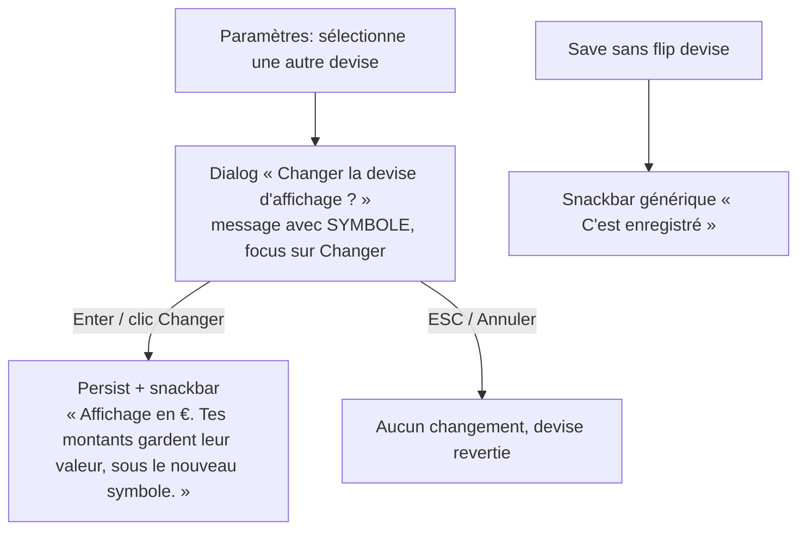

# Instruction: Webapp — PUL-205 dialog/toast, PUL-217 support URL, savings aria-label

## Architecture projection

> Tree of the final files. ✅ create · ✏️ modify · ❌ delete

```txt
frontend/projects/webapp/
├── public/i18n/fr.json                                                        ✏️ currencyChangeMessage → symbole, + currencyChangeSuccess, + savingsGoals locked-aria key
└── src/app/feature/
    ├── settings/
    │   ├── settings-dialog.service.ts                                         ✏️ autoFocus sur le bouton confirm (CA13) + symbole dans le message (CURRENCY_METADATA)
    │   ├── settings-dialog.service.spec.ts (ou spec existante du service)     ✏️ assert autoFocus + symbole passés à MatDialog.open
    │   ├── settings-page.ts                                                   ✏️ snackbar post-flip devise-spécifique quand currencyChanged (CA5)
    │   └── settings-page.spec.ts                                              ✏️ assert copy du snackbar sur flip confirmé vs save simple
    ├── auth/recover-vault-code/
    │   ├── recover-vault-code.ts                                              ✏️ export const SUPPORT_URL + binding [href] (CA12)
    │   └── recover-vault-code.spec.ts                                         ✏️ assert le lien via la constante importée
    └── savings-goals/detail/components/
        ├── goal-plan-timeline.ts                                              ✏️ lockedAmountLabel via transloco + montant formaté (code ISO, règle aria)
        └── goal-plan-timeline.spec.ts (si existante, sinon spec du parent)    ✏️ assert aria-label complet « {montant}, pointé, verrouillé »
```

## User Journey



## Tasks to do

### `1)` CA13 — Enter confirme le flip devise

> Focus initial sur le bouton confirm, scoped au dialog devise uniquement.

1. Dans `settings-dialog.service.ts:23-36`, ajouter `autoFocus: '[data-testid="confirmation-confirm-button"]'` à la config `MatDialog.open`.
2. Ne PAS toucher `ui/dialogs/confirmation-dialog.ts` (partagé avec les confirms destructifs).
3. Spec: `MatDialog.open` reçoit l'`autoFocus` attendu.

### `2)` Symbole au lieu du code ISO dans le message du dialog

> `currencyChangeMessage` interpole aujourd'hui `EUR`/`CHF` brut.

1. Dans `settings-dialog.service.ts`, passer `CURRENCY_METADATA[newCurrency].symbol` (import `pulpe-shared`) comme paramètre du message au lieu de `newCurrency`.
2. `fr.json` `settings.currencyChangeMessage`: renommer le placeholder `{{ currency }}` → `{{ symbol }}` pour l'intention.

### `3)` CA5 — snackbar post-flip devise-spécifique

> Le flip confirmé doit clarifier l'absence de conversion; un save sans flip garde le générique.

1. `fr.json`: ajouter `settings.currencyChangeSuccess` = « Affichage en {{ symbol }}. Tes montants gardent leur valeur, sous le nouveau symbole. »
2. Dans `settings-page.ts` (bloc succès du save, ~:490): si `previousCurrency !== newCurrency` (flip confirmé), snackbar avec la nouvelle clé + symbole; sinon `saveSuccess` inchangé.
3. Spec: les deux chemins (flip confirmé → copy devise; save simple → générique). Vérifier qu'aucune assertion existante sur `saveSuccess` ne casse.

### `4)` CA12 — SUPPORT_URL centralisée (web)

1. Dans `recover-vault-code.ts`, `export const SUPPORT_URL = 'https://pulpe.app/support';` + membre `protected readonly supportUrl = SUPPORT_URL;` + template `[href]="supportUrl"`.
2. `recover-vault-code.spec.ts:165`: remplacer l'URL en dur par l'import de `SUPPORT_URL`.

### `5)` aria-label du montant pointé/verrouillé via transloco

> `goal-plan-timeline.ts:286` hardcode `', pointé, verrouillé'` et remplace l'annonce du montant.

1. `fr.json`: ajouter une clé (ex. `savingsGoals.detail.lockedAmountAria`) = « {{ amount }}, pointé, verrouillé ».
2. Dans `goal-plan-timeline.ts`, `lockedAmountLabel` injecte `TranslocoService` et interpole le montant formaté — code ISO en aria (règle currency-formatting: aria = raw ISO, suivre le pattern des clés `aria*` existantes de fr.json), 2 décimales (catégorie ligne).
3. Spec: aria-label rendu = montant + état pour une ligne pointée; `null` pour une ligne non pointée.

## Test acceptance criteria

| Task | Acceptance criteria |
| ---- | ------------------- |
| 1 | Dialog devise ouvert → focus initial sur « Changer »; Enter persiste le flip; ESC/Annuler ne change rien. Les confirms destructifs (delete) gardent leur focus par défaut |
| 2 | Le message du dialog affiche « … affiché en € » (ou CHF), jamais `EUR`/`CHF` ISO |
| 3 | Flip confirmé → snackbar « Affichage en €. Tes montants gardent leur valeur, sous le nouveau symbole. »; save sans flip → « C'est enregistré » |
| 4 | L'URL support n'existe qu'en un seul littéral dans le code web (constante exportée), template et spec la référencent |
| 5 | Lecteur d'écran: une ligne pointée annonce montant + « pointé, verrouillé »; plus aucune chaîne française en dur dans le TS du composant |
