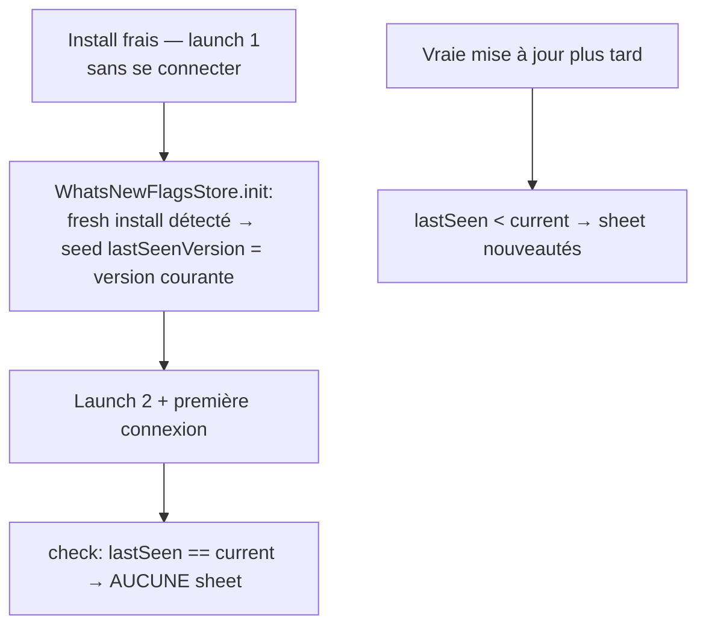

# Instruction: iOS — PUL-186 first-install, PUL-205 toast, SavingsGoalDestination

## Architecture projection

> Tree of the final files. ✅ create · ✏️ modify · ❌ delete

```txt
ios/Pulpe/
├── App/
│   ├── WhatsNewFlagsStore.swift                       ✏️ seed lastSeenVersion au 1er lancement (CA6) + constante de clé partagée avec AppAuthFlagsStore
│   ├── AppState.swift                                 ✏️ accueille SavingsGoalDestination à côté de BudgetDestination (:463)
│   └── (AppAuthFlagsStore.swift)                      ✏️ expose la constante de clé `pulpe-has-launched-before` (si pas déjà accessible)
├── Features/
│   ├── SavingsGoals/SavingsGoalsListView.swift        ✏️ retirer l'enum SavingsGoalDestination (:5)
│   └── Account/CurrencySettingView.swift              ✏️ toast + VoiceOver post-flip avec copy no-conversion (CA5); alert message: symbole au lieu de rawValue
└── PulpeTests/
    ├── Domain/Store/WhatsNewStoreTests.swift          ✏️ scénario « launch 1 sans auth, launch 2 authentifié → silence »
    └── (WhatsNewFlagsStoreTests si dédiée)            ✅ seed-on-fresh-install: écrit une fois, jamais quand wasInstalledBeforeWhatsNew
```

## User Journey



## Tasks to do

### `1)` CA6 — plus de sheet nouveautés pour un install frais à 2 lancements

> Le trou: launch 1 sans auth pose `pulpe-has-launched-before` (bootstrap) sans poser `lastSeenVersion` (auth-gated).

1. Dans `WhatsNewFlagsStore.init`, quand `wasInstalledBeforeWhatsNew == false` ET `lastSeenVersion == nil` → `setLastSeenVersion(currentVersion)` (paramètre `currentVersion: String = AppConfiguration.appVersion` pour l'injectabilité test).
2. Laisser la branche first-install de `WhatsNewStore.check()` en place (défensive, commentaire mis à jour).
3. Extraire la clé dupliquée `pulpe-has-launched-before` en constante unique référencée par `AppAuthFlagsStore` et `WhatsNewFlagsStore` (le rename silencieux casserait la distinction migration/first-install).
4. Tests (Swift Testing, `UserDefaults(suiteName:)` isolé): (a) fresh install → init seed la version courante; (b) `hasLaunchedBefore` déjà posé sans lastSeen → PAS de seed (chemin migration 1.0.4 préservé); (c) scénario bout-en-bout store: launch 1 non-auth puis launch 2 auth → `isPresented == false`.

### `2)` CA5 — toast post-flip devise avec copy no-conversion

1. Dans `CurrencySettingView.persistCurrencyChange` (:184): remplacer « Devise enregistrée » (toast + `announceForVoiceOver`) par « Affichage en {symbole}. Tes montants gardent leur valeur. » — symbole via l'API existante de `SupportedCurrency` (vérifier `Shared/` avant d'écrire, jamais de concat manuelle).
2. Même fichier, alert message (~:56): `currency.rawValue` → symbole (parité avec le fix web du placeholder).

### `3)` SavingsGoalDestination → App/AppState.swift

> Enum Features/SavingsGoals consommée par Features/Budgets + MainTabView (règle FORBIDDEN Features/X→Features/Y).

1. Déplacer l'enum `SavingsGoalDestination` de `SavingsGoalsListView.swift:5` vers `App/AppState.swift`, à côté de `BudgetDestination`/`TemplateDestination` (:463-467). Déplacement pur, zéro changement de casse/logique.
2. Build + suite savings existante pour prouver le non-changement.

## Test acceptance criteria

| Task | Acceptance criteria |
| ---- | ------------------- |
| 1 | Install frais lancé 1× sans auth puis relancé avec login: aucune sheet nouveautés. Install pré-PUL-186 existant: baseline 1.0.4 intacte (sheet sur la 1re update capable). Un seul littéral `pulpe-has-launched-before` dans le code |
| 2 | Flip devise confirmé → toast et annonce VoiceOver « Affichage en CHF. Tes montants gardent leur valeur. » (ou €); l'alert de confirmation affiche le symbole, plus jamais `EUR`/`CHF` brut |
| 3 | `grep SavingsGoalDestination` ne matche plus rien sous `Features/SavingsGoals` (définition), navigation liste→détail et lien depuis Budget Details inchangés (build + tests verts, swiftlint --strict clean) |
