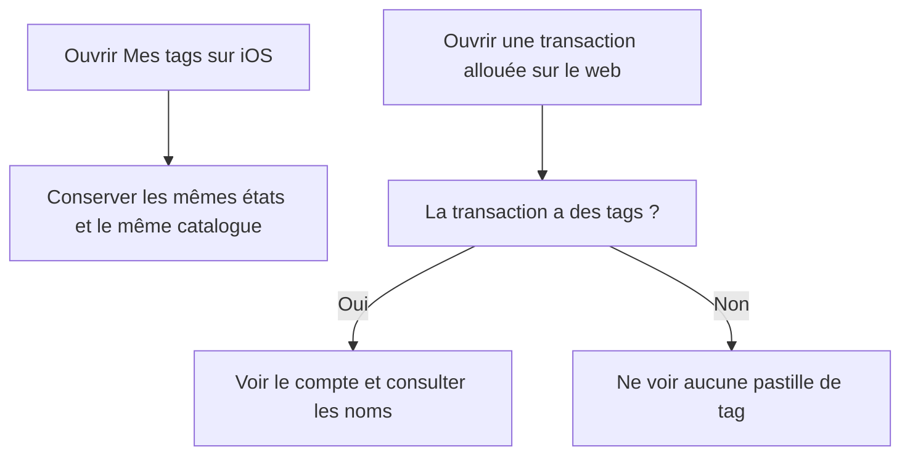

# Instruction: Fermer les deux findings de la review tags

## Architecture projection

> Tree of the final files. ✅ create · ✏️ modify · ❌ delete

```txt
ios/Pulpe/Features/Account/
├── TagsSettingsView.swift                                           ✏️ co-localiser le ViewModel sous la vue sans changer sa logique
└── TagsSettingsViewModel.swift                                      ❌ supprimer le fichier de ViewModel séparé
frontend/projects/webapp/src/app/feature/budget/budget-details/components/budget-grid/
└── budget-detail-panel.spec.ts                                      ✏️ tester le vrai TagIndicator et son rendu vide
```

## User Journey



## Tasks to do

### `1)` Co-localiser le ViewModel iOS

> Respecter la règle d’architecture sans toucher au comportement de l’écran.

1. Déplacer `TagsSettingsViewModel` sous `TagsSettingsView` dans le même fichier, selon le pattern de `SecuritySettingsView`.
2. Conserver `@Observable @MainActor`, l’injection de `TagServicing`, les états, le libellé de compte et la gestion de l’annulation à l’identique.
3. Supprimer `TagsSettingsViewModel.swift` et régénérer le projet avec `xcodegen generate --use-cache` afin d’éliminer toute référence locale obsolète.
4. Garder `TagsSettingsViewModelTests` inchangé sauf adaptation strictement nécessaire à la compilation.

### `2)` Rendre le test Angular probant

> Le test d’intégration doit observer le rendu réel du composant partagé.

1. Retirer `StubTagIndicator` et ne plus remplacer `TagIndicator` dans l’override du panneau.
2. Pour une transaction avec deux tags, vérifier que le panneau résout `Assurance` et `Bureau`, puis vérifier sur le vrai composant le compte `2` et ces noms accessibles. Le `setTestInput` explicite contourne uniquement le `NG0950` connu des signal inputs imbriqués sous TestBed ; l’appel du resolver par le template reste vérifié séparément.
3. Pour une transaction sans tag, vérifier l’absence de la pastille rendue dans le host `pulpe-tag-indicator`, et non la seule valeur vide de son input.
4. Conserver les stubs sans rapport avec ce comportement afin de garder le test ciblé.

### `3)` Valider puis relancer la review

> Les corrections doivent fermer les findings sans régression applicative.

1. Exécuter les specs ciblées de `BudgetDetailPanel` et `TagIndicator` depuis `frontend`.
2. Exécuter `TagsSettingsViewModelTests` avec `xcodebuild test` sur un simulateur disponible après régénération XcodeGen.
3. Exécuter `pnpm quality` à la racine.
4. Relancer la review statique sur le diff final et confirmer la disparition du warning et du point mineur.

## Test acceptance criteria

| Task | Acceptance criteria |
| --- | --- |
| 1 | `TagsSettingsViewModel` est défini dans `TagsSettingsView.swift`, son ancien fichier n’existe plus et les états chargement, erreur, vide et liste restent inchangés. |
| 1 | Le catalogue iOS compile et les tests du ViewModel conservent les scénarios succès, vide et erreur suivie d’une reprise. |
| 2 | Avec deux tags, le test du panneau observe sur le vrai `TagIndicator` le compte `2` et les deux noms accessibles. |
| 2 | Sans tag, aucune pastille n’est rendue et le test échoue si le composant partagé recommence à afficher un indicateur vide. |
| 3 | Les tests ciblés frontend et iOS ainsi que `pnpm quality` passent sur le diff final. |
| 3 | La nouvelle review ne reporte plus les findings `conform` iOS et `code` Angular identifiés le 2026-07-16. |
