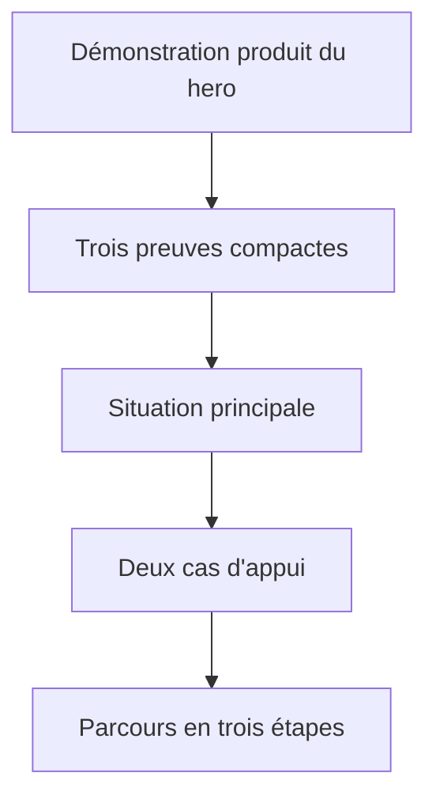

# Instruction: Continuité visuelle et narrative sur mobile

## Architecture projection

> Tree of the final files. ✅ create · ✏️ modify · ❌ delete

```txt
landing/
├── DESIGN.md ✏️ — documenter le champ diffus mobile dérivé de Borumi
├── app/
│   ├── accessibility.test.tsx ✏️ — verrouiller le contrat responsive avant la correction
│   └── globals.css ✏️ — construire les ellipses floutées par section
└── components/
    └── sections/
        ├── Hero.tsx ✏️ — raccourcir uniquement sa sortie mobile
        ├── PainPoints.tsx ✏️ — porter le fond diffus et clarifier les preuves
        └── FinalCTA.tsx ✏️ — renforcer le texte secondaire sur le champ ambiant
```

## User Journey



## Wireframe

```txt
Mobile
┌──────────────────────────────┐
│ (1) Fin de la preuve produit │
├──────────────────────────────┤
│ (2) Preuve · explication     │
│     Preuve · explication     │
│     Preuve · explication     │
├──────────────────────────────┤
│ (3) Situation principale     │
│     repère · titre · texte   │
├──────────────────────────────┤
│ (4) Cas d'appui empilés      │
├──────────────────────────────┤
│ (5) Section suivante         │
└──────────────────────────────┘
```

1. Fin du hero : la démonstration produit reste la dernière preuve de la promesse.
2. Preuves : trois lignes courtes prolongent le hero sans occuper un écran entier.
3. Situation principale : le récit commence immédiatement après les preuves.
4. Cas d'appui : les deux exemples conservent leur hiérarchie actuelle.
5. Section suivante : la transition vers le parcours reste identifiable.

## Tasks to do

### `1)` Écrire le contrat de régression mobile

> Reproduire le défaut avant de modifier le rendu.

1. Étendre `accessibility.test.tsx` avec la source de `PainPoints`.
2. Exiger l'absence de dégradé global sur `body` sous 768 px et la présence de deux ellipses floutées sur le hero et `PainPoints`.
3. Verrouiller les paramètres observés sur le hero et les témoignages Borumi : `40vw × 60vh`, rotation `-30deg`, `blur(150px)`, opacité comprise entre `0.3` et `0.4`, entrées opposées à `10%` et `90%`.
4. Exiger une hiérarchie sémantique et visuelle `preuve → explication`, compacte par défaut puis en trois colonnes à partir de `sm`.
5. Constater l'échec du contrat sur l'implémentation actuelle avant la correction.

### `2)` Reproduire le fondu Borumi avec la palette Pulpe

> Copier la mécanique de diffusion, pas l'identité visuelle de Borumi.

1. Désactiver sous 768 px les dégradés radiaux actuellement portés par `body`.
2. Donner à `.hero-mesh` et à une classe dédiée de `PainPoints` deux pseudo-éléments elliptiques plein champ, non interactifs et placés derrière le contenu.
3. Reprendre la géométrie mobile Borumi : côtés hors-cadre, ellipse droite en haut, ellipse gauche en bas, rotation et flou identiques.
4. Mapper les ellipses sur des variantes mobiles plus denses de `--ambient-leaf`, `--ambient-mint` et `--ambient-lime`; conserver `--color-background` comme base entre les halos et deux teintes distinctes au raccord.
5. Laisser les halos déborder entre `Hero` et `PainPoints`, puis couper uniquement le débordement extérieur au niveau de `#main-content`, afin d'éviter une rupture horizontale.
6. Laisser les règles existantes inchangées à partir de 768 px.

### `3)` Rattacher les preuves au hero

> Supprimer le vide qui fait croire à une section indépendante.

1. Réduire le `padding-bottom` mobile de `Hero`, conserver `md` et resserrer `lg` après validation visuelle desktop.
2. Réduire le `padding-top` mobile de `PainPoints`, conserver `md` et resserrer `lg` après validation visuelle desktop.
3. Ramener l'écart entre les preuves et les blocs voisins à un rythme de contenu : compact en mobile, inférieur ou égal à 120 px entre dashboard et preuves sur desktop.
4. Ne pas modifier `Section`, afin de ne pas dérégler toutes les autres sections pour un seul cas.

### `4)` Clarifier les trois preuves

> Faire lire chaque métrique comme une phrase courte plutôt que comme trois blocs isolés.

1. Nommer explicitement `value` et `label` dans les données de preuve.
2. Présenter la valeur comme terme dominant et son explication comme description.
3. Utiliser trois lignes compactes sur mobile, puis conserver la rangée de trois colonnes à partir de `sm`.
4. Garder les séparateurs structurels; ne créer ni carte, ni effet vitré, ni nouveau texte.

### `5)` Documenter la variante mobile

> Aligner la règle écrite avec la nouvelle direction validée.

1. Remplacer dans `landing/DESIGN.md` l'hypothèse d'un unique champ radial mobile par la mécanique de halos sectionnels diffus.
2. Préciser que le canvas reste neutre, que seuls les verts Pulpe sont permis et que le fond ne doit produire ni bande centrale ni rupture entre sections.
3. Conserver l'interdiction de la grille décorative et des surfaces de contenu vitrées.

### `6)` Vérifier le récit responsive

> Comparer la continuité à Borumi sans régression desktop.

1. Capturer Borumi et Pulpe à 390 px sur les mêmes transitions `hero → preuve → récit` et comparer la couverture, le flou et la continuité.
2. Vérifier à 320, 390, 440 et 767 px que les preuves tiennent sans débordement, que les halos se recouvrent et que le récit principal apparaît sans vide de viewport.
3. Vérifier à 768 et 1440 px que le fond et la rangée de preuves restent stables, avec un raccord dashboard → preuves inférieur ou égal à 120 px à partir de `lg`.
4. Contrôler le début et la fin de `PainPoints`, pas seulement le bloc central.
5. Valider les tests landing, le type-check et le build de production.

### `7)` Renforcer le contraste du CTA final

> Garder le texte secondaire lisible sur la zone la plus colorée du champ desktop.

1. Conserver la hiérarchie secondaire sans réutiliser le gris global trop léger sur ce fond.
2. Exiger un contraste d'au moins `7:1` sur les zones verte et menthe observées dans le CTA.
3. Verrouiller la classe locale dans le contrat d'accessibilité sans modifier le token partagé.

## Test acceptance criteria

| Task | Acceptance criteria |
| ---- | ------------------- |
| 1 | Le contrat échoue avec les dégradés mobiles portés par `body`, l'absence des ellipses Borumi et l'ancienne hiérarchie des preuves, puis passe après correction. |
| 2 | Sous 768 px, le hero et `PainPoints` utilisent chacun deux ellipses de `40vw × 60vh`, tournées à `-30deg`, floutées à `150px`, opacité `0.3–0.4` et placées sur des côtés opposés vers `10%` et `90%`; leurs verts débordent entre les sections sans coupure ni bande neutre centrale. |
| 3 | Entre 320 et 440 px, la distance entre la démonstration du hero et la première preuve ne dépasse pas 80 px; la situation principale suit la dernière preuve en 48 px maximum; à partir de `lg`, le raccord dashboard → preuves ne dépasse pas 120 px. |
| 4 | Chaque ligne mobile se lit dans l'ordre `valeur → explication`, sans débordement horizontal; à partir de `sm`, les trois preuves restent sur une rangée. |
| 5 | `landing/DESIGN.md` décrit le même contrat que le rendu : halos sectionnels verts sur mobile, canvas neutre, aucune grille ni surface vitrée ajoutée. |
| 6 | Les vues 320, 390, 440 et 767 px reproduisent la douceur et la continuité de Borumi; à 768 et 1440 px, le fond et la rangée restent inchangés tandis que le raccord desktop est resserré; tests landing, type-check et build réussissent sans nouvelle dépendance. |
| 7 | Le sous-texte du CTA final conserve une hiérarchie secondaire, atteint au moins `7:1` sur le champ ambiant mesuré et le token `--color-text-secondary` reste inchangé ailleurs. |
