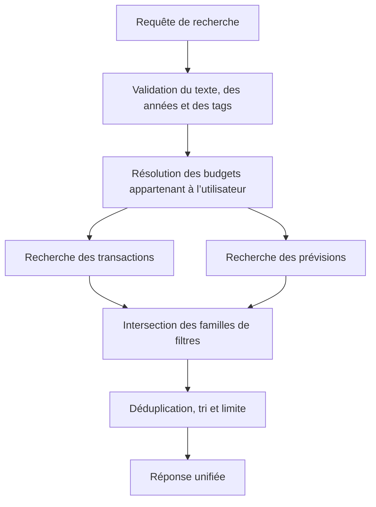

# Instruction: Étendre la recherche globale aux tags

## Architecture projection

> Tree of the final files. ✅ create · ✏️ modify · ❌ delete

```txt
.
├── shared/
│   └── schemas.ts ✏️
└── backend-nest/src/modules/transaction/
    ├── application/
    │   ├── search-transactions.use-case.ts ✏️
    │   └── search-transactions.use-case.spec.ts ✏️
    ├── domain/ports/
    │   └── transaction-repository.port.ts ✏️
    └── infrastructure/
        ├── http/
        │   ├── transaction.controller.ts ✏️
        │   └── transaction.controller.spec.ts ✏️
        └── persistence/
            ├── supabase-transaction.repository.ts ✏️
            └── supabase-transaction.repository.spec.ts ✏️
```

- `shared/schemas.ts` : étendre le contrat de recherche avec des paramètres optionnels `q`, `years` et `tagIds`, tout en exigeant un texte valide ou au moins un tag.
- `search-transactions.use-case.ts` : combiner les filtres et préserver le tri, la déduplication et la limite des résultats.
- `search-transactions.use-case.spec.ts` : couvrir les recherches texte seules, tags seuls et filtres combinés.
- `transaction-repository.port.ts` : transmettre explicitement les critères de recherche et l’identité propriétaire au dépôt.
- `transaction.controller.ts` : valider les paramètres de requête partagés et documenter les tags optionnels dans Swagger.
- `transaction.controller.spec.ts` : vérifier le parsing des tableaux, les UUID invalides et la compatibilité du paramètre `q`.
- `supabase-transaction.repository.ts` : filtrer transactions et prévisions par leurs tables de liaison de tags, avec les gardes d’appartenance disponibles.
- `supabase-transaction.repository.spec.ts` : prouver la sémantique OU des tags, l’intersection avec texte/années, la déduplication et le scope utilisateur.
- Créations : aucune.
- Suppressions : aucune.

## User Journey



## Tasks to do

### `1)` Faire évoluer le contrat de recherche

> Accepter une recherche par texte, par tags, ou par combinaison de filtres sans casser les appels actuels.

1. Étendre le schéma Zod partagé avec les années et identifiants de tags optionnels.
2. Rendre `q` optionnel seulement si au moins un tag valide est fourni.
3. Faire consommer ce contrat par le contrôleur et aligner les annotations Swagger.
4. Conserver le format de réponse existant.

### `2)` Propager une intention de filtre explicite

> Garder la logique d’orchestration dans le use case et les requêtes dans le dépôt.

1. Représenter séparément le motif texte optionnel, les budgets ciblés et les tags sélectionnés.
2. Préserver le comportement des recherches texte existantes.
3. Retourner immédiatement une liste vide lorsqu’un filtre d’années ne cible aucun budget.
4. Conserver le tri chronologique et la limite globale de 50 résultats.

### `3)` Filtrer les deux types d’éléments par tag

> Retourner les transactions et prévisions portant au moins un tag sélectionné.

1. Utiliser `transaction_tag` et `budget_line_tag` pour les correspondances exactes.
2. Appliquer un OU entre les tags, puis un ET avec le texte et les années.
3. Dédupliquer les éléments obtenus par plusieurs chemins.
4. Ajouter le filtre `user_id` explicite sur `monthly_budget` et `tag` lorsque la colonne existe ; conserver les protections RLS parentales pour les tables sans `user_id`.

## Test acceptance criteria

| Task | Acceptance criteria |
| ---- | ------------------- |
| 1 | Un appel historique avec `q` seul produit la même réponse ; un appel avec `tagIds` seul est accepté ; une requête sans texte ni tag et un UUID invalide sont rejetés en 400. |
| 2 | Les filtres texte, années et tags sont combinés sans modifier le tri décroissant ni la limite de 50 résultats. |
| 3 | Une transaction et une prévision portant un des tags sélectionnés sont retournées une seule fois ; les éléments hors années, hors tags ou hors utilisateur sont exclus. |
