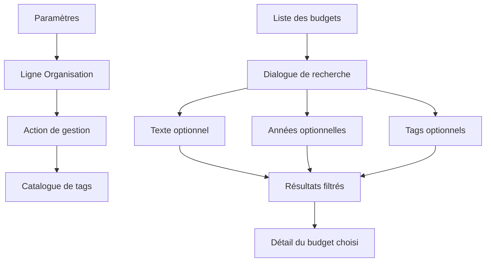

# Instruction: Polir l’entrée et ajouter le filtre web

## Architecture projection

> Tree of the final files. ✅ create · ✏️ modify · ❌ delete

```txt
.
└── frontend/
    ├── e2e/tests/features/
    │   └── budget-search.spec.ts ✏️
    └── projects/webapp/
        ├── public/i18n/
        │   └── fr.json ✏️
        └── src/app/
            ├── core/transaction/
            │   ├── transaction-api.ts ✏️
            │   └── transaction-api.spec.ts ✏️
            └── feature/
                ├── settings/
                │   ├── settings-page.ts ✏️
                │   └── settings-page.spec.ts ✏️
                └── budget/budget-list/search-transactions-dialog/
                    ├── search-transactions-dialog.ts ✏️
                    └── search-transactions-dialog.spec.ts ✏️
```

- `fr.json` : ajouter les libellés du bouton de gestion et du filtre par tags, puis remettre les messages touchés au tutoiement.
- `transaction-api.ts` : sérialiser les filtres optionnels en paramètres répétés.
- `transaction-api.spec.ts` : vérifier les URLs produites pour chaque combinaison.
- `settings-page.ts` : remplacer la carte cliquable par une ligne de réglage et un bouton secondaire explicite.
- `settings-page.spec.ts` : préserver la navigation accessible et vérifier la nouvelle action.
- `search-transactions-dialog.ts` : charger le catalogue via `TagStore`, afficher le multi-sélecteur et déclencher une recherche par tags sans texte.
- `search-transactions-dialog.spec.ts` : couvrir le rendu, les états du catalogue et les combinaisons de filtres.
- `budget-search.spec.ts` : valider le parcours utilisateur complet depuis la sélection d’un tag jusqu’à l’ouverture du budget correspondant.
- Créations : aucune.
- Suppressions : aucune.

## User Journey



## Wireframe

```txt
Écran Paramètres
┌────────────────────────────────────────────────────────────┐
│ (1) En-tête de page                                        │
├───────────────────┬────────────────────────────────────────┤
│ (2) Section       │ (3) Ligne de réglage                   │
│     organisation  │     libellé · description    [action]  │
└───────────────────┴────────────────────────────────────────┘

1. En-tête : repère la page dans la navigation existante.
2. Section : regroupe les outils d’organisation financière.
3. Ligne : présente la destination et son action au même niveau que les autres réglages.

Dialogue de recherche global
┌────────────────────────────────────────────────────────────┐
│ (1) Titre du dialogue                                      │
├────────────────────────────────────────────────────────────┤
│ (2) [ champ de recherche                                 ] │
│ (3) [ filtre années       ] [ filtre tags                ] │
├────────────────────────────────────────────────────────────┤
│ (4) état initial / chargement / erreur / résultats         │
│     ┌───────────┬────────────────────┬───────────────────┐  │
│     │ période   │ élément            │ montant           │  │
│     └───────────┴────────────────────┴───────────────────┘  │
├────────────────────────────────────────────────────────────┤
│                                               (5) [action] │
└────────────────────────────────────────────────────────────┘

1. Titre : identifie la recherche transversale.
2. Recherche : conserve la saisie textuelle comme contrôle principal.
3. Filtres : regroupent les années et le multi-sélecteur de tags sur une ligne qui s’empile en vue étroite.
4. Contenu : garde un emplacement stable pour tous les états et la liste de résultats.
5. Action : ferme le dialogue sans modifier la sélection courante.
```

## Tasks to do

### `1)` Aligner l’entrée du catalogue sur les réglages

> Faire disparaître l’effet de carte isolée au profit du motif déjà utilisé dans la section Sécurité.

1. Présenter titre et description dans une ligne sans conteneur décoratif.
2. Ajouter un bouton `matButton="outlined"` dédié à l’ouverture du catalogue.
3. Conserver la route, le `data-testid`, le libellé accessible et le comportement clavier.

### `2)` Ajouter les tags au modèle de recherche

> Permettre une recherche avec au moins deux caractères ou au moins un tag.

1. Étendre le modèle Signal Forms avec `tagIds`.
2. Charger les options depuis le `TagStore` partagé sans permettre la création de tag dans ce contexte.
3. Ajouter un `mat-select` multiple sous le champ texte, à côté des années sur grand écran.
4. Garder la recherche texte et année disponible si le catalogue de tags échoue.
5. Afficher un état initial adapté lorsque ni texte valide ni tag n’est sélectionné.

### `3)` Connecter et vérifier le parcours complet

> Envoyer uniquement les filtres actifs et conserver la navigation depuis un résultat.

1. Sérialiser `q`, `years` et `tagIds` dans `TransactionApi`.
2. Déclencher la ressource lors d’une sélection de tag même sans texte.
3. Mettre à jour les tests unitaires des états initial, chargement, erreur, vide et résultats.
4. Ajouter un scénario E2E de filtre par tag et combinaison avec une année.
5. Vérifier la disposition desktop et l’empilement mobile, le focus, les libellés et le contraste.

## Test acceptance criteria

| Task | Acceptance criteria |
| ---- | ------------------- |
| 1 | L’entrée « Mes tags » se lit comme les autres lignes de paramètres, expose une seule action secondaire et ouvre toujours `/settings/tags` au clavier comme au pointeur. |
| 2 | Le dialogue propose un multi-sélecteur de tags ; sélectionner un tag suffit à afficher des résultats ; une panne du catalogue ne bloque pas la recherche texte/année ; les contrôles s’empilent sans débordement sur mobile. |
| 3 | Les paramètres actifs sont envoyés sans valeurs vides, les filtres se combinent selon la sémantique prévue, les états restent compréhensibles au tutoiement et un résultat ouvre le bon budget. |
