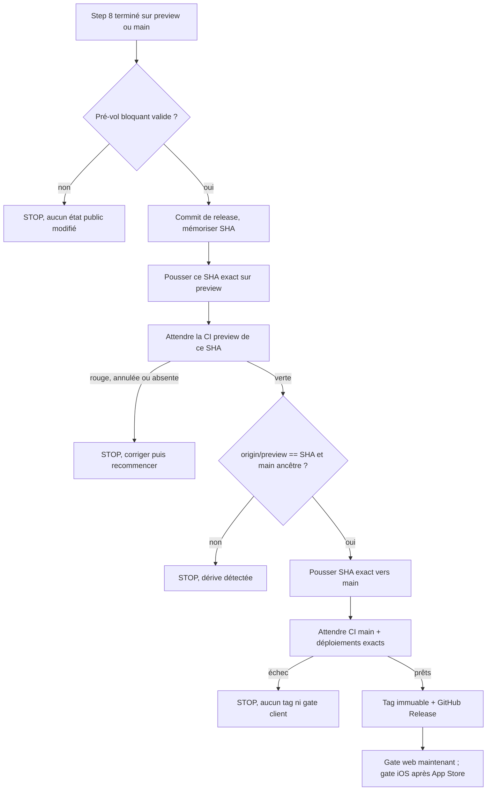

# Instruction: Sécuriser l'ordre de publication et le SHA promu

> Le commit validé sur `preview` doit être exactement celui promu sur `main`. Les surfaces publiques et les gates client ne changent qu'après preuve que ce SHA est en production.

## Architecture projection

> Tree of the final files. ✅ create · ✏️ modify · ❌ delete

```txt
.claude/skills/release/
├── SKILL.md                    ✏️ règle critique, pré-vol, Step 9 et maintenance d'une release publiée
└── references/
    ├── jsts-release.md         ✏️ `LATEST_WEB_VERSION` après disponibilité web
    └── ios-release.md          ✏️ `LATEST_IOS_VERSION` après disponibilité App Store
```

## User Journey



## Tasks to do

### `1)` Écrire les invariants opérationnels

1. Vercel et Railway réagissent au push sur leur branche de production ; le skill ne suppose pas qu'un webhook attend GitHub Actions.
2. Dans `ci.yml`, `migrate`, `posthog-annotate` et `verify-prod-csp` sont derrière `ci-success`. Ce gate GitHub ne retarde pas à lui seul les déploiements externes.
3. Les tags `v*` sont protégés sans bypass. Leur création est donc la dernière mutation Git, après validation de la production.
4. Les pushes directs sur `preview` et `main` nécessitent le bypass admin actuel, mais le skill doit résoudre le ruleset par son nom `main-protection`, jamais par un identifiant figé.
5. Interdire `--force`, `--force-with-lease` et `git push --tags`.

### `2)` Déplacer le pré-vol avant toute mutation

1. Exécuter ce pré-vol avant la préparation des fichiers de release, pas seulement au Step 9 :
   - worktree propre ;
   - `git fetch origin main preview --tags` ;
   - branche courante égale à `preview` ou `main`, sinon stop ;
   - `HEAD` égal à la branche distante correspondante ;
   - si le départ est `main`, `origin/preview` doit être ancêtre de `HEAD`, sinon stop.
2. Résoudre l'identifiant du ruleset dont le nom vaut `main-protection` via l'API GitHub, exiger un résultat unique, puis vérifier `current_user_can_bypass == exempt`.
3. Calculer la version et vérifier avant de continuer :
   - tag absent localement ;
   - tag absent de `refs/tags` sur `origin` ;
   - GitHub Release correspondante absente.
4. Ne jamais transformer une branche de feature en release implicite : expliquer qu'elle doit d'abord rejoindre `preview`.

### `3)` Valider puis promouvoir le SHA exact

1. Créer le commit de release sans tag, puis figer `SHA=$(git rev-parse HEAD)`.
2. Pousser explicitement `"$SHA:refs/heads/preview"` depuis l'un ou l'autre point d'entrée.
3. Attendre l'apparition du run `ci.yml` correspondant simultanément à :
   - `headSha == $SHA` ;
   - événement `push` ;
   - branche `preview`.
4. Poller jusqu'à apparition du run, puis exécuter `gh run watch "$RUN" --exit-status`. Un run annulé, rouge ou introuvable après le délai documenté provoque un stop ; aucune annulation n'est filtrée.
5. Après le succès, refaire `git fetch origin main preview` et exiger :
   - `git rev-parse origin/preview == "$SHA"` ;
   - `git merge-base --is-ancestor origin/main "$SHA"`.
6. Tester puis exécuter le refspec exact :
   - `git push --dry-run origin "$SHA:refs/heads/main"` ;
   - `git push origin "$SHA:refs/heads/main"`.
7. Refaire un fetch et exiger `git rev-parse origin/main == "$SHA"`. Ne jamais promouvoir `origin/preview`, qui pourrait avoir avancé après sa CI.

### `4)` Valider la production avant de publier

1. Attendre le run `ci.yml` de la branche `main`, événement `push`, pour le même `$SHA`. Une annulation ou un échec arrête la procédure.
2. Attendre séparément les déploiements de production Vercel et Railway :
   - le statut fournisseur doit être prêt/réussi ;
   - les métadonnées Git doivent référencer exactement `$SHA` ;
   - les health checks existants doivent réussir.
3. Si une de ces preuves manque, arrêter sans tag, sans GitHub Release et sans modification des gates client. La correction repart par `preview` avec la même version.
4. Une fois la production du SHA exact vérifiée :
   - créer `vX.Y.Z` sur `$SHA` et pousser uniquement ce tag ;
   - créer la GitHub Release avec les notes préparées au Step 5 ;
   - mettre à jour `LATEST_WEB_VERSION` dans les environnements web concernés, puis vérifier le comportement public.
5. Mettre à jour `LATEST_IOS_VERSION` seulement après confirmation que la version marketing est disponible sur l'App Store. Sinon, laisser la valeur inchangée et signaler cette opération différée.

### `5)` Aligner les références et la règle d'en-tête

1. Dans `references/jsts-release.md`, déplacer toute mutation de `LATEST_WEB_VERSION` après la preuve de disponibilité de la production.
2. Dans `references/ios-release.md`, rendre explicite que le gate iOS est une étape post-App Store, potentiellement différée du flux Git.
3. Dans la règle critique de `SKILL.md`, interdire tout push vers `main` avant le succès de la CI `preview` sur le SHA exact et toute publication avant validation de la production de ce même SHA.

### `6)` Séparer la maintenance d'une release déjà publiée

1. Sortir la réédition d'une GitHub Release du Step 9 normal.
2. Si `landing/data/releases.json` change pour une version déjà taguée, générer les nouvelles notes et montrer le diff public exact.
3. Demander une approbation explicite avant tout `gh release edit "vX.Y.Z"`.
4. Documenter que cette parité reste manuelle, contrairement aux données landing ↔ iOS.

## Test acceptance criteria

| Task | Acceptance criteria                                                                                                                                  |
| ---- | ---------------------------------------------------------------------------------------------------------------------------------------------------- |
| 1    | Le skill distingue clairement les déploiements externes des trois jobs GitHub gardés et résout le bypass par nom de ruleset                         |
| 2    | Un départ synchronisé depuis `preview` ou `main` converge vers le même parcours ; branche sale, feature, tag/release existant ou bypass absent stoppe |
| 3    | Seul le SHA validé est promu ; toute dérive de `preview`, CI annulée/rouge ou perte d'ascendance stoppe avant le push `main`                         |
| 4    | Tag, GitHub Release et gate web restent inchangés tant que CI `main`, Vercel, Railway et health checks n'ont pas validé le SHA exact                 |
| 4    | Le gate iOS reste inchangé tant que la version n'est pas disponible sur l'App Store                                                                  |
| 5    | L'en-tête, le Step 9 et les deux références décrivent le même ordre sans mutation anticipée                                                          |
| 6    | Une release déjà publiée ne peut être rééditée sans aperçu du diff et approbation explicite                                                          |
